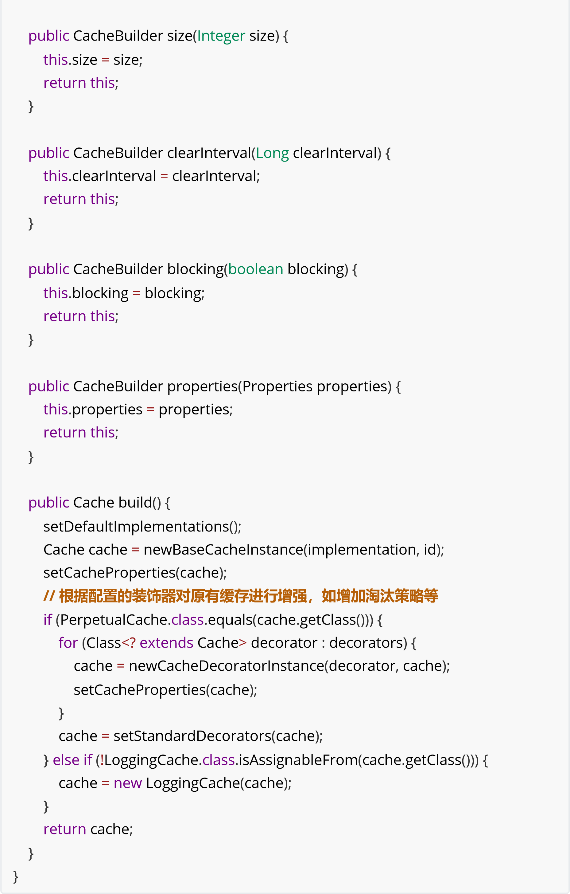
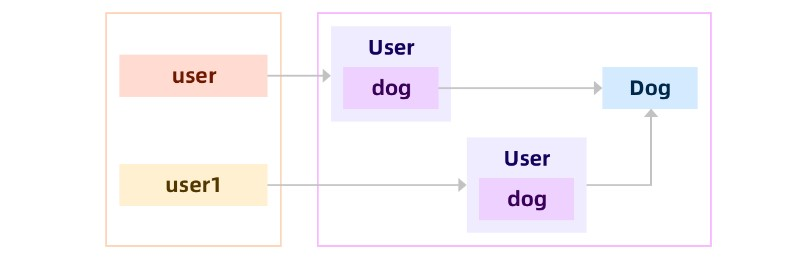
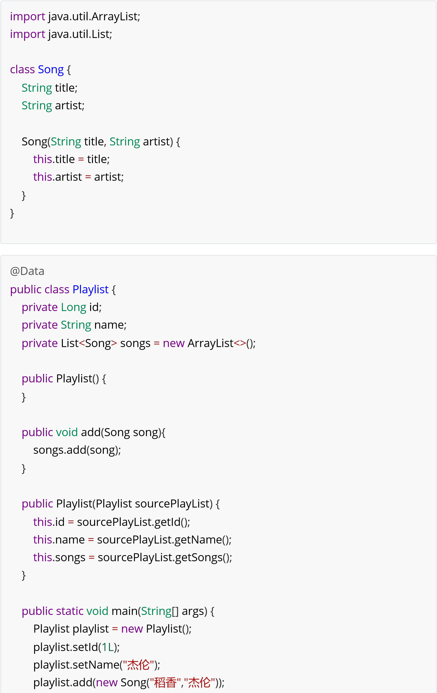
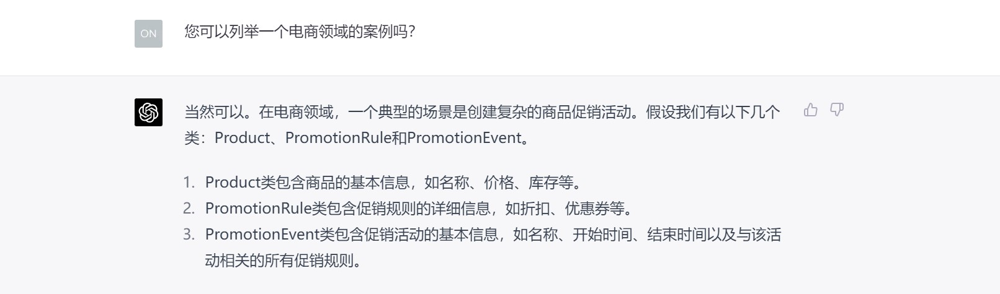
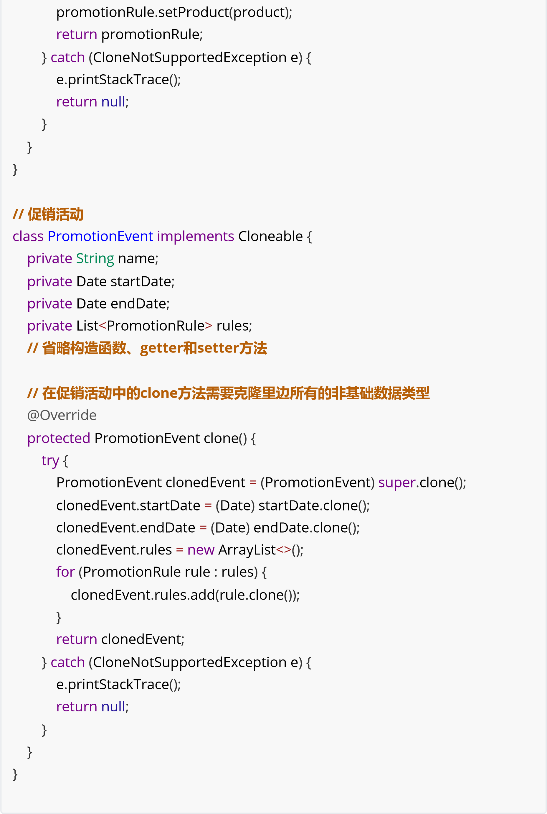
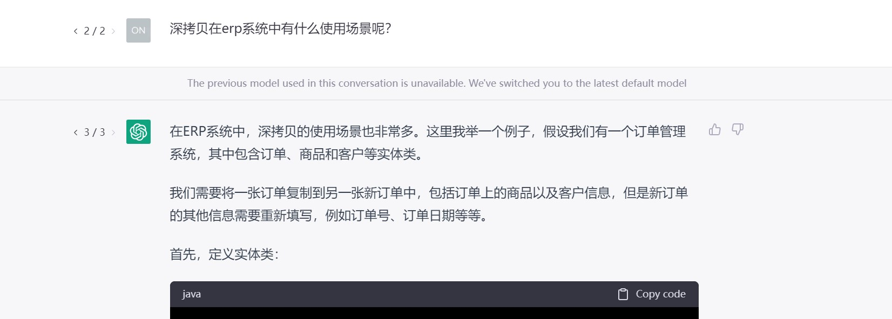
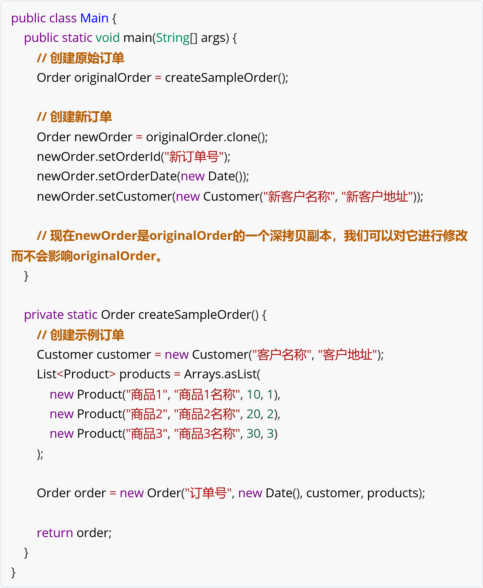
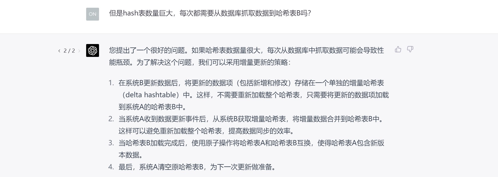
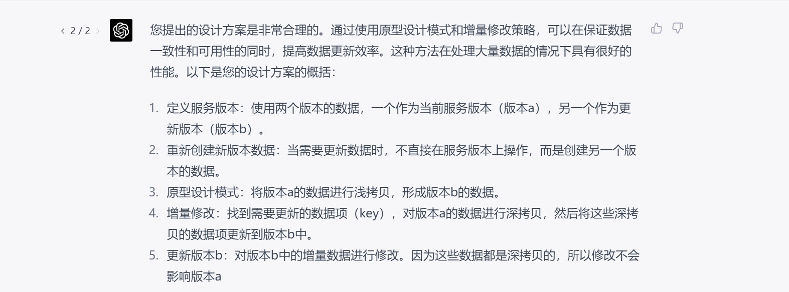
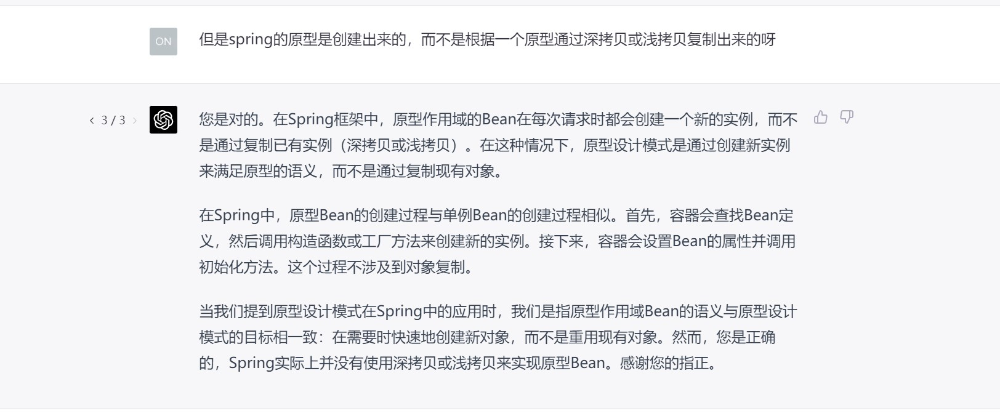

# 单例设计模式 

**单例设计模式**（Singleton Design
Pattern）理解起来非常简单。一个类只允许创建

一个对象（或者实例），那这个类就是一个**单例类**，这种设计模式就叫作单例设计模

式，简称单例模式。

**一、为什么要使用单例**

## 表示全局唯一 

如果有些数据在系统中**应该且只能保存一份**，那就应该设计为单例类。如：

> 配置类：在系统中，我们只有一个配置文件，当配置文件被加载到内存之后，应
>
> 该被映射为一个唯一的【配置实例】，此时就可以使用单例，当然也可以不用。
>
> 全局计数器：我们使用一个全局的计数器进行数据统计、生成全局递增ID等功
>
> 能。若计数器不唯一，很有可能产生统计无效，ID重复等。

以上代码也可以实现全局ID生成器的代码。

```java
public class GlobalCounter {
        private AtomicLong atomicLong = new AtomicLong(0);
        private static final GlobalCounter instance = new GlobalCounter();

        // 私有化无参构造器
        private GlobalCounter() {
        }

        public static GlobalCounter getInstance() {
            return instance;
        }

        public long getId() {
            return atomicLong.incrementAndGet();
        }
    }

    // 查看当前的统计数量
    long courrentNumber = GlobalCounter.getInstance().getId();
```


## 处理资源访问冲突

如果让我们设计一个日志输出的功能，你不要跟我杠，即使市面存在很多的日志框

架，我们也要自己设计。

如下，我们写了简单的小例子：

```java
public class Logger {
        private String basePath = "D://info.log";
        private FileWriter writer;
        public Logger() {
            File file = new File(basePath);
            try {
                writer = new FileWriter(file, true); //true表示追加写入
            } catch (IOException e) {
                throw new RuntimeException(e);
            }
        }
        public void log(String message) {
            try {
                writer.write(message);
            } catch (IOException e) {
                throw new RuntimeException(e);
            }
        }
        public void setBasePath(String basePath) {
            this.basePath = basePath;
        }
    }
```


当然，任何的设计都不是拍脑门，这是我们写的v1版本，他很可能会存在很多的
bug，设计结束之后，我们可能是这样使用的：

```java
@RestController("user")
    public class UserController {
        public Result login(){
// 登录成功
            Logger logger = new Logger();
            logger.log("tom logged in successfully.");
// ...
            return new Result();
        }
    }
```

当然，其他千千万的代码，我们都是这样写的。这样就会产生如下的问题：**多个
logger实例，在多个线程中，同时操作同一个文件，就可能产生相互覆盖的问题。**因为tomcat处理每一个请求都会使用一个新的线程（暂且不考虑多路复用）。此时

日志文件就成了一个**共享资源**，但凡是多线程访问共享资源，我们都要考虑并发修改

产生的问题。

有的同学可能想到如下的解决方案，加锁呀，代码如下：

```java
public synchronized void log(String message) {
        try {
            writer.write(message);
        } catch (IOException e) {
            throw new RuntimeException(e);
        }
    }
```

事实上这样加锁毫无卵用，方法级别的锁可以保证new出来的同一个实例多线程下可以同步执行log方法，然而你却new了很多：

{width="6.17995406824147in"
height="3.209825021872266in"}

其实，writer方法本身也是加了锁的，我们这样加锁就没有了意义：

```java
public void write(String str, int off, int len) throws IOException {
        synchronized (lock) {
            char cbuf[];
            if (len <= WRITE_BUFFER_SIZE) {
                if (writeBuffer == null) {
                    writeBuffer = new char[WRITE_BUFFER_SIZE];
                }
                cbuf = writeBuffer;
            } else { // Don't permanently allocate very large buffers.
                cbuf = new char[len];
            }
            str.getChars(off, (off + len), cbuf, 0);
            write(cbuf, 0, len);
        }
    }
```

当然，加锁是一定能解决共享资源冲突问题的，我们只要放大锁的范围从【this】到

【class】，这个问题也是能解决的，代码如下：


{width="6.17995406824147in"
height="2.813807961504812in"}

```java
public void log(String message) {
        synchronized (Logger.class) {
            try {
                writer.write(message);
            } catch (IOException e) {
                throw new RuntimeException(e);
            }
        }
    }
```


从以上的内容我们也发现了：

> 如果使用单个实例输出日志，锁【this】即可。
>
> 如果要保证JVM级别防止日志文件访问冲突，锁【class】即可。
>
> 如果要保证集群服务级别的防止日志文件访问冲突，加分布式锁即可。

如果我们是一个简单工程，对日志输入要求不高。单例模式的解决思路就十分合适，既然同一个Logger无法并行输出到一个文件中，那么针对这个日志文件创建多个Logger实例也就失去了意义，如果工程要求我们所有的日志输出到同一个日志文件中，这样其实并不需要创建大量的Logger实例，这样的好处有：

> 一方面节省内存空间。
>
> 另一方面节省系统文件句柄（对于操作系统来说，文件句柄也是一种资源，不能
>
> 随便浪费）。

按照这个设计思路，我们实现了 Logger 单例类。具体代码如下所示：

```java
public class Logger {
	private String basePath = "D://log/";
	private static Logger instance = new Logger();
    private FileWriter writer;
    private Logger() {
        File file = new File(basePath);
        try {
            writer = new FileWriter(file, true); //true表示追加写入
        } catch (IOException e) {
            throw new RuntimeException(e);
        }
    }
    public static Logger getInstance(){
        return instance;
    }
    public void log(String message) {
        try {
            writer.write(message);
        } catch (IOException e) {
            throw new RuntimeException(e);
        }
    }
    public void setBasePath(String basePath) {
        this.basePath = basePath;
    }
}
```


除此之外，并发队列（比如 Java ~中的~BlockingQueue~）也可以解决这个问题：多个~线程同时往并发队列里写日志，一个单独的线程负责将并发队列中的数据写入到日志文件。这种方式实现起来也稍微有点复杂。当然，我们还可将其**延伸至消息队列处理****分布式系统的日志**。

## **如何实现一个单例**

常见的单例设计模式，有如下五种写法，在编写单例代码的时候要注意以下几点：

1.  **构造器需要私有化**

2.  **暴露一个公共的获取单例对象的接口**

3.  **是否支持懒加载（延迟加载）**

4.  **是否线程安全**

### 饿汉式 

饿汉式的实现方式比较简单。在类加载的时候，instance静态实例就已经创建并初始化好了，所以，instance实例的创建过程是线程安全的。从名字中我们也可以看出这一点。具体的代码实现如下所示：

```java
public class EagerSingleton {
        private static Singleton instance = new Singleton();
        private Singleton (){}
        public static Singleton getInstance() {
            return instance;
        }
    }
```


事实上，恶汉式的写法在工作中反而应该被提倡，面试中不问，只是应为他简单。很多人觉得饿汉式不能支持懒加载，即使不使用也会浪费资源，一方面是内存资源，一方面会增加初始化的开销。

1.  现代计算机不缺这一个对象的内存。

2.  如果一个实例初始化的过程复杂那更加应该放在启动时处理，避免卡顿或者构造问题发生在运行时。满足fail-fast 的设计原则。

### 懒汉式 

有饿汉式，对应地，就有懒汉式。懒汉式相对于饿汉式的优势是支持延迟加载，具体的代码实现如下所示：

```java
public class LazySingleton {
        private static Singleton instance;
        private Singleton (){}
        public static Singleton getInstance() {
            if (instance == null) {
                instance = new Singleton();
            }
            return instance;
        }
    }
```


以上的写法本质上是有问题，当面对大量并发请求时，其实是无法保证其单例的特点的，很有可能会有超过一个线程同时执行了`new Singleton()`; 当然解决他的方案也很简单，加锁呗：

```java
public class Singleton {
        private static Singleton instance;
        private Singleton (){}
        public synchronized static Singleton getInstance() {
            if (instance == null) {
                instance = new Singleton();
            }
            return instance;
        }
    }
```


以上的写法确实可以保证`jvm`中有且仅有一个单例实例存在，但是方法上加锁会极大的降低获取单例对象的并发度。同一时间只有一个线程可以获取单例对象，为了解决以上的方案则有了第三种写法。

### 双重检查锁 

饿汉式不支持延迟加载，懒汉式有性能问题，不支持高并发。那我们再来看一种既支持延迟加载、又支持高并发的单例实现方式，也就是双重检测实现方式：

在这种实现方式中，只要 `instance` 被创建之后，即便再调用`getInstance()`函数也不会再进入到加锁逻辑中了。所以，这种实现方式解决了懒汉式并发度低的问题。具体的代码实现如下所示：

```java
public class DclSingleton {
	// volatile如果不加可能会出现半初始化的对象
	// 现在用的高版本的 Java 已经在 JDK 内部实现中解决了这个问题（解决的方法很
        简单，只要把对象 new 操作和初始化操作设计为原子操作，就自然能禁止重排序）,
        为了兼容性我们加上
        private volatile static Singleton singleton;
        private Singleton (){}
        public static Singleton getInstance() {
            if (singleton == null) {
                synchronized (Singleton.class) {
                    if (singleton == null) {
                        singleton = new Singleton();
                    }
                }
            }
            return singleton;
        }
    }
```


### 静态内部类 

我们再来看一种比双重检测更加简单的实现方法，那就是利用 Java的静态内部类。它有点类似饿汉式，但又能做到了延迟加载。具体是怎么做到的呢？我们先来看它的代码实现。

```java
public class InnerSingleton {
        /** 私有化构造器 */
        private Singleton() {
        }
        /** 对外提供公共的访问方法 */
        public static Singleton getInstance() {
            return SingletonHolder.INSTANCE;
        }
        /** 写一个静态内部类，里面实例化外部类 */
        private static class SingletonHolder {
            private static final Singleton INSTANCE = new Singleton();
        }
}
```


`SingletonHolder` 是一个静态内部类，当外部类
`Singleton`被加载的时候，并不会创建 `SingletonHolder` 实例对象。只有当调用`getInstance()` 方法时，`SingletonHolder` 才会被加载，这个时候才会创建 `instance`。`insance`的唯一性、创建过程的线程安全性，都由 JVM来保证。所以，这种实现方法既保证了线程安全，又能做到延迟加载。

### 枚举

后，我们介绍一种 简单的实现方式，基于枚举类型的单例实现。这种实现方式通过 Java枚举类型本身的特性，保证了实例创建的线程安全性和实例的唯一性。具体的代码如下所示：

```java
public enum EnumSingleton {
	INSTANCE；
}
```

这是一个 简单的实现，因为枚举类中，每一个枚举项本身就是一个单例的：更通用的写法如下：

```java
public class EnumSingleton {
        private Singleton(){
        }
        public static enum SingletonEnum {
            EnumSingleton;
            private EnumSingleton instance = null;
            private SingletonEnum(){
                instance = new Singleton();
            }
            public EnumSingleton getInstance(){
                return instance;
            }
        }
    }
```


事实上我们还可以将单例项作为枚举的成员变量，我们的累加器可以这样编写：

```java
public enum GlobalCounter {
        INSTANCE;
        private AtomicLong atomicLong = new AtomicLong(0);
        public long getNumber() {
            return atomicLong.incrementAndGet();
        }
    }
```


这种写法是Head-first中推荐的写法，他除了可以和其他的方式一样实现单例，他还能有效的防止反射入侵。

### 反射入侵

事实上，我们想要**阻止其他人构造实例**仅仅私有化构造器还是不够的，因为我们还可以**使用反射获取私有构造器**进行构造，当然使用枚举的方式是可以解决这个问题的，对于其他的书写方案，我们通过下边的方式解决：

```java
public class Singleton {
        private volatile static Singleton singleton;
        private Singleton (){
            if(singleton != null)
                throw new RuntimeException("实例：【"
                        + this.getClass().getName() + "】已经存在，该实例只允许实例化一次");
        }
        public static Singleton getInstance() {
            if (singleton == null) {
                synchronized (Singleton.class) {
                    if (singleton == null) {
                        singleton = new Singleton();
                    }
                }
            }
            return singleton;
        }
    }
```


此时方法如下：

```java
@Test
    public void testReflect() throws NoSuchMethodException,
            InvocationTargetException, InstantiationException, IllegalAccessException {
        Class<DclSingleton> clazz = DclSingleton.class;
        Constructor<DclSingleton> constructor = clazz.getDeclaredConstructor();
        constructor.setAccessible(true);
        boolean flag = DclSingleton.getInstance() == constructor.newInstance();
        log.info("flag -> {}",flag);
    }
```


结果如下：

{width="6.179955161854768in"
height="0.7503488626421697in"}

### **序列化与反序列化安全**

事实上，到目前为止，我们的单例依然是有漏洞的，看如下代码：

```java
@Test
    public void testSerialize() throws IllegalAccessException,
            NoSuchMethodException, IOException, ClassNotFoundException {
// 获取单例并序列化
        Singleton singleton = Singleton.getInstance();
        FileOutputStream fout = new FileOutputStream("D://singleton.txt");
        ObjectOutputStream out = new ObjectOutputStream(fout);
        out.writeObject(singleton);
// 将实例反序列化出来
        FileInputStream fin = new FileInputStream("D://singleton.txt");
        ObjectInputStream in = new ObjectInputStream(fin);
        Object o = in.readObject();
        log.info("他们是同一个实例吗？{}",o == singleton);
    }
```


我们发现，即使我们废了九牛二虎之力还是没能阻止他返回false，结果如下：

{width="6.179955161854768in"
height="0.7711920384951881in"}

`readResolve()`方法可以用于替换从流中读取的对象，在进行反序列化时，会尝试执行`readResolve`方法，并将返回值作为反序列化的结果，而不会克隆一个新的实例，保证jvm中仅仅有一个实例存在：

```java
public class Singleton implements Serializable {
        // 省略其他的内容
        public static Singleton getInstance() {
        }
        // 需要加这么一个方法
        public Object readResolve(){
            return singleton;
        }
    }
```


{width="6.17995406824147in"
height="0.6773982939632546in"}

一切问题迎刃而解。

## **源码应用**

事实上，我们在JDK或者其他的通用框架中很少能看到标准的单例设计模式，这也就意味着他确实很经典，但严格的单例设计确实有它的问题和局限性，我们先看看在源码中的一些案例。

### jdk的中的单例 

jdk中有一个类的实现是一个标准单例模式-\>**Runtime类**，该类封装了运行时的环境。每个Java 应用程序都有一个 Runtime类实例，使应用程序能够与其运行的环境相连接。一般不能实例化一个Runtime对象，应用程序也不能创建自己的 Runtime类实例，但可以通过 `getRuntime` 方法获取当前Runtime运行时对象的引用。

```java
public class Runtime {
// 典型的饿汉式
	private static final Runtime currentRuntime = new Runtime();
	private static Version version;
    public static Runtime getRuntime() {
        return currentRuntime;
    }
    /** Don't let anyone else instantiate this class */
    private Runtime() {}
    public void exit(int status) {
        @SuppressWarnings("removal")
        SecurityManager security = System.getSecurityManager();
        if (security != null) {
            security.checkExit(status);
        }
        Shutdown.exit(status);
    }
    public Process exec(String command) throws IOException {
        return exec(command, null, null);
    }
    public native long freeMemory();
    public native long maxMemory();
    public native void gc();
```

测试用例：

```java
    @Test
    public void testRunTime() throws IOException {
        Runtime runtime = Runtime.getRuntime();
        Process exec = runtime.exec("ping 127.0.0.1");
        InputStream inputStream = exec.getInputStream();
        byte[] buffer = new byte[1024];
        int len;
        while ((len = inputStream.read(buffer)) > 0 ){
            System.out.println(new String(buffer,0,len, Charset.forName("GBK")));
		}
		long maxMemory = runtime.maxMemory();
		log.info("maxMemory-->{}", maxMemory);
}
```


### **Mybatis中的单例**

Mybaits中的org.apache.ibatis.io.VFS使用到了单例模式。VFS就是Virtual File System的意思，mybatis通过VFS来查找指定路径下的资源。查看VFS以及它的实现

类，不难发现，VFS的角色就是对更"底层"的查找指定资源的方法的封装，将复杂的"底层"操作封装到易于使用的高层模块中，方便使用者使用，我们在mybatis源码课中进行了介绍，有兴趣的同学可以前往观看。接下来我们阅读其源码，其中省略了和单例无关的其他代码，并思考他使用了哪一种形式的单例：

```java
public class public abstract class VFS {
        // 使用了内部类
        private static class VFSHolder {
            static final VFS INSTANCE = createVFS();
            @SuppressWarnings("unchecked")
            static VFS createVFS() {
// ...省略创建过程
                return vfs;
            }
        }
        public static VFS getInstance() {
            return VFSHolder.INSTANCE;
        }
    }
```


## **单例存在的问题**

尽管单例是一个很经典的设计模式，但在实际的开发中，我们也很少**按照严格的定义**去使用它，以上的知识大多是为了理解和面试而使用和学习，有些人甚至认为单例是一种反模式（anti-pattern），压根就不推荐使用。大部分情况下，我们在项目中使用单例，都是用它来表示一些全局唯一类，比如配置信息类、连接池类、ID生成器类。单例模式书写简洁、使用方便，在代码中，我们不需要创建对象。但是，这种使用方法有点类似硬编码（hard code），会带来诸多问题，所以我们一般会使用**spring的单例容器作为替代方案**。那单例究竟存在哪些问题呢？

### 无法支持面向对象编程 

我们知道，OOP的三大特性是**封装、继承、多态**。单例将**构造私有化**，直接导致的结果就是，他无法成为其他类的父类，这就相当于直接放弃了继承和多态的特性，也就相当于损失了可以应对未来需求变化的扩展性，以后一旦有扩展需求，比如写一个类似的具有绝大部分相同功能的单例，我们不得不新建一个十分【雷同】的单例。

{width="6.17995406824147in" height="0.89625in"}

### 极难的横向扩展 

我们知道，单例类只能有一个对象实例。如果未来某一天，一个实例已经无法满足我们的需求，我们需要创建一个，或者更多个实例时，就必须对源代码进行修改，无法友好扩展。

有人一定会说"这不是沙雕"吗？明明一个实例无法满足，你却要设计成单例？事实上，这种场景是很常见的，因为我们要明白一个道理，永远不变的就是"永远在变"。人生的开始，你可能觉得自己有一辆车就够了，但是将来有一天你变成了亿万富翁，你可能就会想买一百辆。

{width="6.17995406824147in"
height="1.6361767279090114in"}

在系统设计初期，我们觉得系统中只应该有一个数据库连接池，这样能方便我们控制对数据库连接资源的消耗。所以，我们把数据库连接池类设计成了单例类。但之后我们发现，系统中有些 SQL 语句运行得非常慢。这些 SQL语句在执行的时候，长时间占用数据库连接资源，导致其他 SQL请求无法响应。为了解决这个问题，我们希望将慢 SQL 与其他 SQL隔离开来执行。为了实现这样的目的，我们可以在系统中创建两个数据库连接池，慢 SQL 独享一个数据库连接池，其他 SQL
独享另外一个数据库连接池，这样就能避免慢 SQL 影响到其他 SQL 的执行。如果我们将数据库连接池设计成单例类，显然就无法适应这样的需求变更，也就是

说，单例类在某些情况下会影响代码的扩展性、灵活性。所以，数据库连接池、线程池这类的资源池，好还是不要设计成单例类。实际上，一些开源的数据库连接池、线程池也确实没有设计成单例类。

## **不同作用范围的单例**

首先，我们重新看一下单例的定义："一个类只允许创建唯一一个对象（或者实例），那这个类就是一个单例类，这种设计模式就叫作单例设计模式，简称单例模式。"定义中提到，"一个类只允许创建唯一一个对象"。那对象的唯一性的作用范围是什么呢？在标准的单例设计模式中，其单例是进程唯一的，**也就意味着一个项目启动，在其整个运行环境中只能有一个实例。**事实上，在实际的工作当中，我们能够看到极多【只有一个实例的情况】，但是大多并不是标准的单例设计模式，如：

1.  使用ThreadLocal实现的线程级别的单一实例。

2.  使用spring实现的容器级别的单一是实例。

3.  使用分布式锁实现的集群状态的唯一实例。

以上的情况都不是标准的单例设计模式，但我们可以将其看做单例设计模式的扩展，我们以前两种情况为例进行介绍。

### 线程级别的单例 

刚刚我们讲了单例类对象是进程唯一的，一个进程只能有一个单例对象。那如何实现一个线程唯一的单例呢？如果在不允许使用`ThreadLocal`的时候我们可能想到如下的解决方案，定义一个全局的线程安全的`ConcurrentHashMap`，以线程`id`为`key`，以实例为`value`，每个线程的存取都从共享的map中进行操作，代码如下：

```JAVA
public class Connection {
        private static final ConcurrentHashMap<Long, Connection> instances
                = new ConcurrentHashMap<>();
        private Connection() {}
        public static Connection getInstance() {
            Long currentThreadId = Thread.currentThread().getId();
            instances.putIfAbsent(currentThreadId, new Connection());
            return instances.get(currentThreadId);
        }
    }
```


事实上ThreadLocal的原理也大致如此：

项目中的ThreadLocal的使用场景：

在spring使用ThreadLocal对当前线程和一个连接资源进行绑定，实现事务管理

```java
public abstract class TransactionSynchronizationManager {
	// 本地线程中保存了当前的连接资源，key(datasource)--> value(connection)
private static final ThreadLocal<Map<Object, Object>> resources =
            new NamedThreadLocal<>("Transactional resources");
    // 保存了当前线程的事务同步器
    private static final ThreadLocal<Set<TransactionSynchronization>>
            synchronizations = new NamedThreadLocal<>("Transaction synchronizations");
    // 保存了当前线程的事务名称
    private static final ThreadLocal<String> currentTransactionName =
            new NamedThreadLocal<>("Current transaction name");
    // 保存了当前线程的事务是否只读
    private static final ThreadLocal<Boolean> currentTransactionReadOnly =
            new NamedThreadLocal<>("Current transaction read-only status");
    // 保存了当前线程的事务隔离级别
    private static final ThreadLocal<Integer> currentTransactionIsolationLevel =
            new NamedThreadLocal<>("Current transaction isolation level");
    // 保存了当前线程的事务的活跃状态
    private static final ThreadLocal<Boolean> actualTransactionActive =
            new NamedThreadLocal<>("Actual transaction active");
}
```

在spring中使用RequestContextHolder，可以再一个线程中轻松的获取request、response和session。如果将来我们在静态方法，切面中想获取一个
request~对象就可以使用这个类。

```java
public abstract class RequestContextHolder {
        private static final ThreadLocal<RequestAttributes> requestAttributesHolder =
                new NamedThreadLocal("Request attributes");
        private static final ThreadLocal<RequestAttributes>
                inheritableRequestAttributesHolder = new
                NamedInheritableThreadLocal("Request context");
        @Nullable
        public static RequestAttributes getRequestAttributes() {
            RequestAttributes attributes =
                    (RequestAttributes)requestAttributesHolder.get();
            if (attributes == null) {
                attributes = (RequestAttributes)inheritableRequestAttributesHolder.get();
            }
            return attributes;
        }
}
```

ServletRequestAttributes：

```java
public class ServletRequestAttributes extends AbstractRequestAttributes {
        public static final String DESTRUCTION_CALLBACK_NAME_PREFIX =
                ServletRequestAttributes.class.getName() + ".DESTRUCTION_CALLBACK.";
        protected static final Set<Class<?>> immutableValueTypes = new HashSet(16);
        private final HttpServletRequest request;
        @Nullable
        private HttpServletResponse response;
        @Nullable
        private volatile HttpSession session;
        private final Map<String, Object> sessionAttributesToUpdate;
    }
```


在pageHelper使用ThreadLocal保存分页对象：

```java
public abstract class PageMethod {
        protected static final ThreadLocal<Page> LOCAL_PAGE = new
                ThreadLocal<Page>();
        protected static boolean DEFAULT_COUNT = true;
    }
```


### 容器范围的单例 

有的时候我们将单例的作用范围由进程切换到一个容器，可能会更加方便我们进行单例对象的管理。这也是spring作为java生态大哥大核心思想。spring通过提供一个单例容器，来确保一个实例在容器级别单例，并且可以在容器启动时完成初始化，他的优势如下：

1.  所有的bean以单例形式存在于容器中，避免大量的对象被创建，造成jvm内存抖动严重，频繁gc。

2.  程序启动时，初始化单例bean，满足fast-fail，将所有构建过程的异常暴露在启动时，而非运行时，更加安全。

3.  缓存了所有单例bean，启动的过程相当于预热的过程，运行时不必进行对象创建，效率更高。
    4、容器管理bean的生命周期，结合依赖注入使得解耦更加彻底、扩展性无敌。

我们学习玩了工厂模式后，会尝试编写一个DI容器，这里就不赘述了。

### 日志中的多例 

我们看一个例子，在日志框架中，我们可以通过LoggerFactory.getLogger(\"ydl\")方法获取一个实例，我们做如下的测试：

```java
@Test
    public void testLogger(){
        Logger ydl = LoggerFactory.getLogger("ydl");
        Logger ydl2 = LoggerFactory.getLogger("ydl");
        Logger ydlclass = LoggerFactory.getLogger("ydlclass");
        log.info("ydl == ydl2 -->{}", ydl == ydl2);
        log.info("ydl == ydlclass --> {}", ydl == ydlclass);
    }
```


其结果如下：

{width="6.17995406824147in"
height="0.719083552055993in"}

我们发现，如果我们使用相同的名字，他会返回同一个实例，否则就是另一个实例，这其实就是一个多例，一个类可以创建多个对象，但是个数是有限制的，他可是是具体的约定好的个数，比如5，也可以按照类型的个数创建。这种多例模式有点类似工厂模式。它跟工厂模式的不同之处是，多例模式创建的对象都是同一个类的对象，而工厂模式创建的是**不同子类的对象**，关于这一点，下一节课中就会讲到。实际上，它还有点类似享元模式，两者的区别等到我们讲到享元模式的

时候再来分析。除此之外，实际上，**枚举类型也相当于多例模式**，一个类型只能对应一个对象，一个类可以创建多个对象。事实上，如果你不相信别人，或者这个实例及其重要，我们可以使用标准的单例实现方式强制保障一个类只被实例化一次，事实上绝大部分的类也可以通过工厂模式、IOC 容器（比如 Spring IOC容器）来保证，甚至指定规则由程序员自己保证，只要满足业务要求，扩展性要求，具体方案可以自由设定。

# 工厂设计模式 

一般情况下，工厂模式分为三种更加细分的类型：简单工厂、工厂方法和抽象工厂。在 GoF 的《设计模式》一书中，它将简单工厂模式看作是工厂方法模式的一种特例，所以工厂模式只被分成了工厂方法和抽象工厂两类。实际上，前面一种分类方法更加常见，所以，在今天的讲解中，我们沿用第一种分类方法。在这三种细分的工厂模式中，简单工厂、工厂方法原理比较简单，在实际的项目中也比较常用。而抽象工厂的原理稍微复杂点，在实际的项目中相对也不常用。所以，我们今天讲解的重点是前两种工厂模式。对于抽象工厂，你稍微了解一下即可。

## **简单工厂（Simple Factory）**

简单工厂叫作静态工厂方法模式（Static Factory Method Pattern）。学习此设计模式时，我们会从一个案例不断优化带着大家领略工厂设计模式的魅力。

现在有一个场景，我们需要一个资源加载器，他要**根据不用的url进行资源加载**，但是如果我们将**所有的加载实现代码全部封装在了一个load方法**中，就会导致一个类很大，同时扩展性也非常差，当想要添加新的前缀解析其他类型的url时，发现需要修改大量的源代码，我们的代码如下：


定义两个需要之后会用到的类，非常简单：

```java
/**
 * @author banyanmei
 */
@Data
@NoArgsConstructor
@AllArgsConstructor
public class Resource {
    private String url;

    @Override
    public String toString() {
        return "Resource{" +
                "url='" + url + '\'' +
                '}';
    }
}
```


源码如下：

```java
public class ResourceLoader {
        public Resource load(String filePath) {
            String prefix = getResourcePrefix(filePath);
            Resource resource = null;
            if("http".equals(type)){
// ..发起请求下载资源... 可能很复杂
                return new Resource(url);
            } else if ("file".equals(type)) {
// ..建立流，做异常处理等等
                return new Resource(url);
            } else if ("classpath".equals(type)) {
// ...
                return new Resource(url);
            } else {
                return new Resource("default");
            }
            return resource;
        }
        private String getPrefix(String url) {
            if(url == null || "".equals(url) || !url.contains(":")){
                throw new ResourceLoadException("此资源url不合法.");
            }
            String[] split = url.split(":");
            return split[0];
        }
    }
```


在上边的案例中，存在很多的if分支，如果分支数量不多，且不需要扩展，这样的编写方式当然没错，然而在实际的工作场景中，我们的业务代码可能会很多，分支逻辑也可能十分复杂，这个时候简单工厂设计模式就要发挥作用了。

我们可以看到不管有多少个分支逻辑，他的本质就是一个，**创造一个资源产品**，我们只需要创建一个工厂类，将创建资源的能力交给工厂即可：

```java
/**
 * @author banyanmei
 * 简单工厂模式
 * 优点：简单，易于理解
 * 缺点：不符合开闭原则，每次新增类型都需要修改工厂类
 */
@Slf4j
public class ResourceFactory {

    public static Resource create(String type, String url) {
        if ("http".equals(type)) {
            // ..发起请求下载资源... 可能很复杂
            log.info("http");
            return new Resource(url);
        } else if ("file".equals(type)) {
            // ..建立流，做异常处理等等
            log.info("file");
            return new Resource(url);
        } else if ("classpath".equals(type)) {
            // ...
            log.info("classpath");
            return new Resource(url);
        } else {
            log.info("default");
            return new Resource("default");
        }
    }
}
```


有了上边的工厂类，我们将【创建资源产品】这个单一的能力赋予产品工厂，这样能更好的符合单一原则。有了工厂之后，我们的主要逻辑就会简化：

```java
public class FResourceLoader {
    public Resource load(String url) {
        String prefix = getPrefix(url);
        return ResourceFactory.create(prefix, url);
    }

    public String getPrefix(String url) {
        if (url == null || !url.contains(":")) {
            throw new ResourceLoadException("url不能为空");
        }
        return url.substring(0, url.indexOf(":"));
    }
    
}
```


这就是简单工厂设计模式，提取一个工厂类，工厂会根据传入的不同的类型，创建不同的产品，好处如下：

将**创建对象的过程交给工厂类**、其他业务需要某个产品时，直接使用create（方法名字不重要）创建即可这样的好处是：

1.  工厂将创建的过程进行封装，不需要关系创建的细节，更加符合面向对象思想

2.  这样主要的业务逻辑不会被创建对象的代码干扰，代码更易阅读

3.  产品的创建可以独立测试，更将容易测试

4.  独立的工厂类只负责创建产品，更加符合单一原则

需要修改或者添加新的功能，我们还是要修改源代码呀，这不符合开闭原则

确实如此，但是原则这种东西，一定要结合业务创建，在**创建对象的过程相对简单，业务改动不是很频繁**的情况下，适当的不按原则出牌才是更好的选择，只是偶尔修改一下`ResourceLoaderFactory`代码，稍微不符合开闭原则，也是完全可以接受的。

因为这样可以更加简单的编码，在进行软件开发时**编码难度也是一个很重要的考量标准**。我们一定要在合理设计和过度设计之间进行权衡，明白一点，**适合的才是好的**。

绝大部分工厂类都是以"Factory"单词结尾，但也不是必须的，比如 Java 中的`DateFormat`、`Calender`。除此之外，工厂类中创建对象的方法一般都是 create
开头，比如代码中的 `createParser()`，但有的也命名为~ `getInstance()`、`createInstance()`、`newInstance()`，有的甚至命名为 `valueOf()`（比如Java String 类的 valueOf() 函数等等，这个我们根据具体的场景和习惯来命名就好。

## **工厂方法（Factory Method）**

如果有一天，我们的if分支逻辑不断膨胀，有变为**肿瘤代码**的可能，就有必要将if 分支逻辑去掉，那又该怎么办呢？比较经典的处理方法就是利用多态。按照多态的实现思路，对上面的代码进行重构。我们会为每一个 Resource创建一个独立的工厂类，形成一个个小作坊，将每一个实例的创建过程交给工厂类完成，重构之后的代码如下所示：

之前是一个**大而全的工厂，**一个工厂需要创建不同的产品，工厂方法讲究的是**工厂也要专而精**，一个工厂只创建一种资源（产品），奔驰工厂只负责生产奔驰，宝马工厂只负责生产宝马。回到我们的例子中，每一种url加载成不同的资源产品，那每一种资源都可以由一个独立的`ResourceFactory`生产，在这个案例中我们觉得`ResourceLoader`这个名字更加合适。为了实现这一种场景，我们需要将生产资源的工厂类进行抽象：

```java
public interface IResourceLoader {
    Resource load(String url);
}
```

并为每一种资源创建与之匹配的实现：

```java
public class ClassPathResourceLoader implements IResourceLoader{
    @Override
    public Resource load(String url) {
        return new Resource(url);
    }
}
```


实际上，这就是工厂方法模式的典型代码实现。这样当我们新增一种读取资源的方式时，只需要新增一个实现，并实现 `IResourceLoader`
接口即可。所以，**工厂方法模式比起简单工厂模式更加符合开闭原则。**

但是每次增加工厂仍然会修改`FResourceLoader`

```java
@Component
public class FResourceLoader {
    public Resource load(String url) {
        String prefix = getPrefix(url);
        IResourceLoader resourceLoader;
        if ("http".equals(prefix)) {
            resourceLoader = new HttpResourceLoader();
        } else if ("classpath".equals(prefix)) {
            resourceLoader = new ClassPathResourceLoader();
        } else if ("file".equals(prefix)) {
            resourceLoader = new FileResourceLoader();
        } else {
            throw new ResourceLoadException("不支持的资源类型");
        }
        //加一个工厂就要加一个ifesle
        return resourceLoader.load(url);
    }

    public String getPrefix(String url) {
        if (url == null || !url.contains(":")) {
            throw new ResourceLoadException("url不能为空");
        }
        return url.substring(0, url.indexOf(":"));
    }
}
```


一个工厂的缓存来统一管理工厂实例，以后使用工厂会更加的简单，代码如下：

```java
private static Map<String, IResourceLoader> resourceLoaderMap;
    static {
        resourceLoaderMap.put("http", new HttpResourceLoader());
        resourceLoaderMap.put("classpath", new ClassPathResourceLoader());
        resourceLoaderMap.put("file", new FileResourceLoader());
    }
```

事实上，`ResourceLoader`的核心方法就可以简化成这个样子了：

```java
public Resource load(String url) {
        String prefix = getPrefix(url);
        //版本1
//        IResourceLoader resourceLoader;
//        if ("http".equals(prefix)) {
//            resourceLoader = new HttpResourceLoader();
//        } else if ("classpath".equals(prefix)) {
//            resourceLoader = new ClassPathResourceLoader();
//        } else if ("file".equals(prefix)) {
//            resourceLoader = new FileResourceLoader();
//        } else {
//            throw new ResourceLoadException("不支持的资源类型");
//        }
//        //加一个工厂就要加一个ifesle
//        return resourceLoader.load(url);
        //版本2
        try {
            return resourceLoaderMap.get(prefix).load(url);
        } catch (Exception e) {
            throw new ResourceLoadException("不支持的资源类型");
        }
    }
```

当然你如果觉得还是不够，你觉得修改需求还是不够灵活，仍然需要修改static中的代码，我们可以这样做，搞一个配置文件如下，将我们的工厂类进行配置，如下：

```properties
http=com.ydlclass.factoryMethod.resourceFactory.impl.HttpResourceLoader
file=com.ydlclass.factoryMethod.resourceFactory.impl.FileResourceLoader
classpath=com.ydlclass.factoryMethod.resourceFactory.impl.ClassPathResourceLoader
default=com.ydlclass.factoryMethod.resourceFactory.impl.DefaultResourceLoader
```

这样我们可以在static中这样编写代码，让我完全满足开闭原则：

```java
//版本3
    static {
        InputStream resourceAsStream = Thread.currentThread().getContextClassLoader()
                .getResourceAsStream("fresourceloader.properties");
        Properties properties = new Properties();
        try {
            properties.load(resourceAsStream);
            //拿到类名，通过反射创建对象，然后放到集合中
            for (Object key : properties.keySet()) {
                String className = properties.getProperty(key.toString());
                Class<?> clazz = Class.forName(className);
                IResourceLoader resourceLoader = (IResourceLoader) clazz.newInstance();
                resourceLoaderMap.put(key.toString(), resourceLoader);
            }
        } catch (IOException | InstantiationException | ClassNotFoundException | IllegalAccessException e) {
            throw new RuntimeException(e);
        }
    }
```


以后我们想新增或删除一个`resourceLoader`只需要写一个类实现`IResourceLoader`接口，并在配置文件中进行配置即可。此时此刻我们已经看不到if-else的影子了。

我们的代码中产品是简单单一的类，事实上，在工作中，我们的产品可能是及其复杂的，我们同样需要对整个产品线进行抽象，为不同的具体的产品需要继承这个抽象类：

```java
public abstract class AbstractResource {
    private String url;

    public AbstractResource() {
    }

    public AbstractResource(String url) {
        this.url = url;
    }

    protected void shardMethod(String url) {
        System.out.println("shardMethod" + url);
    }

    public abstract void load();

    @Override
    public String toString() {
        return "AbstractResource{" +
                "url='" + url + '\'' +
                '}';
    }
}
```

抽象类的具体实现

```java
@Slf4j
@Component
public class ClasspathResource extends AbstractResource {
    public ClasspathResource() {
    }

    public ClasspathResource(String url) {
        super(url);
    }

    @Override
    public void load() {
        log.info("ClasspathResource load");
    }
}
```


其他产品同理，我们的工厂类也需要面向产品的抽象进行编程了：

```java
public interface IResourceLoader {
    AbstractResource load(String url);
}
```

具体实现 

```java
@Slf4j
public class ClassPathResourceLoader implements IResourceLoader {

    @Override
    public AbstractResource load(String url) {
        return new ClasspathResource(url);
    }
}
```


**这样每个工厂面对的是产品的抽象，而创建者也只需面对工厂的抽象，这样也就是实现依赖倒置，也就是说高层模块不依赖与低层模块，其实仔细一想，我们通过静态的方法缓存的形式将需要使用的对象缓存起来，那我们是通过什么得到对象的呢？答案是通过配置的类名反射然后进行加载，这不就是spring加载bean的方式吗，只不过spring实现可以是注解的形式，XML和我们的实现及其相似。**

我们编写测试用例进行测试：

```java
@Autowired
    private AbstractFResourceLoader abstractFResourceLoader;
    @Test
    void testAbstractFactory() {
        String url = "file://www.baidu.com";
        AbstractResource load = abstractFResourceLoader.load(url);
        log.info(load.toString());
        load.load();
    }
```


q：工厂可以缓存，产品不能缓存吗，我们将简单工厂的实例做缓存可以吗？

产品往往很复杂，并且每个产品应该都不相同

q：工厂和产品的创建过程谁更复杂，我们在学习设计模式的时候一定假设代码都是复杂的？

工厂往往没有产品复杂

## **抽象工厂（Abstract Factory）**

本小节我们学习抽象工厂模式（Abstract Factory Pattern），该设计模式的应用场景比较特殊，他的重要性比不上简单工厂和工厂方法，其定义如下：

Provide an interface for creating families of related or dependent objects without specifying their concrete classes.(**为创建一组相关或者相互依赖的对象提供一个接口，而且无须指定他们的具体类。**)

抽象工厂模式是工厂方法模式的升级版本，在有多个业务品种、业务分类时，通过抽象工厂模式生产需要的对象是一种不错的解决方案。

在简单工厂和工厂方法中，往往只需要创建**一种类型的产品**，但是如果需求改变，需要增加多种类型的产品，即增加产品族，我们上边的需求是创建各种类型的资源，本小节我们再增加一个维度，如图片资源、视频资源、文本资源等。

换句话说也就是再加一层。

```java
public interface Resource {
    InputStream loadFile(String url);
}
```

然后其他的抽象类实现这个接口

```java
public abstract class xxxxAbstractResource implements Resource{
    //具体的产品簇的逻辑
}
```

不仅仅是产品可以抽象出产品簇，工厂也可以，当我们的工厂有着很多共享的方法，变量，资源等

```java
public abstract class AbstractResourceLoader implements IResourceLoader{
    //共享的方法，变量，资源等
}
```


大家思考，如果不停的增加产品维度，后导致的结果就是产品数量不停的爆炸，以笛卡尔集的方式指数级增长，如下：

1.  HttpPictureResource

2.  HttpVideoResource

3.  FilePictureResource

4.  FileVideoResource

> \...\...

按照之前的逻辑，我们有5个产品，加3个维度，就会产生15个产品和15个产品工厂，类会迅速爆炸起来，这显然不合适。

## **源码应用**

###  **jdk种的使用**

#### Calendar 

jdk中的日历类可以根据时区、地点创建一个满足当时需求的日历实例，这就是一个简单工厂：

由于返回的不是单例，不是单例模式

```java
public static Calendar getInstance(TimeZone zone,
                                       Locale aLocale)
    {
        return createCalendar(zone, aLocale);
    }

private static Calendar createCalendar(TimeZone zone,
                                           Locale aLocale)
    {
        CalendarProvider provider =
            LocaleProviderAdapter.getAdapter(CalendarProvider.class, aLocale)
                                 .getCalendarProvider();
        if (provider != null) {
            try {
                return provider.getInstance(zone, aLocale);
            } catch (IllegalArgumentException iae) {
                // fall back to the default instantiation
            }
        }
  
    @Override
    public Calendar getInstance(TimeZone zone, Locale locale) {
        return new Calendar.Builder()
                     .setLocale(locale)
                     .setTimeZone(zone)
                     .setInstant(System.currentTimeMillis())
                     .build();
    }
```


#### DateFormat 

DateFormat同样可以根据类型和地域生成一个满足本地特色的Date格式化工具：

```java
DateFormat dateInstance = DateFormat.getDateInstance(DateFormat.FULL,
	Locale.CHINA);
	log.info("date-->{}", dateInstance.format(new Date()));

```


### **spring**

**典型的简单工厂**
spring中的bean工厂就是一个典型的简单工厂设计模式：

```java
beanFactory.getBean("userService");
```


##### 典型的工厂方法 

`FactoryBean`提供了三个方法，其中`getObject`就是一个典型的工厂方法，

`FactoryBean`定制bean的创建过程，我们将工厂bean注入容器，有容器统一管理工厂对象，再有工厂对象创建具体的bean。

```java
public interface FactoryBean<T> {
    @Nullable
    T getObject() throws Exception;
    Class<?> getObjectType();
    default boolean isSingleton() {
        return true;
    }
}
```


### **mybatis**

mybatis中有很多Factory结尾的类，也是使用工厂设计模式如：

#### SqlSessionFactory 

```java
public interface SqlSessionFactory {
    SqlSession openSession();
    SqlSession openSession(boolean autoCommit);
    SqlSession openSession(Connection connection);
    SqlSession openSession(TransactionIsolationLevel level);
    SqlSession openSession(ExecutorType execType);
    SqlSession openSession(ExecutorType execType, boolean autoCommit);
    SqlSession openSession(ExecutorType execType, TransactionIsolationLevel
            level);
    SqlSession openSession(ExecutorType execType, Connection connection);
    Configuration getConfiguration();
}
```


#### MapperProxyFactory 

该类可以根据接口类型生成对应的具体实现，也是一种代理，核心方法`newInstance`：

```java
public class MapperProxyFactory<T> {
    private final Class<T> mapperInterface;
    private final Map<Method, MapperMethodInvoker> methodCache = new
            ConcurrentHashMap<>();
    public MapperProxyFactory(Class<T> mapperInterface) {
        this.mapperInterface = mapperInterface;
    }
    public Class<T> getMapperInterface() {
        return mapperInterface;
    }
    public Map<Method, MapperMethodInvoker> getMethodCache() {
        return methodCache;
    }
    @SuppressWarnings("unchecked")
    protected T newInstance(MapperProxy<T> mapperProxy) {
        return (T) Proxy.newProxyInstance(mapperInterface.getClassLoader(), new
                Class[] { mapperInterface }, mapperProxy);
    }
    public T newInstance(SqlSession sqlSession) {
        final MapperProxy<T> mapperProxy = new MapperProxy<>(sqlSession,
                mapperInterface, methodCache);
        return newInstance(mapperProxy);
    }
}
```


### **小节**

**当创建逻辑比较复杂**，是一个"大工程"的时候，我们就应该考虑使用工厂模式，封装对象的创建过程，**将对象的创建和使用相分离**。何为创建逻辑比较复杂呢？我总结了下面两种情况。

> 第一种情况：类似规则配置解析的例子，代码中存在 if-else分支判断，动态地根据不同的类型创建不同的对象。针对这种情况，我们就考虑使用工厂模式，将
> 
>这一大坨 if-else 创建对象的代码抽离出来，放到工厂类中。
> 
>还有一种情况，尽管我们不需要根据不同的类型创建不同的对象，但是，单个对象本身的**创建过程比较复杂，**比如前面提到的要组合其他类对象，做各种初始化操作。在这种情况下，我们也可以考虑使用工厂模式，将对象的创建过程封装到工厂类中。
> 

对于第一种情况，当每个对象的创建逻辑都比较简单的时候，我推荐使用简单工厂模式，将多个对象的创建逻辑放到一个工厂类中。当每个对象的创建逻辑都比较复杂的时候，为了避免设计一个过于庞大的简单工厂类，我推荐使用工厂方法模式，将创建逻辑拆分得更细，每个对象的创建逻辑独立到各自的工厂类中。同理，对于第二种情况，因为单个对象本身的创建逻辑就比较复杂，所以，我建议使用工厂方法模式。

除了刚刚提到的这几种情况之外，如果创建对象的逻辑并不复杂，那我们就直接通过new 来创建对象就可以了，不需要使用工厂模式。

现在，我们上升一个思维层面来看工厂模式，它的作用无外乎下面这四个。这也是判断要不要使用工厂模式的 本质的参考标准。

> 封装变化：创建逻辑有可能变化，封装成工厂类之后，创建逻辑的变更对调用者透明。
>
> 代码复用：创建代码抽离到独立的工厂类之后可以复用。
>
> 隔离复杂性：封装复杂的创建逻辑，调用者无需了解如何创建对象。
>
> 控制复杂度：将创建代码抽离出来，让原本的函数或类职责更单一，代码更简洁。
>

日常工作中很多场景都可以使用工厂设计模式，如使用不同的支付方式支付，使用不同的登录器登录等等。

假设您正在开发一个支持多种数据库（例如 MySQL、PostgreSQL、Oracle等）的应用程序。根据配置文件或用户选择的数据库类型，您需要创建相应类型的数据库连接。这是一个工厂模式可以发挥作用的场景。

首先，定义一个数据库连接接口：

```java
public interface DatabaseConnection {
    Connection getConnection();
}
```


然后，实现多种数据库连接类型：

```java
public class MySQLConnection implements DatabaseConnection {
    @Override
    public Connection getConnection() {
// 实现 MySQL 连接的创建逻辑
    }
}
public class PostgreSQLConnection implements DatabaseConnection {
    @Override
    public Connection getConnection() {
// 实现 PostgreSQL 连接的创建逻辑
    }
}
public class OracleConnection implements DatabaseConnection {
    @Override
    public Connection getConnection() {
// 实现 Oracle 连接的创建逻辑
    }
}
```


接下来，创建一个工厂类，用于根据数据库类型创建相应的数据库连接实例：

```java
public class DatabaseConnectionFactory {
    public static DatabaseConnection createDatabaseConnection(String databaseType) {
        if (databaseType == null) {
            throw new IllegalArgumentException("Database type cannot be null.");
        }
        if (databaseType.equalsIgnoreCase("MySQL")) {
            return new MySQLConnection();
        } else if (databaseType.equalsIgnoreCase("PostgreSQL")) {
            return new PostgreSQLConnection();
        } else if (databaseType.equalsIgnoreCase("Oracle")) {
            return new OracleConnection();
        } else {
        throw new IllegalArgumentException("Invalid database type: " +
        databaseType);
        }
    }
}

```


现在，您可以使用工厂类根据配置或用户选择创建相应的数据库连接实例：

```java
DatabaseConnection connection =
DatabaseConnectionFactory.createDatabaseConnection("MySQL");
Connection conn = connection.getConnection();
```

通过工厂设计模式，您可以轻松地在运行时根据需要创建不同类型的数据库连接，提高代码的可扩展性和灵活性。

## 第三章 建造者模式 

**一、原理**

**Builder
模式**，中文翻译为**建造者模式**或者**构建者模式**，也有人叫它**生成器模式**。

实际上，建造者模式的原理和代码实现非常简单，掌握起来并不难，难点在于应用场

景。比如，你有没有考虑过这样几个问题：**直接使用构造函数或者配合 set
方法就能**

**创建对象**，为什么还需要建造者模式来创建呢？建造者模式和工厂模式都可以创建对

象，那它们两个的区别在哪里呢，话不多说，我们直接来学习：

创建者模式主要包含以下四个角色：

1.  产品（Product）：表示将要被构建的复杂对象。

2.  抽象创建者（Abstract
    Builder）：定义构建产品的接口，通常包含创建和获取

> 产品的方法。

3.  具体创建者（Concrete
    Builder）：实现抽象创建者定义的接口，为产品的各个

> 部分提供具体实现。

4.  指挥者（Director）：负责调用具体创建者来构建产品的各个部分，控制构建过程。我们考虑一个文档编辑器的例子。假设我们需要创建一个复杂的HTML文档，它包含

了标题、段落和图像等元素。我们可以使用创建者设计模式来构建HTML文档。

1.  ~产品（~Product~）类~ - HTML~文档（~HtmlDocument~）：~

2.  ~抽象创建者（~Abstract Builder~）类~ - HtmlDocumentBuilder~：~

3.  ~具体创建者（~Concrete Builder~）类~ -
    ArticleHtmlDocumentBuilder~：~

4.  ~指挥者（~Director~）类~ - HtmlDirector~：~

现在我们可以使用创建者设计模式来构建一个HTML文档对象：

在这个例子中，我们创建了一个表示HTML~文档的产品类（~HtmlDocument~），一个~

抽象的创建者类（HtmlDocumentBuilder~），一个具体的创建者类~

（ArticleHtmlDocumentBuilder~）和一个指挥者类（~HtmlDirector~）。当我们需要~

创建一个新的HTML文档对象时，我们可以使用指挥者类来控制构建过程，从而实现

了将构建过程与表示过程的分离。

以上是一个创建者设计模式的标准写法，事实，我们在工作中往往不会写的这么复

杂，为了创建一个对象，我们创建了很多辅助的类，总觉得不太合适，在这个案例

中，我们可以使用内部类来简化代码，以下是修改后的代码（甚至我们还移除了抽象

层）：

现在我们可以使用以下代码来创建一个HTML文档对象：

在这个修改后的例子中，我们将创建者类（Builder~）作为~HTML~文档类~

### （HtmlDocument）的内部类。这样做可以让代码更加紧凑。此外，我们使用了一

种流式接口（Fluent Interface），使得在客户端代码中创建HTML文档对象更加简

洁。

当然有些人看了这个案例，已经会觉得

**二、为什么需要建造者模式**

需求一、根据复杂的配置项进行定制化构建

首先，我们先看一个mybaits中经典的案例，这个案例中使用了装饰器和创建者设计

模式：

{width="6.190001093613298in" height="9.7in"}

我们总结这个案例中的几个特点：

1、参数**有必填项id**，有很多**可选填的内容**，通常必选项id通过构造器传入，可选项

通过方法传递。
2、真正的构建过程需要调用build方法，构建时需要根据**已配置的成员变量的内容**选

择合适的装饰器，对目标cache进行增强。

需求二、实现不可变对象

创建者设计模式（Builder Design
Pattern~）可以实现不可变对象，即一旦创建完~

成，对象的状态就不能改变。这有助于保证对象的线程安全和数据完整性。下面是一

个使用创建者设计模式实现的不可变对象的Java示例：

实际上，使用建造者模式创建对象，还能避免对象**存在无效状态**。我再举个例子解释

一下。比如我们定义了一个长方形类，如果不使用建造者模式，采用先创建后 set
的

方式，那就会导致在第一个 set 之后，对象处于无效状态。具体代码如下所示：

为了避免这种无效状态的存在，我们就需要使用构造函数一次性初始化好所有的成员

变量。如果构造函数参数过多，我们就需要考虑使用建造者模式，先设置建造者的变

量，然后再一次性地创建对象，让对象一直处于有效状态。实际上，如果我们并不是很关心对象是否有短暂的无效状态，也不是太在意对象是否

是可变的。比如，对象只是用来映射数据库读出来的数据，那我们**直接暴露
set() 方**

**法来设置类的成员变量值是完全没问题的**。而且，使用建造者模式来构建对象，代码

实际上是有点重复的。

小结：

建造者模式是用来创建一种类型的复杂对象，通过设置不同的可选参数，"定制化"地

创建不同的对象。

我们把类的必填属性放到构造函数中，强制创建对象的时候就设置。如果必填的属性

有很多，把这些必填属性都放到构造函数中设置，那构造函数就又会出现参数列表很

长的问题。如果我们把必填属性通过 set()
方法设置，那校验这些必填属性是否已经

填写的逻辑就无处安放了。

如果类的属性之间有一定的依赖关系或者约束条件，我们继续使用构造函数配合
set() 方法的设计思路，那这些依赖关系或约束条件的校验逻辑就无处安放了。

如果我们希望创建不可变对象，也就是说，对象在创建好之后，就不能再修改内部的

属性值，要实现这个功能，我们就不能在类中暴露 set() 方法。构造函数配合
set() 方

法来设置属性值的方式就不适用了。

#### q：与工厂模式有何区别？

实际上，我们也不要太学院派，非得把工厂模式、建造者模式分得那么清楚，我们需

要知道的是，每个模式为什么这么设计，能解决什么问题。**只有了解了这些
本质的**

#### 东西，我们才能不生搬硬套，才能灵活应用，甚至可以混用各种模式创造出新的模

**式，来解决特定场景的问题。**

**三、源码应用**

创建者设计模式在源码中有广泛的使用常见：

1.  jdk中，如StringBuilder和StringBuffer，他们的实现不是完全按照标准的创建者设计模式设计，但也是一样的思想：这两个类用于构建和修改字符串。它们实现了创建者模式，允许客户端通过方法链来

修改字符串。这些类在性能上优于 String
类，因为它们允许在同一个对象上执行多

次修改，而不需要每次修改都创建一个新的对象。

2.  在ssm源码中很多类都使用创建者设计模式，如Spring中的

BeanDefinitionBuilder ~类，~mybatis~中的~ SqlSessionFactoryBuilder~、~

> XMLConfigBuilder~、~XMLMapperBuilder~、~XMLStatementBuilder~、~

CacheBuilder~等，因为实现都比较简单就不带着大家一个一个看了。~

3.  使用lombok简单的实现创建者设计模式

Lombok 是一个 Java
库，它可以简化代码，提高开发效率，尤其是在实现模式和生成常用方法（例如
getter~、~setter~、~equals~、~hashCode ~和~ toString~）时。要使用~

Lombok 简单地实现创建者设计模式，您可以使用 \@Builder
注解。这将为您自动生成创建者类和相关方法。以下是一个使用 Lombok
的创建者设计模式的例子：

首先，确保您已经在项目中引入了 Lombok ~库。对于~ Maven ~项目，在~
pom.xml ~文~件中添加以下依赖：

然后，创建一个使用 Lombok 的创建者设计模式的类：

通过 Lombok，您可以轻松地实现创建者设计模式，减少样板代码，提高代码可读

性。

## 第四章 原型设计模式 

对于创建型模式，前面我们已经讲了单例模式、工厂模式、建造者模式，今天我们来

讲 后一个：原型模式。

原型设计模式是一种创建型设计模式，它允许在运行时**通过拷贝来创建新的对象**，而

不是通过实例化一个类。在原型设计模式中，我们首先创建一个原型对象，然后使用

它来创建新的对象。这种方式可以**减少对象的创建成本**，因为我们可以直接复制现有

的对象，而不必重新创建。在创建新对象时，我们可以通过修改原型对象的属性值来

定制新对象的属性，这样就可以实现动态配置和个性化定制。

原型设计模式的典型使用场景是在**创建成本较高的对象**时，通过复制现有对象来创建

新的对象，以提高对象创建的效率和性能。该模式适用于以下场景：

1.  **对象创建的成本较高**，例如需要进行大量的计算、网络调用或IO操作等。

2.  **需要创建大量相似对象**，但这些对象的状态可能稍有不同，例如使用不同的参数或数据源等。

3.  **需要动态地创建对象**，并且希望能够避免使用传统的对象创建方式（例如使用
    new 关键字）来创建大量的对象。

在这些场景中，原型设计模式可以显著地提高**系统性能和可扩展性**，因为它可以**避免**

**频繁地创建和销毁对象**，从而减少系统的资源消耗和响应时间。同时，原型设计模式

还可以使代码更加简洁和易于维护，因为它将对象创建的逻辑封装在一个原型对象

中，而**无需关系创建的细节**，使代码更加模块化和可重用。

在实际应用中，原型设计模式经常用于创建复杂的数据结构、缓存对象、动态代理对

象、线程池等。例如，在某些 Web
框架中，原型设计模式被广泛地应用于创建数据

库连接、会话对象等资源，以提高系统的性能和可扩展性。

**一、实现方式**

### **1、浅拷贝** 

#### 在Java编程中，浅拷贝是指在复制对象时，只复制对象的基本数据类型的值和引用类

**型的地址**，不复制引用类型指向的对象本身。浅拷贝可以用于一些简单的场景，例如

对象的基本属性不包含其他对象的引用类型，或者不需要修改对象引用类型所指向的

对象。

以下是几个使用浅拷贝的场景：

1.  原型模式：在创建一个新对象时，如果该对象和已有对象的属性相同，可以使用浅拷贝来复制已有对象的属性，而不必重新创建一个新对象。

2.  缓存数据：当需要缓存某些数据时，可以使用浅拷贝来创建缓存对象。如果原始

> 对象不再使用，可以直接将其赋值为null，而不必担心缓存对象的引用被同时置为null~。~

3.  复制属性：当需要将一个对象的属性值复制到另一个对象时，可以使用浅拷贝。例如，将一个对象的属性值复制到一个DTO（数据传输对象）中，以传递给其他

> 系统或服务。

{width="6.17995406824147in"
height="2.053036964129484in"}

#### （1）方案一，直接赋值

我们举一个很简单的例子，使用浅拷贝来复制一个音乐播放列表，以便为用户创建一

个新的播放列表，同时保留原始播放列表的内容。

{width="6.190001093613298in"
height="9.813334426946632in"}

在这个例子中，我们创建了一个原始播放列表，然后使用浅拷贝创建了一个新的播放

列表。注意，我们只复制了歌曲列表的引用，而不是歌曲列表本身。这意味着，当我

们向新播放列表添加歌曲时，原始播放列表的歌曲列表也会受到影响。

**（2）方案二、使用clone方法**
java中给我们提供了Cloneable接口，可以帮助我们很简单的实现浅拷贝：

当然浅拷贝还有一个做法就是使用反射技术循环遍历类中的getter和setter方法，对

成员变量进行循环赋值操作。

因此，在选择使用深拷贝还是浅拷贝时，我们需要根据具体场景来决定。如果对象的

属性包含引用类型对象且需要修改这些对象的属性时，应该使用深拷贝；如果对象的

属性不包含引用类型对象或不需要修改这些对象的属性时，可以使用浅拷贝。

### **2、深拷贝** 

深拷贝的实现，通常有两个思路，一个是递归克隆，一个是使用序列化的手段，我们

分别对以下两种方式进行讲解：

#### （1）递归克隆 

我使用chatgpt试图让他给我列举一个深拷贝的典型案例，他推荐了如下的案例，而

此案例中的深拷贝也使用了clone方法，对每一层进行了一次浅拷贝：

{width="6.179955161854768in"
height="1.8237642169728785in"}

为了实现这个案例，我们首先需要定义一些实体类，每个实体类都要实现Cloneable
接口：

{width="6.190001093613298in" height="9.2in"}

现在，我们已经为每个实体类实现了深拷贝方法。假设我们需要为**不同的商品创建相**

**似的促销活动**，我们可以使用深拷贝来实现：

+-----------------------------------------------------------------------+
| public static void main(String\[\] args) {                            |
|                                                                       |
| **// ~创建原始促销活动~**                                             |
|                                                                       |
| PromotionEvent originalEvent = createSamplePromotionEvent();          |
|                                                                       |
| **// ~创建新的促销活动~**                                             |
|                                                                       |
| PromotionEvent newEvent = originalEvent.clone();                      |
|                                                                       |
| newEvent.setName(\"~新的促销活动~\");                                 |
|                                                                       |
| **//                                                                  |
| 现在newEvent是origina                                                 |
| lEvent的一个深拷贝副本，我们可以对它进行修改而不会影响originalEvent** |
|                                                                       |
| **// ~修改新促销活动的日期~**                                         |
|                                                                       |
| newEvent.setStartDate(addDays(newEvent.getStartDate(), 7));           |
|                                                                       |
| newEvent.setEndDate(addDays(newEvent.getEndDate(), 7));               |
|                                                                       |
| **// ~修改新促销活动的部分规则~**                                     |
|                                                                       |
| List\<PromotionRule\> newRules = newEvent.getRules();                 |
|                                                                       |
| newRules.get(0).setDiscount(newRules.get(0).getDiscount() \* 1.1);    |
|                                                                       |
| **//                                                                  |
| 现在，我们已经成                                                      |
| 功地复制了一个与原始活动相似但具有不同日期和部分规则的新促销活动。**  |
|                                                                       |
| **// 可以将新活动应用于其他商品，而原始活动保持不变。**               |
|                                                                       |
| }                                                                     |
|                                                                       |
| private static PromotionEvent createSamplePromotionEvent() {          |
|                                                                       |
| **// ~创建示例促销活动~**                                             |
|                                                                       |
| List\<PromotionRule\> rules = Arrays.asList(                          |
|                                                                       |
| new PromotionRule(\"~折扣~\", 0.9),                                   |
|                                                                       |
| new PromotionRule(\"~满减~\", 50)                                     |
|                                                                       |
| );                                                                    |
|                                                                       |
| PromotionEvent event = new PromotionEvent(                            |
|                                                                       |
| \"~原始促销活动~\",                                                   |
|                                                                       |
| new Date(),                                                           |
|                                                                       |
| addDays(new Date(), 7),                                               |
|                                                                       |
| rules );                                                              |
|                                                                       |
| return event;                                                         |
|                                                                       |
| }                                                                     |
|                                                                       |
| private static Date addDays(Date date, int days) {                    |
|                                                                       |
| Calendar calendar = Calendar.getInstance();                           |
|                                                                       |
| calendar.setTime(date);                                               |
+=======================================================================+
+-----------------------------------------------------------------------+

#### （2）序列化 

深拷贝的通用做法就是使用对象想对原型对象进行序列化，再对序列化后的二进制流

执行反序列化操作，就可以得到一个完完全全相同的对象，这种序列化的方式有很多

比如先转为json，在转成内存模型的对象，也是可以的。

**二、应用场景** **1、场景一**
我继续追问chatgpt，我想知道深拷贝在erp系统中的应用场景：

{width="6.17995406824147in"
height="2.2093602362204723in"}

以下是他的回答：

在ERP系统中，深拷贝的使用场景也非常多。这里我举一个例子，假设我们有一个订

单管理系统，其中包含订单、商品和客户等实体类。

我们需要将一张订单复制到另一张新订单中，包括订单上的商品以及客户信息，但是

新订单的其他信息需要重新填写，例如订单号、订单日期等等。

首先，定义实体类：

现在，我们已经为每个实体类实现了深拷贝方法。接下来，我们可以在复制订单时使

用深拷贝：

{width="6.190001093613298in"
height="7.523333333333333in"}

在这个例子中，我们创建了一个原始订单，并通过深拷贝创建了一个新的订单。然后

我们修改了新订单的部分信息，例如订单号、订单日期以及客户信息，但是保留了原

始订单上的商品信息。这样，我们就可以快速创建一个新订单，并且可以选择保留或

修改原始订单上的商品信息。同时，原始订单保持不变，不受新订单的影响。

在ERP系统中，深拷贝还可以用于创建复杂的产品和工单等场景，例如复制一个产品

和其相关的工单、BOM等信息以创建新产品，或者复制一个工单和其相关的任务、

零件清单等信息以创建新工单。深拷贝可以有效地减少重复劳动和错误，提高生产效

率和品质。

### **2、场景二（必看）** 

#### （1）需求 

假设我们现在针对商城的20万个商品记录其浏览行为，每一个行为都会记录被搜索

次数，安卓端点击次数、苹果端点击次数， 近被搜索或点击的时间戳等内容。

系统A启动后需要加载这一份数据，做一些特殊处理，完成一些特定的业务，为了快

速查询商品的一些浏览信息我们将其保存在一个hash~表中。~key~为商品~id~，~value~为~

具体信息。

此外，我们还有另外一个系统 B，专门用来**分析日志，定期（比如间隔 10
分钟）批**

**量地从数据库中更新数据，并且会将新的数据标记为新的版本。**

**（2）方案一** 我将上述问题和chatgpt进行了交流，他给出了如下的方案：

为了确保**系统A能够快速查询商品的浏览信息**，并与系统B同步，我们可以采用以下

方案：

1.  数据结构：在系统A中，使用哈希表存储商品浏览信息，key为商品ID，value为

> 具体信息。同时，为了跟踪数据版本，我们可以在value中添加一个版本字段
>
> （如"version"~）。~

2.  数据更新策略：系统B负责分析日志并**定期批量更新数据库。**每当系统B更新数

> 据库时，它会将数据版本递增（例如，从v3更新到v4）。系统B可以将**更新后的数据存储在一个单独的哈希表中，与原始数据分开。**

3.  数据同步：在系统B将数据更新至新版本后，系统A需要获取这些更新。这可以通过以下几种方式实现：

    a.  拉取（Pull）策略：系统A定期向系统B请求新数据版本，如果有新版本，则将

> 新版本的数据合并到系统A的哈希表中。合并时，可以对比新旧数据的版本号，
>
> 只更新较新版本的数据。

b.  推送（Push）策略：系统B在更新数据后主动通知系统A。

c.  事件驱动：当系统B完成数据更新时，可以触发一个事件。系统A订阅这个事件，一旦事件发生，系统A即开始同步数据。这样可以确保系统A总是能及时获取到
    > 新的数据。

```{=html}
<!-- -->
```
4.  处理冲突：在同步数据时，可能会遇到数据冲突的问题，例如同一个商品的两个版本同时被修改。为了处理这种情况，可以采用以下策略之一：

    a.  以
        > 新版本为准：当发现数据冲突时，直接采用版本号较高的数据，覆盖旧版本。

    b.  合并冲突：对于冲突的数据，尝试合并不同版本的修改。例如，如果两个版本的数据在不同字段上有修改，可以将这些修改合并到一个新版本中。如果同一个字段的修改冲突，则需要人工介入解决。

#### （3）新需求和方案 

此时，我们提出一个**新的特殊的要求**。

我们要求在任何时刻，**系统 A
中的所有数据都必须是同一个版本的，**要么都是版本
v1，要么都是版本v2，不能有的是版本v1，有的是版本v2。那刚刚的更新方式就不能满足这个要求了。除此之外，我们还要求：在更新内存数据的时候，**系统
A 不能**

**处于不可用状态，也就是不能停机更新数据。**

针对这个需求我同样请教了chatgpt4，他给了我如下的方案：

为了满足这些要求，我们可以采用以下策略：

> 1\.
> **两阶段更新：**系统A维护两个哈希表，一个用于**保存当前版本的数据（哈希表**

#### A），另一个用于保存新版本的数据（哈希表B）。这样，在数据更新过程中，

> 系统A始终保持可用状态。具体步骤如下：
>
> a\.
> **当系统B更新数据并触发更新事件时，系统A将新版本数据加载到哈希表B中。**
> b.
> 当哈希表B加载完成后，系统A使用原子操作将哈希表A和哈希表B互换，使得哈希表A包含新版本数据。
>
> c\. 后，系统A清空原哈希表B，为下一次更新做准备。

#### 2. 读写锁：在系统A中使用读写锁来保证数据更新时的线程安全性。读取数据时，

> 使用共享锁，允许多个线程同时读取数据。在更新数据时，使用排他锁，确保同
>
> 一时间只有一个线程可以更新数据。这样，在更新数据过程中，系统A依然保持
>
> 可用状态。

这种方法可以确保系统A中的所有数据都是同一版本，并且在更新数据时不影响系统

A

我们会继续追问，如果一次构建的过程很复杂，很损耗性能，我们应该怎么办呢？

{width="6.17995406824147in"
height="2.198938101487314in"}

他的答案如下：

您提出了一个很好的问题。如果哈希表数据量很大，每次从数据库中抓取数据可能会

导致性能瓶颈。为了解决这个问题，我们可以采用增量更新的策略：

> 1\.
> 在系统B更新数据后，将更新的数据项（包括新增和修改）存储在一个单独的增量哈希表（delta
> hashtable~）中。这样，不需要重新加载整个哈希表，只需要~将更新的数据项加载到系统A的哈希表B中。

#### 2. 当系统A收到数据更新事件后，从系统B获取增量哈希表，将增量数据合并到哈

> **希表B中。**这样可以避免重新加载整个哈希表，提高数据同步的效率。

3.  当哈希表B加载完成后，使用原子操作将哈希表A和哈希表B互换，使得哈希表A

> 包含新版本数据。

4.  后，系统A清空原哈希表B，为下一次更新做准备。

事实上，chatgpt已经给了我们一个很不错的答案了，但是我们依旧不满足：

#### （4） 终方案

有的朋友可能会想到我们在jdk~中学习过的一个类叫：~CopyOnWriteArrayList~。该类~

在修改时的流程如下：

1.  当需要对 CopyOnWriteArrayList 进行写操作时，先将原有的数组复制一

> 份，得到一个新的数组副本。

2.  在新的数组副本上进行修改操作，例如添加、删除、修改元素等。

3.  当修改完成后，将新的数组副本替换原有的数组，以确保所有的读操作都可以看到修改后的结果。

需要注意的是，由于每次修改操作都会创建一个新的数组副本，因此

### CopyOnWriteArrayList 并不适用于需要频繁修改集合元素的场景。相反，它适

用于读操作远远多于写操作的场景，当然我们目前的使用场景是适用的。

结合以上的内容，我们做出如下的设计：
1、我们将正在使用的数据的版本定义为"服务版本"，当我们要更新内存中的数据的时候，我们并不是直接在服务版本（假设是版本
a 数据）上更新，而是重新创建另

一个版本数据（假设是版本 b 数据），

2.  等新的版本数据建好之后，再一次性地将服务版本从版本 a 切换到版本
    b。这样既保证了数据一直可用，又避免了中间状态的存在。

3.  使用原型设计模式，将a版本的数据进行浅拷贝，形成b版本。

4.  增量修改，寻找到增量的key，使用深拷贝将a版本的增量数据拷贝至b版本。

5.  修改b版本的数据（修改的数据都是深拷贝后的）不影响版本a。

6.  修改完成，使用原子性操作直接交换版本a和版本b的引用。

7.  将a版本的数据进行浅拷贝，形成新的b版本，等待下一次的操作。

这种方式即利用了浅拷贝节省时间、空间的优点，又能保证 版本a
中数据都是老版

本的数据。

{width="6.17995406824147in"
height="2.2927318460192474in"}

您提出的设计方案是非常合理的。通过使用原型设计模式和增量修改策略，可以在保

证数据一致性和可用性的同时，提高数据更新效率。这种方法在处理大量数据的情况

下具有很好的性能。以下是您的设计方案的概括：

1.  定义服务版本：使用两个版本的数据，一个作为当前服务版本（版本a），另一个作为更新版本（版本b）。

2.  重新创建新版本数据：当需要更新数据时，不直接在服务版本上操作，而是创建

> 另一个版本的数据。

3.  原型设计模式：将版本a的数据进行浅拷贝，形成版本b的数据。

4.  增量修改：找到需要更新的数据项（key），对版本a的数据进行深拷贝，然后将

> 这些深拷贝的数据项更新到版本b中。

5.  更新版本b：对版本b中的增量数据进行修改。因为这些数据都是深拷贝的，所以修改不会影响版本a

**三、源码应用** **1~、~jdk~中\ ~**

在JDK中，原型设计模式主要应用于那些需要提供对象拷贝功能的类。以下是一些

JDK中使用原型设计模式的示例：

java.lang.Cloneable接口：Cloneable接口是一个标记接口，表示一个类的实例可以被克隆。实现了Cloneable接口的类可以通过重写Object类中的clone()方法来提供

对象复制功能。这种方式允许通过复制现有对象来创建新实例，而不是通过构造函

数。

Date类实现了Cloneable接口，提供了一个clone()方法来创建Date对象的副本。

这样，可以通过复制现有Date对象来创建新的Date实例，而不是通过构造函数。

在JDK中，原型设计模式的应用并不非常广泛。然而，在需要快速创建具有相似属性

的新对象时，原型设计模式提供

还有一个典型例子，CopyOnWriteArrayList~：~

在我们对集合进行修改时，他通过克隆技术，对原数据进行了克隆，原始版本不受影

响：

# 2~、框架~ 

在Java的常用框架SSM（Spring、Spring MVC和MyBatis）中，原型设计模式主要应

用在Spring框架的Bean管理上。在Spring框架中，Bean的生命周期可以是单例（Singleton）或原型

（Prototype）。当Bean的作用域被定义为原型时，Spring容器会为每个请求创建一

个新的Bean实例，而不是在整个应用程序生命周期内共享一个实例。这就是原型设

计模式在Spring~框架中的应用。~

例如，在Spring的XML配置文件中，可以将一个Bean的作用域设置为原型：

允许在需要独立实例的场景中有效地管理对象的生命周期，提高性能和资源利用率。

事实上，我一直认为这个例子和原型设计模式，针对这个问题，我也追问了
chatgpt~：~

{width="6.17995406824147in"
height="2.574113079615048in"}
