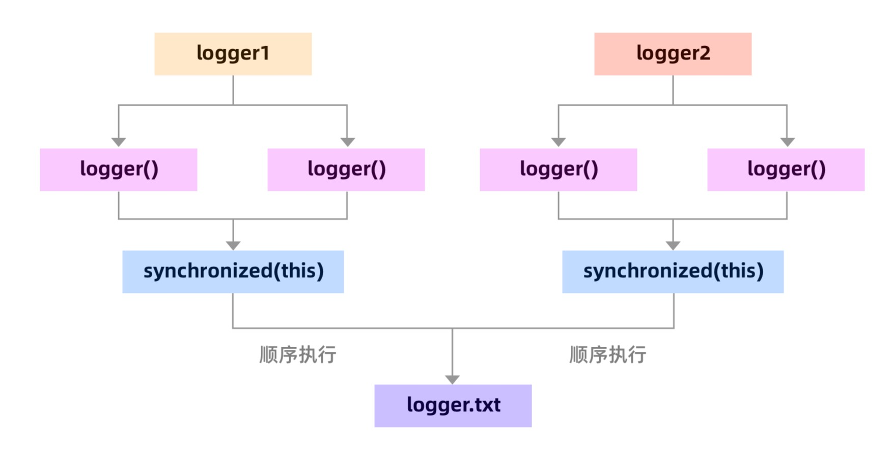
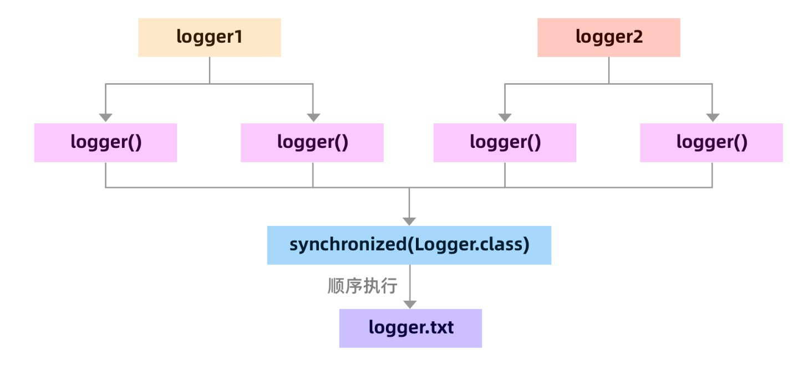
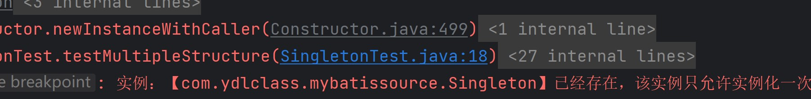
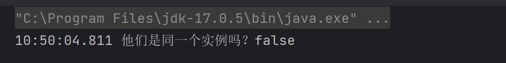
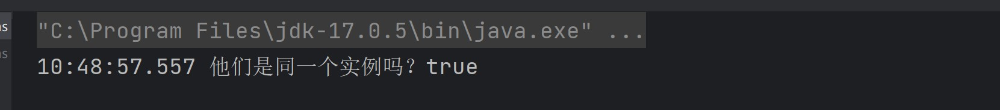
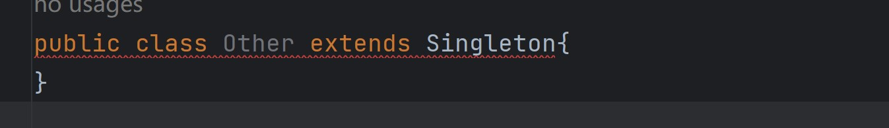
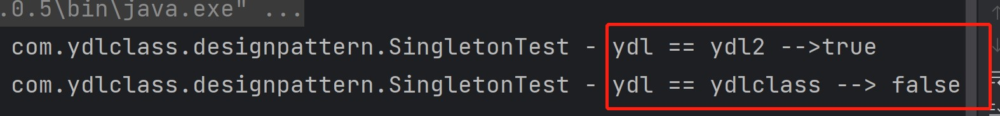
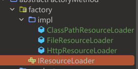

# 单例设计模式 

**单例设计模式**（Singleton Design
Pattern）理解起来非常简单。一个类只允许创建

一个对象（或者实例），那这个类就是一个**单例类**，这种设计模式就叫作单例设计模

式，简称单例模式。

**一、为什么要使用单例**

## 表示全局唯一 

如果有些数据在系统中**应该且只能保存一份**，那就应该设计为单例类。如：

> 配置类：在系统中，我们只有一个配置文件，当配置文件被加载到内存之后，应
>
> 该被映射为一个唯一的【配置实例】，此时就可以使用单例，当然也可以不用。
>
> 全局计数器：我们使用一个全局的计数器进行数据统计、生成全局递增ID等功
>
> 能。若计数器不唯一，很有可能产生统计无效，ID重复等。

以上代码也可以实现全局ID生成器的代码。

```java
public class GlobalCounter {
        private AtomicLong atomicLong = new AtomicLong(0);
        private static final GlobalCounter instance = new GlobalCounter();

        // 私有化无参构造器
        private GlobalCounter() {
        }

        public static GlobalCounter getInstance() {
            return instance;
        }

        public long getId() {
            return atomicLong.incrementAndGet();
        }
    }

    // 查看当前的统计数量
    long courrentNumber = GlobalCounter.getInstance().getId();
```


## 处理资源访问冲突

如果让我们设计一个日志输出的功能，你不要跟我杠，即使市面存在很多的日志框

架，我们也要自己设计。

如下，我们写了简单的小例子：

```java
public class Logger {
        private String basePath = "D://info.log";
        private FileWriter writer;
        public Logger() {
            File file = new File(basePath);
            try {
                writer = new FileWriter(file, true); //true表示追加写入
            } catch (IOException e) {
                throw new RuntimeException(e);
            }
        }
        public void log(String message) {
            try {
                writer.write(message);
            } catch (IOException e) {
                throw new RuntimeException(e);
            }
        }
        public void setBasePath(String basePath) {
            this.basePath = basePath;
        }
    }
```


当然，任何的设计都不是拍脑门，这是我们写的v1版本，他很可能会存在很多的
bug，设计结束之后，我们可能是这样使用的：

```java
@RestController("user")
    public class UserController {
        public Result login(){
// 登录成功
            Logger logger = new Logger();
            logger.log("tom logged in successfully.");
// ...
            return new Result();
        }
    }
```

当然，其他千千万的代码，我们都是这样写的。这样就会产生如下的问题：**多个
logger实例，在多个线程中，同时操作同一个文件，就可能产生相互覆盖的问题。**因为tomcat处理每一个请求都会使用一个新的线程（暂且不考虑多路复用）。此时

日志文件就成了一个**共享资源**，但凡是多线程访问共享资源，我们都要考虑并发修改

产生的问题。

有的同学可能想到如下的解决方案，加锁呀，代码如下：

```java
public synchronized void log(String message) {
        try {
            writer.write(message);
        } catch (IOException e) {
            throw new RuntimeException(e);
        }
    }
```

事实上这样加锁毫无卵用，方法级别的锁可以保证new出来的同一个实例多线程下可以同步执行log方法，然而你却new了很多：

{width="6.17995406824147in"
height="3.209825021872266in"}

其实，writer方法本身也是加了锁的，我们这样加锁就没有了意义：

```java
public void write(String str, int off, int len) throws IOException {
        synchronized (lock) {
            char cbuf[];
            if (len <= WRITE_BUFFER_SIZE) {
                if (writeBuffer == null) {
                    writeBuffer = new char[WRITE_BUFFER_SIZE];
                }
                cbuf = writeBuffer;
            } else { // Don't permanently allocate very large buffers.
                cbuf = new char[len];
            }
            str.getChars(off, (off + len), cbuf, 0);
            write(cbuf, 0, len);
        }
    }
```

当然，加锁是一定能解决共享资源冲突问题的，我们只要放大锁的范围从【this】到

【class】，这个问题也是能解决的，代码如下：


{width="6.17995406824147in"
height="2.813807961504812in"}

```java
public void log(String message) {
        synchronized (Logger.class) {
            try {
                writer.write(message);
            } catch (IOException e) {
                throw new RuntimeException(e);
            }
        }
    }
```


从以上的内容我们也发现了：

> 如果使用单个实例输出日志，锁【this】即可。
>
> 如果要保证JVM级别防止日志文件访问冲突，锁【class】即可。
>
> 如果要保证集群服务级别的防止日志文件访问冲突，加分布式锁即可。

如果我们是一个简单工程，对日志输入要求不高。单例模式的解决思路就十分合适，既然同一个Logger无法并行输出到一个文件中，那么针对这个日志文件创建多个Logger实例也就失去了意义，如果工程要求我们所有的日志输出到同一个日志文件中，这样其实并不需要创建大量的Logger实例，这样的好处有：

> 一方面节省内存空间。
>
> 另一方面节省系统文件句柄（对于操作系统来说，文件句柄也是一种资源，不能
>
> 随便浪费）。

按照这个设计思路，我们实现了 Logger 单例类。具体代码如下所示：

```java
public class Logger {
	private String basePath = "D://log/";
	private static Logger instance = new Logger();
    private FileWriter writer;
    private Logger() {
        File file = new File(basePath);
        try {
            writer = new FileWriter(file, true); //true表示追加写入
        } catch (IOException e) {
            throw new RuntimeException(e);
        }
    }
    public static Logger getInstance(){
        return instance;
    }
    public void log(String message) {
        try {
            writer.write(message);
        } catch (IOException e) {
            throw new RuntimeException(e);
        }
    }
    public void setBasePath(String basePath) {
        this.basePath = basePath;
    }
}
```


除此之外，并发队列（比如 Java ~中的~BlockingQueue~）也可以解决这个问题：多个~线程同时往并发队列里写日志，一个单独的线程负责将并发队列中的数据写入到日志文件。这种方式实现起来也稍微有点复杂。当然，我们还可将其**延伸至消息队列处理****分布式系统的日志**。

## **如何实现一个单例**

常见的单例设计模式，有如下五种写法，在编写单例代码的时候要注意以下几点：

1.  **构造器需要私有化**

2.  **暴露一个公共的获取单例对象的接口**

3.  **是否支持懒加载（延迟加载）**

4.  **是否线程安全**

### 饿汉式 

饿汉式的实现方式比较简单。在类加载的时候，instance静态实例就已经创建并初始化好了，所以，instance实例的创建过程是线程安全的。从名字中我们也可以看出这一点。具体的代码实现如下所示：

```java
public class EagerSingleton {
        private static Singleton instance = new Singleton();
        private Singleton (){}
        public static Singleton getInstance() {
            return instance;
        }
    }
```


事实上，恶汉式的写法在工作中反而应该被提倡，面试中不问，只是应为他简单。很多人觉得饿汉式不能支持懒加载，即使不使用也会浪费资源，一方面是内存资源，一方面会增加初始化的开销。

1.  现代计算机不缺这一个对象的内存。

2.  如果一个实例初始化的过程复杂那更加应该放在启动时处理，避免卡顿或者构造问题发生在运行时。满足fail-fast 的设计原则。

### 懒汉式 

有饿汉式，对应地，就有懒汉式。懒汉式相对于饿汉式的优势是支持延迟加载，具体的代码实现如下所示：

```java
public class LazySingleton {
        private static Singleton instance;
        private Singleton (){}
        public static Singleton getInstance() {
            if (instance == null) {
                instance = new Singleton();
            }
            return instance;
        }
    }
```


以上的写法本质上是有问题，当面对大量并发请求时，其实是无法保证其单例的特点的，很有可能会有超过一个线程同时执行了`new Singleton()`; 当然解决他的方案也很简单，加锁呗：

```java
public class Singleton {
        private static Singleton instance;
        private Singleton (){}
        public synchronized static Singleton getInstance() {
            if (instance == null) {
                instance = new Singleton();
            }
            return instance;
        }
    }
```


以上的写法确实可以保证`jvm`中有且仅有一个单例实例存在，但是方法上加锁会极大的降低获取单例对象的并发度。同一时间只有一个线程可以获取单例对象，为了解决以上的方案则有了第三种写法。

### 双重检查锁 

饿汉式不支持延迟加载，懒汉式有性能问题，不支持高并发。那我们再来看一种既支持延迟加载、又支持高并发的单例实现方式，也就是双重检测实现方式：

在这种实现方式中，只要 `instance` 被创建之后，即便再调用`getInstance()`函数也不会再进入到加锁逻辑中了。所以，这种实现方式解决了懒汉式并发度低的问题。具体的代码实现如下所示：

```java
public class DclSingleton {
	// volatile如果不加可能会出现半初始化的对象
	// 现在用的高版本的 Java 已经在 JDK 内部实现中解决了这个问题（解决的方法很
        简单，只要把对象 new 操作和初始化操作设计为原子操作，就自然能禁止重排序）,
        为了兼容性我们加上
        private volatile static Singleton singleton;
        private Singleton (){}
        public static Singleton getInstance() {
            if (singleton == null) {
                synchronized (Singleton.class) {
                    if (singleton == null) {
                        singleton = new Singleton();
                    }
                }
            }
            return singleton;
        }
    }
```


### 静态内部类 

我们再来看一种比双重检测更加简单的实现方法，那就是利用 Java的静态内部类。它有点类似饿汉式，但又能做到了延迟加载。具体是怎么做到的呢？我们先来看它的代码实现。

```java
public class InnerSingleton {
        /** 私有化构造器 */
        private Singleton() {
        }
        /** 对外提供公共的访问方法 */
        public static Singleton getInstance() {
            return SingletonHolder.INSTANCE;
        }
        /** 写一个静态内部类，里面实例化外部类 */
        private static class SingletonHolder {
            private static final Singleton INSTANCE = new Singleton();
        }
}
```


`SingletonHolder` 是一个静态内部类，当外部类
`Singleton`被加载的时候，并不会创建 `SingletonHolder` 实例对象。只有当调用`getInstance()` 方法时，`SingletonHolder` 才会被加载，这个时候才会创建 `instance`。`insance`的唯一性、创建过程的线程安全性，都由 JVM来保证。所以，这种实现方法既保证了线程安全，又能做到延迟加载。

### 枚举

后，我们介绍一种 简单的实现方式，基于枚举类型的单例实现。这种实现方式通过 Java枚举类型本身的特性，保证了实例创建的线程安全性和实例的唯一性。具体的代码如下所示：

```java
public enum EnumSingleton {
	INSTANCE；
}
```

这是一个 简单的实现，因为枚举类中，每一个枚举项本身就是一个单例的：更通用的写法如下：

```java
public class EnumSingleton {
        private Singleton(){
        }
        public static enum SingletonEnum {
            EnumSingleton;
            private EnumSingleton instance = null;
            private SingletonEnum(){
                instance = new Singleton();
            }
            public EnumSingleton getInstance(){
                return instance;
            }
        }
    }
```


事实上我们还可以将单例项作为枚举的成员变量，我们的累加器可以这样编写：

```java
public enum GlobalCounter {
        INSTANCE;
        private AtomicLong atomicLong = new AtomicLong(0);
        public long getNumber() {
            return atomicLong.incrementAndGet();
        }
    }
```


这种写法是Head-first中推荐的写法，他除了可以和其他的方式一样实现单例，他还能有效的防止反射入侵。

### 反射入侵

事实上，我们想要**阻止其他人构造实例**仅仅私有化构造器还是不够的，因为我们还可以**使用反射获取私有构造器**进行构造，当然使用枚举的方式是可以解决这个问题的，对于其他的书写方案，我们通过下边的方式解决：

```java
public class Singleton {
        private volatile static Singleton singleton;
        private Singleton (){
            if(singleton != null)
                throw new RuntimeException("实例：【"
                        + this.getClass().getName() + "】已经存在，该实例只允许实例化一次");
        }
        public static Singleton getInstance() {
            if (singleton == null) {
                synchronized (Singleton.class) {
                    if (singleton == null) {
                        singleton = new Singleton();
                    }
                }
            }
            return singleton;
        }
    }
```


此时方法如下：

```java
@Test
    public void testReflect() throws NoSuchMethodException,
            InvocationTargetException, InstantiationException, IllegalAccessException {
        Class<DclSingleton> clazz = DclSingleton.class;
        Constructor<DclSingleton> constructor = clazz.getDeclaredConstructor();
        constructor.setAccessible(true);
        boolean flag = DclSingleton.getInstance() == constructor.newInstance();
        log.info("flag -> {}",flag);
    }
```


结果如下：

{width="6.179955161854768in"
height="0.7503488626421697in"}

### **序列化与反序列化安全**

事实上，到目前为止，我们的单例依然是有漏洞的，看如下代码：

```java
@Test
    public void testSerialize() throws IllegalAccessException,
            NoSuchMethodException, IOException, ClassNotFoundException {
// 获取单例并序列化
        Singleton singleton = Singleton.getInstance();
        FileOutputStream fout = new FileOutputStream("D://singleton.txt");
        ObjectOutputStream out = new ObjectOutputStream(fout);
        out.writeObject(singleton);
// 将实例反序列化出来
        FileInputStream fin = new FileInputStream("D://singleton.txt");
        ObjectInputStream in = new ObjectInputStream(fin);
        Object o = in.readObject();
        log.info("他们是同一个实例吗？{}",o == singleton);
    }
```


我们发现，即使我们废了九牛二虎之力还是没能阻止他返回false，结果如下：

{width="6.179955161854768in"
height="0.7711920384951881in"}

`readResolve()`方法可以用于替换从流中读取的对象，在进行反序列化时，会尝试执行`readResolve`方法，并将返回值作为反序列化的结果，而不会克隆一个新的实例，保证jvm中仅仅有一个实例存在：

```java
public class Singleton implements Serializable {
        // 省略其他的内容
        public static Singleton getInstance() {
        }
        // 需要加这么一个方法
        public Object readResolve(){
            return singleton;
        }
    }
```


{width="6.17995406824147in"
height="0.6773982939632546in"}

一切问题迎刃而解。

## **源码应用**

事实上，我们在JDK或者其他的通用框架中很少能看到标准的单例设计模式，这也就意味着他确实很经典，但严格的单例设计确实有它的问题和局限性，我们先看看在源码中的一些案例。

### jdk的中的单例 

jdk中有一个类的实现是一个标准单例模式-\>**Runtime类**，该类封装了运行时的环境。每个Java 应用程序都有一个 Runtime类实例，使应用程序能够与其运行的环境相连接。一般不能实例化一个Runtime对象，应用程序也不能创建自己的 Runtime类实例，但可以通过 `getRuntime` 方法获取当前Runtime运行时对象的引用。

```java
public class Runtime {
// 典型的饿汉式
	private static final Runtime currentRuntime = new Runtime();
	private static Version version;
    public static Runtime getRuntime() {
        return currentRuntime;
    }
    /** Don't let anyone else instantiate this class */
    private Runtime() {}
    public void exit(int status) {
        @SuppressWarnings("removal")
        SecurityManager security = System.getSecurityManager();
        if (security != null) {
            security.checkExit(status);
        }
        Shutdown.exit(status);
    }
    public Process exec(String command) throws IOException {
        return exec(command, null, null);
    }
    public native long freeMemory();
    public native long maxMemory();
    public native void gc();
```

测试用例：

```java
    @Test
    public void testRunTime() throws IOException {
        Runtime runtime = Runtime.getRuntime();
        Process exec = runtime.exec("ping 127.0.0.1");
        InputStream inputStream = exec.getInputStream();
        byte[] buffer = new byte[1024];
        int len;
        while ((len = inputStream.read(buffer)) > 0 ){
            System.out.println(new String(buffer,0,len, Charset.forName("GBK")));
		}
		long maxMemory = runtime.maxMemory();
		log.info("maxMemory-->{}", maxMemory);
}
```


### **Mybatis中的单例**

Mybaits中的org.apache.ibatis.io.VFS使用到了单例模式。VFS就是Virtual File System的意思，mybatis通过VFS来查找指定路径下的资源。查看VFS以及它的实现

类，不难发现，VFS的角色就是对更"底层"的查找指定资源的方法的封装，将复杂的"底层"操作封装到易于使用的高层模块中，方便使用者使用，我们在mybatis源码课中进行了介绍，有兴趣的同学可以前往观看。接下来我们阅读其源码，其中省略了和单例无关的其他代码，并思考他使用了哪一种形式的单例：

```java
public class public abstract class VFS {
        // 使用了内部类
        private static class VFSHolder {
            static final VFS INSTANCE = createVFS();
            @SuppressWarnings("unchecked")
            static VFS createVFS() {
// ...省略创建过程
                return vfs;
            }
        }
        public static VFS getInstance() {
            return VFSHolder.INSTANCE;
        }
    }
```


## **单例存在的问题**

尽管单例是一个很经典的设计模式，但在实际的开发中，我们也很少**按照严格的定义**去使用它，以上的知识大多是为了理解和面试而使用和学习，有些人甚至认为单例是一种反模式（anti-pattern），压根就不推荐使用。大部分情况下，我们在项目中使用单例，都是用它来表示一些全局唯一类，比如配置信息类、连接池类、ID生成器类。单例模式书写简洁、使用方便，在代码中，我们不需要创建对象。但是，这种使用方法有点类似硬编码（hard code），会带来诸多问题，所以我们一般会使用**spring的单例容器作为替代方案**。那单例究竟存在哪些问题呢？

### 无法支持面向对象编程 

我们知道，OOP的三大特性是**封装、继承、多态**。单例将**构造私有化**，直接导致的结果就是，他无法成为其他类的父类，这就相当于直接放弃了继承和多态的特性，也就相当于损失了可以应对未来需求变化的扩展性，以后一旦有扩展需求，比如写一个类似的具有绝大部分相同功能的单例，我们不得不新建一个十分【雷同】的单例。

{width="6.17995406824147in" height="0.89625in"}

### 极难的横向扩展 

我们知道，单例类只能有一个对象实例。如果未来某一天，一个实例已经无法满足我们的需求，我们需要创建一个，或者更多个实例时，就必须对源代码进行修改，无法友好扩展。

有人一定会说"这不是沙雕"吗？明明一个实例无法满足，你却要设计成单例？事实上，这种场景是很常见的，因为我们要明白一个道理，永远不变的就是"永远在变"。人生的开始，你可能觉得自己有一辆车就够了，但是将来有一天你变成了亿万富翁，你可能就会想买一百辆。

{width="6.17995406824147in"
height="1.6361767279090114in"}

在系统设计初期，我们觉得系统中只应该有一个数据库连接池，这样能方便我们控制对数据库连接资源的消耗。所以，我们把数据库连接池类设计成了单例类。但之后我们发现，系统中有些 SQL 语句运行得非常慢。这些 SQL语句在执行的时候，长时间占用数据库连接资源，导致其他 SQL请求无法响应。为了解决这个问题，我们希望将慢 SQL 与其他 SQL隔离开来执行。为了实现这样的目的，我们可以在系统中创建两个数据库连接池，慢 SQL 独享一个数据库连接池，其他 SQL
独享另外一个数据库连接池，这样就能避免慢 SQL 影响到其他 SQL 的执行。如果我们将数据库连接池设计成单例类，显然就无法适应这样的需求变更，也就是

说，单例类在某些情况下会影响代码的扩展性、灵活性。所以，数据库连接池、线程池这类的资源池，好还是不要设计成单例类。实际上，一些开源的数据库连接池、线程池也确实没有设计成单例类。

## **不同作用范围的单例**

首先，我们重新看一下单例的定义："一个类只允许创建唯一一个对象（或者实例），那这个类就是一个单例类，这种设计模式就叫作单例设计模式，简称单例模式。"定义中提到，"一个类只允许创建唯一一个对象"。那对象的唯一性的作用范围是什么呢？在标准的单例设计模式中，其单例是进程唯一的，**也就意味着一个项目启动，在其整个运行环境中只能有一个实例。**事实上，在实际的工作当中，我们能够看到极多【只有一个实例的情况】，但是大多并不是标准的单例设计模式，如：

1.  使用ThreadLocal实现的线程级别的单一实例。

2.  使用spring实现的容器级别的单一是实例。

3.  使用分布式锁实现的集群状态的唯一实例。

以上的情况都不是标准的单例设计模式，但我们可以将其看做单例设计模式的扩展，我们以前两种情况为例进行介绍。

### 线程级别的单例 

刚刚我们讲了单例类对象是进程唯一的，一个进程只能有一个单例对象。那如何实现一个线程唯一的单例呢？如果在不允许使用`ThreadLocal`的时候我们可能想到如下的解决方案，定义一个全局的线程安全的`ConcurrentHashMap`，以线程`id`为`key`，以实例为`value`，每个线程的存取都从共享的map中进行操作，代码如下：

```JAVA
public class Connection {
        private static final ConcurrentHashMap<Long, Connection> instances
                = new ConcurrentHashMap<>();
        private Connection() {}
        public static Connection getInstance() {
            Long currentThreadId = Thread.currentThread().getId();
            instances.putIfAbsent(currentThreadId, new Connection());
            return instances.get(currentThreadId);
        }
    }
```


事实上ThreadLocal的原理也大致如此：

项目中的ThreadLocal的使用场景：

在spring使用ThreadLocal对当前线程和一个连接资源进行绑定，实现事务管理

```java
public abstract class TransactionSynchronizationManager {
	// 本地线程中保存了当前的连接资源，key(datasource)--> value(connection)
private static final ThreadLocal<Map<Object, Object>> resources =
            new NamedThreadLocal<>("Transactional resources");
    // 保存了当前线程的事务同步器
    private static final ThreadLocal<Set<TransactionSynchronization>>
            synchronizations = new NamedThreadLocal<>("Transaction synchronizations");
    // 保存了当前线程的事务名称
    private static final ThreadLocal<String> currentTransactionName =
            new NamedThreadLocal<>("Current transaction name");
    // 保存了当前线程的事务是否只读
    private static final ThreadLocal<Boolean> currentTransactionReadOnly =
            new NamedThreadLocal<>("Current transaction read-only status");
    // 保存了当前线程的事务隔离级别
    private static final ThreadLocal<Integer> currentTransactionIsolationLevel =
            new NamedThreadLocal<>("Current transaction isolation level");
    // 保存了当前线程的事务的活跃状态
    private static final ThreadLocal<Boolean> actualTransactionActive =
            new NamedThreadLocal<>("Actual transaction active");
}
```

在spring中使用RequestContextHolder，可以再一个线程中轻松的获取request、response和session。如果将来我们在静态方法，切面中想获取一个
request~对象就可以使用这个类。

```java
public abstract class RequestContextHolder {
        private static final ThreadLocal<RequestAttributes> requestAttributesHolder =
                new NamedThreadLocal("Request attributes");
        private static final ThreadLocal<RequestAttributes>
                inheritableRequestAttributesHolder = new
                NamedInheritableThreadLocal("Request context");
        @Nullable
        public static RequestAttributes getRequestAttributes() {
            RequestAttributes attributes =
                    (RequestAttributes)requestAttributesHolder.get();
            if (attributes == null) {
                attributes = (RequestAttributes)inheritableRequestAttributesHolder.get();
            }
            return attributes;
        }
}
```

ServletRequestAttributes：

```java
public class ServletRequestAttributes extends AbstractRequestAttributes {
        public static final String DESTRUCTION_CALLBACK_NAME_PREFIX =
                ServletRequestAttributes.class.getName() + ".DESTRUCTION_CALLBACK.";
        protected static final Set<Class<?>> immutableValueTypes = new HashSet(16);
        private final HttpServletRequest request;
        @Nullable
        private HttpServletResponse response;
        @Nullable
        private volatile HttpSession session;
        private final Map<String, Object> sessionAttributesToUpdate;
    }
```


在pageHelper使用ThreadLocal保存分页对象：

```java
public abstract class PageMethod {
        protected static final ThreadLocal<Page> LOCAL_PAGE = new
                ThreadLocal<Page>();
        protected static boolean DEFAULT_COUNT = true;
    }
```


### 容器范围的单例 

有的时候我们将单例的作用范围由进程切换到一个容器，可能会更加方便我们进行单例对象的管理。这也是spring作为java生态大哥大核心思想。spring通过提供一个单例容器，来确保一个实例在容器级别单例，并且可以在容器启动时完成初始化，他的优势如下：

1.  所有的bean以单例形式存在于容器中，避免大量的对象被创建，造成jvm内存抖动严重，频繁gc。

2.  程序启动时，初始化单例bean，满足fast-fail，将所有构建过程的异常暴露在启动时，而非运行时，更加安全。

3.  缓存了所有单例bean，启动的过程相当于预热的过程，运行时不必进行对象创建，效率更高。
    4、容器管理bean的生命周期，结合依赖注入使得解耦更加彻底、扩展性无敌。

我们学习玩了工厂模式后，会尝试编写一个DI容器，这里就不赘述了。

### 日志中的多例 

我们看一个例子，在日志框架中，我们可以通过LoggerFactory.getLogger(\"ydl\")方法获取一个实例，我们做如下的测试：

```java
@Test
    public void testLogger(){
        Logger ydl = LoggerFactory.getLogger("ydl");
        Logger ydl2 = LoggerFactory.getLogger("ydl");
        Logger ydlclass = LoggerFactory.getLogger("ydlclass");
        log.info("ydl == ydl2 -->{}", ydl == ydl2);
        log.info("ydl == ydlclass --> {}", ydl == ydlclass);
    }
```


其结果如下：

{width="6.17995406824147in"
height="0.719083552055993in"}

我们发现，如果我们使用相同的名字，他会返回同一个实例，否则就是另一个实例，这其实就是一个多例，一个类可以创建多个对象，但是个数是有限制的，他可是是具体的约定好的个数，比如5，也可以按照类型的个数创建。这种多例模式有点类似工厂模式。它跟工厂模式的不同之处是，多例模式创建的对象都是同一个类的对象，而工厂模式创建的是**不同子类的对象**，关于这一点，下一节课中就会讲到。实际上，它还有点类似享元模式，两者的区别等到我们讲到享元模式的

时候再来分析。除此之外，实际上，**枚举类型也相当于多例模式**，一个类型只能对应一个对象，一个类可以创建多个对象。事实上，如果你不相信别人，或者这个实例及其重要，我们可以使用标准的单例实现方式强制保障一个类只被实例化一次，事实上绝大部分的类也可以通过工厂模式、IOC 容器（比如 Spring IOC容器）来保证，甚至指定规则由程序员自己保证，只要满足业务要求，扩展性要求，具体方案可以自由设定。

# 工厂设计模式 

一般情况下，工厂模式分为三种更加细分的类型：简单工厂、工厂方法和抽象工厂。在 GoF 的《设计模式》一书中，它将简单工厂模式看作是工厂方法模式的一种特例，所以工厂模式只被分成了工厂方法和抽象工厂两类。实际上，前面一种分类方法更加常见，所以，在今天的讲解中，我们沿用第一种分类方法。在这三种细分的工厂模式中，简单工厂、工厂方法原理比较简单，在实际的项目中也比较常用。而抽象工厂的原理稍微复杂点，在实际的项目中相对也不常用。所以，我们今天讲解的重点是前两种工厂模式。

## **简单工厂（Simple Factory）**

简单工厂叫作静态工厂方法模式（Static Factory Method Pattern）。学习此设计模式时，我们会从一个案例不断优化带着大家领略工厂设计模式的魅力。

现在有一个场景，我们需要一个资源加载器，他要**根据不用的url进行资源加载**，但是如果我们将**所有的加载实现代码全部封装在了一个load方法**中，就会导致一个类很大，同时扩展性也非常差，当想要添加新的前缀解析其他类型的url时，发现需要修改大量的源代码，我们的代码如下：


定义两个需要之后会用到的类，非常简单：

```java
/**
 * @author banyanmei
 */
@Data
@NoArgsConstructor
@AllArgsConstructor
public class Resource {
    private String url;

    @Override
    public String toString() {
        return "Resource{" +
                "url='" + url + '\'' +
                '}';
    }
}
```


源码如下：

```java
public class ResourceLoader {
        public Resource load(String filePath) {
            String prefix = getResourcePrefix(filePath);
            Resource resource = null;
            if("http".equals(type)){
// ..发起请求下载资源... 可能很复杂
                return new Resource(url);
            } else if ("file".equals(type)) {
// ..建立流，做异常处理等等
                return new Resource(url);
            } else if ("classpath".equals(type)) {
// ...
                return new Resource(url);
            } else {
                return new Resource("default");
            }
            return resource;
        }
        private String getPrefix(String url) {
            if(url == null || "".equals(url) || !url.contains(":")){
                throw new ResourceLoadException("此资源url不合法.");
            }
            String[] split = url.split(":");
            return split[0];
        }
    }
```


在上边的案例中，存在很多的if分支，如果分支数量不多，且不需要扩展，这样的编写方式当然没错，然而在实际的工作场景中，我们的业务代码可能会很多，分支逻辑也可能十分复杂，这个时候简单工厂设计模式就要发挥作用了。

我们可以看到不管有多少个分支逻辑，他的本质就是一个，**创造一个资源产品**，我们只需要创建一个工厂类，将创建资源的能力交给工厂即可：

```java
/**
 * @author banyanmei
 * 简单工厂模式
 * 优点：简单，易于理解
 * 缺点：不符合开闭原则，每次新增类型都需要修改工厂类
 */
@Slf4j
public class ResourceFactory {

    public static Resource create(String type, String url) {
        if ("http".equals(type)) {
            // ..发起请求下载资源... 可能很复杂
            log.info("http");
            return new Resource(url);
        } else if ("file".equals(type)) {
            // ..建立流，做异常处理等等
            log.info("file");
            return new Resource(url);
        } else if ("classpath".equals(type)) {
            // ...
            log.info("classpath");
            return new Resource(url);
        } else {
            log.info("default");
            return new Resource("default");
        }
    }
}
```


有了上边的工厂类，我们将【创建资源产品】这个单一的能力赋予产品工厂，这样能更好的符合单一原则。有了工厂之后，我们的主要逻辑就会简化：

```java
public class FResourceLoader {
    public Resource load(String url) {
        String prefix = getPrefix(url);
        return ResourceFactory.create(prefix, url);
    }

    public String getPrefix(String url) {
        if (url == null || !url.contains(":")) {
            throw new ResourceLoadException("url不能为空");
        }
        return url.substring(0, url.indexOf(":"));
    }
    
}
```


这就是简单工厂设计模式，提取一个工厂类，工厂会根据传入的不同的类型，创建不同的产品，好处如下：

将**创建对象的过程交给工厂类**、其他业务需要某个产品时，直接使用create（方法名字不重要）创建即可这样的好处是：

1.  工厂将创建的过程进行封装，不需要关系创建的细节，更加符合面向对象思想

2.  这样主要的业务逻辑不会被创建对象的代码干扰，代码更易阅读

3.  产品的创建可以独立测试，更将容易测试

4.  独立的工厂类只负责创建产品，更加符合单一原则

需要修改或者添加新的功能，我们还是要修改源代码呀，这不符合开闭原则

确实如此，但是原则这种东西，一定要结合业务创建，在**创建对象的过程相对简单，业务改动不是很频繁**的情况下，适当的不按原则出牌才是更好的选择，只是偶尔修改一下`ResourceLoaderFactory`代码，稍微不符合开闭原则，也是完全可以接受的。

因为这样可以更加简单的编码，在进行软件开发时**编码难度也是一个很重要的考量标准**。我们一定要在合理设计和过度设计之间进行权衡，明白一点，**适合的才是好的**。

绝大部分工厂类都是以"Factory"单词结尾，但也不是必须的，比如 Java 中的`DateFormat`、`Calender`。除此之外，工厂类中创建对象的方法一般都是 create
开头，比如代码中的 `createParser()`，但有的也命名为~ `getInstance()`、`createInstance()`、`newInstance()`，有的甚至命名为 `valueOf()`（比如Java String 类的 valueOf() 函数等等，这个我们根据具体的场景和习惯来命名就好。

## **工厂方法（Factory Method）**

如果有一天，我们的if分支逻辑不断膨胀，有变为**肿瘤代码**的可能，就有必要将if 分支逻辑去掉，那又该怎么办呢？比较经典的处理方法就是利用多态。按照多态的实现思路，对上面的代码进行重构。我们会为每一个 Resource创建一个独立的工厂类，形成一个个小作坊，将每一个实例的创建过程交给工厂类完成，重构之后的代码如下所示：

之前是一个**大而全的工厂，**一个工厂需要创建不同的产品，工厂方法讲究的是**工厂也要专而精**，一个工厂只创建一种资源（产品），奔驰工厂只负责生产奔驰，宝马工厂只负责生产宝马。回到我们的例子中，每一种url加载成不同的资源产品，那每一种资源都可以由一个独立的`ResourceFactory`生产，在这个案例中我们觉得`ResourceLoader`这个名字更加合适。为了实现这一种场景，我们需要将生产资源的工厂类进行抽象：

```java
public interface IResourceLoader {
    Resource load(String url);
}
```

并为每一种资源创建与之匹配的实现：

```java
public class ClassPathResourceLoader implements IResourceLoader{
    @Override
    public Resource load(String url) {
        return new Resource(url);
    }
}
```


实际上，这就是工厂方法模式的典型代码实现。这样当我们新增一种读取资源的方式时，只需要新增一个实现，并实现 `IResourceLoader`
接口即可。所以，**工厂方法模式比起简单工厂模式更加符合开闭原则。**

但是每次增加工厂仍然会修改`FResourceLoader`

```java
@Component
public class FResourceLoader {
    public Resource load(String url) {
        String prefix = getPrefix(url);
        IResourceLoader resourceLoader;
        if ("http".equals(prefix)) {
            resourceLoader = new HttpResourceLoader();
        } else if ("classpath".equals(prefix)) {
            resourceLoader = new ClassPathResourceLoader();
        } else if ("file".equals(prefix)) {
            resourceLoader = new FileResourceLoader();
        } else {
            throw new ResourceLoadException("不支持的资源类型");
        }
        //加一个工厂就要加一个ifesle
        return resourceLoader.load(url);
    }

    public String getPrefix(String url) {
        if (url == null || !url.contains(":")) {
            throw new ResourceLoadException("url不能为空");
        }
        return url.substring(0, url.indexOf(":"));
    }
}
```


一个工厂的缓存来统一管理工厂实例，以后使用工厂会更加的简单，代码如下：

```java
private static Map<String, IResourceLoader> resourceLoaderMap;
    static {
        resourceLoaderMap.put("http", new HttpResourceLoader());
        resourceLoaderMap.put("classpath", new ClassPathResourceLoader());
        resourceLoaderMap.put("file", new FileResourceLoader());
    }
```

事实上，`ResourceLoader`的核心方法就可以简化成这个样子了：

```java
public Resource load(String url) {
        String prefix = getPrefix(url);
        //版本1
//        IResourceLoader resourceLoader;
//        if ("http".equals(prefix)) {
//            resourceLoader = new HttpResourceLoader();
//        } else if ("classpath".equals(prefix)) {
//            resourceLoader = new ClassPathResourceLoader();
//        } else if ("file".equals(prefix)) {
//            resourceLoader = new FileResourceLoader();
//        } else {
//            throw new ResourceLoadException("不支持的资源类型");
//        }
//        //加一个工厂就要加一个ifesle
//        return resourceLoader.load(url);
        //版本2
        try {
            return resourceLoaderMap.get(prefix).load(url);
        } catch (Exception e) {
            throw new ResourceLoadException("不支持的资源类型");
        }
    }
```

当然你如果觉得还是不够，你觉得修改需求还是不够灵活，仍然需要修改static中的代码，我们可以这样做，搞一个配置文件如下，将我们的工厂类进行配置，如下：

```properties
http=com.ydlclass.factoryMethod.resourceFactory.impl.HttpResourceLoader
file=com.ydlclass.factoryMethod.resourceFactory.impl.FileResourceLoader
classpath=com.ydlclass.factoryMethod.resourceFactory.impl.ClassPathResourceLoader
default=com.ydlclass.factoryMethod.resourceFactory.impl.DefaultResourceLoader
```

这样我们可以在static中这样编写代码，让我完全满足开闭原则：

```java
//版本3
    static {
        InputStream resourceAsStream = Thread.currentThread().getContextClassLoader()
                .getResourceAsStream("fresourceloader.properties");
        Properties properties = new Properties();
        try {
            properties.load(resourceAsStream);
            //拿到类名，通过反射创建对象，然后放到集合中
            for (Object key : properties.keySet()) {
                String className = properties.getProperty(key.toString());
                Class<?> clazz = Class.forName(className);
                IResourceLoader resourceLoader = (IResourceLoader) clazz.newInstance();
                resourceLoaderMap.put(key.toString(), resourceLoader);
            }
        } catch (IOException | InstantiationException | ClassNotFoundException | IllegalAccessException e) {
            throw new RuntimeException(e);
        }
    }
```


以后我们想新增或删除一个`resourceLoader`只需要写一个类实现`IResourceLoader`接口，并在配置文件中进行配置即可。此时此刻我们已经看不到if-else的影子了。

我们的代码中产品是简单单一的类，事实上，在工作中，我们的产品可能是及其复杂的，我们同样需要对整个产品线进行抽象，为不同的具体的产品需要继承这个抽象类：

```java
public abstract class AbstractResource {
    private String url;

    public AbstractResource() {
    }

    public AbstractResource(String url) {
        this.url = url;
    }

    protected void shardMethod(String url) {
        System.out.println("shardMethod" + url);
    }

    public abstract void load();

    @Override
    public String toString() {
        return "AbstractResource{" +
                "url='" + url + '\'' +
                '}';
    }
}
```

抽象类的具体实现

```java
@Slf4j
@Component
public class ClasspathResource extends AbstractResource {
    public ClasspathResource() {
    }

    public ClasspathResource(String url) {
        super(url);
    }

    @Override
    public void load() {
        log.info("ClasspathResource load");
    }
}
```


其他产品同理，我们的工厂类也需要面向产品的抽象进行编程了：

```java
public interface IResourceLoader {
    AbstractResource load(String url);
}
```

具体实现 

```java
@Slf4j
public class ClassPathResourceLoader implements IResourceLoader {

    @Override
    public AbstractResource load(String url) {
        return new ClasspathResource(url);
    }
}
```



**这样每个工厂面对的是产品的抽象，而创建者也只需面对工厂的抽象，这样也就是实现依赖倒置，也就是说高层模块不依赖与低层模块，其实仔细一想，我们通过静态的方法缓存的形式将需要使用的对象缓存起来，那我们是通过什么得到对象的呢？答案是通过配置的类名反射然后进行加载，这不就是spring加载bean的方式吗，只不过spring实现可以是注解的形式，XML和我们的实现及其相似。**

我们编写测试用例进行测试：

```java
@Autowired
    private AbstractFResourceLoader abstractFResourceLoader;
    @Test
    void testAbstractFactory() {
        String url = "file://www.baidu.com";
        AbstractResource load = abstractFResourceLoader.load(url);
        log.info(load.toString());
        load.load();
    }
```


q：工厂可以缓存，产品不能缓存吗，我们将简单工厂的实例做缓存可以吗？

产品往往很复杂，并且每个产品应该都不相同

q：工厂和产品的创建过程谁更复杂，我们在学习设计模式的时候一定假设代码都是复杂的？

工厂往往没有产品复杂

## **抽象工厂（Abstract Factory）**

本小节我们学习抽象工厂模式（Abstract Factory Pattern），该设计模式的应用场景比较特殊，他的重要性比不上简单工厂和工厂方法，其定义如下：

Provide an interface for creating families of related or dependent objects without specifying their concrete classes.(**为创建一组相关或者相互依赖的对象提供一个接口，而且无须指定他们的具体类。**)

抽象工厂模式是工厂方法模式的升级版本，在有多个业务品种、业务分类时，通过抽象工厂模式生产需要的对象是一种不错的解决方案。

在简单工厂和工厂方法中，往往只需要创建**一种类型的产品**，但是如果需求改变，需要增加多种类型的产品，即增加产品族，我们上边的需求是创建各种类型的资源，本小节我们再增加一个维度，如图片资源、视频资源、文本资源等。

换句话说也就是再加一层。

```java
public interface Resource {
    InputStream loadFile(String url);
}
```

然后其他的抽象类实现这个接口

```java
public abstract class xxxxAbstractResource implements Resource{
    //具体的产品簇的逻辑
}
```

不仅仅是产品可以抽象出产品簇，工厂也可以，当我们的工厂有着很多共享的方法，变量，资源等

```java
public abstract class AbstractResourceLoader implements IResourceLoader{
    //共享的方法，变量，资源等
}
```


大家思考，如果不停的增加产品维度，后导致的结果就是产品数量不停的爆炸，以笛卡尔集的方式指数级增长，如下：

1.  HttpPictureResource

2.  HttpVideoResource

3.  FilePictureResource

4.  FileVideoResource

> \...\...

按照之前的逻辑，我们有5个产品，加3个维度，就会产生15个产品和15个产品工厂，类会迅速爆炸起来，这显然不合适。

## **源码应用**

###  **jdk种的使用**

#### Calendar 

jdk中的日历类可以根据时区、地点创建一个满足当时需求的日历实例，这就是一个简单工厂：

由于返回的不是单例，不是单例模式

```java
public static Calendar getInstance(TimeZone zone,
                                       Locale aLocale)
    {
        return createCalendar(zone, aLocale);
    }

private static Calendar createCalendar(TimeZone zone,
                                           Locale aLocale)
    {
        CalendarProvider provider =
            LocaleProviderAdapter.getAdapter(CalendarProvider.class, aLocale)
                                 .getCalendarProvider();
        if (provider != null) {
            try {
                return provider.getInstance(zone, aLocale);
            } catch (IllegalArgumentException iae) {
                // fall back to the default instantiation
            }
        }
  
    @Override
    public Calendar getInstance(TimeZone zone, Locale locale) {
        return new Calendar.Builder()
                     .setLocale(locale)
                     .setTimeZone(zone)
                     .setInstant(System.currentTimeMillis())
                     .build();
    }
```


#### DateFormat 

DateFormat同样可以根据类型和地域生成一个满足本地特色的Date格式化工具：

```java
DateFormat dateInstance = DateFormat.getDateInstance(DateFormat.FULL,
	Locale.CHINA);
	log.info("date-->{}", dateInstance.format(new Date()));

```


### **spring**

**典型的简单工厂**
spring中的bean工厂就是一个典型的简单工厂设计模式：

```java
beanFactory.getBean("userService");
```


##### 典型的工厂方法 

`FactoryBean`提供了三个方法，其中`getObject`就是一个典型的工厂方法，

`FactoryBean`定制bean的创建过程，我们将工厂bean注入容器，有容器统一管理工厂对象，再有工厂对象创建具体的bean。

```java
public interface FactoryBean<T> {
    @Nullable
    T getObject() throws Exception;
    Class<?> getObjectType();
    default boolean isSingleton() {
        return true;
    }
}
```


### **mybatis**

mybatis中有很多Factory结尾的类，也是使用工厂设计模式如：

#### SqlSessionFactory 

```java
public interface SqlSessionFactory {
    SqlSession openSession();
    SqlSession openSession(boolean autoCommit);
    SqlSession openSession(Connection connection);
    SqlSession openSession(TransactionIsolationLevel level);
    SqlSession openSession(ExecutorType execType);
    SqlSession openSession(ExecutorType execType, boolean autoCommit);
    SqlSession openSession(ExecutorType execType, TransactionIsolationLevel
            level);
    SqlSession openSession(ExecutorType execType, Connection connection);
    Configuration getConfiguration();
}
```


#### MapperProxyFactory 

该类可以根据接口类型生成对应的具体实现，也是一种代理，核心方法`newInstance`：

```java
public class MapperProxyFactory<T> {
    private final Class<T> mapperInterface;
    private final Map<Method, MapperMethodInvoker> methodCache = new
            ConcurrentHashMap<>();
    public MapperProxyFactory(Class<T> mapperInterface) {
        this.mapperInterface = mapperInterface;
    }
    public Class<T> getMapperInterface() {
        return mapperInterface;
    }
    public Map<Method, MapperMethodInvoker> getMethodCache() {
        return methodCache;
    }
    @SuppressWarnings("unchecked")
    protected T newInstance(MapperProxy<T> mapperProxy) {
        return (T) Proxy.newProxyInstance(mapperInterface.getClassLoader(), new
                Class[] { mapperInterface }, mapperProxy);
    }
    public T newInstance(SqlSession sqlSession) {
        final MapperProxy<T> mapperProxy = new MapperProxy<>(sqlSession,
                mapperInterface, methodCache);
        return newInstance(mapperProxy);
    }
}
```


### **小节**

**当创建逻辑比较复杂**，是一个"大工程"的时候，我们就应该考虑使用工厂模式，封装对象的创建过程，**将对象的创建和使用相分离**。何为创建逻辑比较复杂呢？我总结了下面两种情况。

> 第一种情况：类似规则配置解析的例子，代码中存在 if-else分支判断，动态地根据不同的类型创建不同的对象。针对这种情况，我们就考虑使用工厂模式，将
> 
>这一大坨 if-else 创建对象的代码抽离出来，放到工厂类中。
> 
>还有一种情况，尽管我们不需要根据不同的类型创建不同的对象，但是，单个对象本身的**创建过程比较复杂，**比如前面提到的要组合其他类对象，做各种初始化操作。在这种情况下，我们也可以考虑使用工厂模式，将对象的创建过程封装到工厂类中。
> 

对于第一种情况，当每个对象的创建逻辑都比较简单的时候，我推荐使用简单工厂模式，将多个对象的创建逻辑放到一个工厂类中。当每个对象的创建逻辑都比较复杂的时候，为了避免设计一个过于庞大的简单工厂类，我推荐使用工厂方法模式，将创建逻辑拆分得更细，每个对象的创建逻辑独立到各自的工厂类中。同理，对于第二种情况，因为单个对象本身的创建逻辑就比较复杂，所以，我建议使用工厂方法模式。

除了刚刚提到的这几种情况之外，如果创建对象的逻辑并不复杂，那我们就直接通过new 来创建对象就可以了，不需要使用工厂模式。

现在，我们上升一个思维层面来看工厂模式，它的作用无外乎下面这四个。这也是判断要不要使用工厂模式的 本质的参考标准。

> 封装变化：创建逻辑有可能变化，封装成工厂类之后，创建逻辑的变更对调用者透明。
>
> 代码复用：创建代码抽离到独立的工厂类之后可以复用。
>
> 隔离复杂性：封装复杂的创建逻辑，调用者无需了解如何创建对象。
>
> 控制复杂度：将创建代码抽离出来，让原本的函数或类职责更单一，代码更简洁。
>

日常工作中很多场景都可以使用工厂设计模式，如使用不同的支付方式支付，使用不同的登录器登录等等。

假设您正在开发一个支持多种数据库（例如 MySQL、PostgreSQL、Oracle等）的应用程序。根据配置文件或用户选择的数据库类型，您需要创建相应类型的数据库连接。这是一个工厂模式可以发挥作用的场景。

首先，定义一个数据库连接接口：

```java
public interface DatabaseConnection {
    Connection getConnection();
}
```


然后，实现多种数据库连接类型：

```java
public class MySQLConnection implements DatabaseConnection {
    @Override
    public Connection getConnection() {
// 实现 MySQL 连接的创建逻辑
    }
}
public class PostgreSQLConnection implements DatabaseConnection {
    @Override
    public Connection getConnection() {
// 实现 PostgreSQL 连接的创建逻辑
    }
}
public class OracleConnection implements DatabaseConnection {
    @Override
    public Connection getConnection() {
// 实现 Oracle 连接的创建逻辑
    }
}
```


接下来，创建一个工厂类，用于根据数据库类型创建相应的数据库连接实例：

```java
public class DatabaseConnectionFactory {
    public static DatabaseConnection createDatabaseConnection(String databaseType) {
        if (databaseType == null) {
            throw new IllegalArgumentException("Database type cannot be null.");
        }
        if (databaseType.equalsIgnoreCase("MySQL")) {
            return new MySQLConnection();
        } else if (databaseType.equalsIgnoreCase("PostgreSQL")) {
            return new PostgreSQLConnection();
        } else if (databaseType.equalsIgnoreCase("Oracle")) {
            return new OracleConnection();
        } else {
        throw new IllegalArgumentException("Invalid database type: " +
        databaseType);
        }
    }
}

```


现在，您可以使用工厂类根据配置或用户选择创建相应的数据库连接实例：

```java
DatabaseConnection connection =
DatabaseConnectionFactory.createDatabaseConnection("MySQL");
Connection conn = connection.getConnection();
```

通过工厂设计模式，您可以轻松地在运行时根据需要创建不同类型的数据库连接，提高代码的可扩展性和灵活性。

## 建造者模式

### 原理

**Builder 模式**，中文翻译为**建造者模式**或者**构建者模式**，也有人叫它**生成器模式**。

实际上，建造者模式的原理和代码实现非常简单，掌握起来并不难，难点在于应用场景。比如，你有没有考虑过这样几个问题：**直接使用构造函数或者配合 set 方法就能创建对象**，为什么还需要建造者模式来创建呢？建造者模式和工厂模式都可以创建对象，那它们两个的区别在哪里呢，话不多说，我们直接来学习：

创建者模式主要包含以下四个角色：

1. 产品（Product）：表示将要被构建的复杂对象。
2. 抽象创建者（Abstract Builder）：定义构建产品的接口，通常包含创建和获取产品的方法。
3. 具体创建者（Concrete Builder）：实现抽象创建者定义的接口，为产品的各个部分提供具体实现。
4. 指挥者（Director）：负责调用具体创建者来构建产品的各个部分，控制构建过程。

我们考虑一个文档编辑器的例子。假设我们需要创建一个复杂的HTML文档，它包含了标题、段落和图像等元素。我们可以使用创建者设计模式来构建HTML文档。

1、产品（Product）类 - HTML文档（HtmlDocument）：


```java
public class HtmlDocument {
    private String header = "";
    private String body = "";
    private String footer = "";

    public void addHeader(String header) {
        this.header = header;
    }

    public void addBody(String body) {
        this.body = body;
    }

    public void addFooter(String footer) {
        this.footer = footer;
    }

    @Override
    public String toString() {
        return "<html><head>" + header + "</head><body>" + body + "</body><footer>" + footer + "</footer></html>";
    }
}
```

2、抽象创建者（Abstract Builder）类 - HtmlDocumentBuilder：


```java
public abstract class HtmlDocumentBuilder {
    protected HtmlDocument document;

    public HtmlDocument getDocument() {
        return document;
    }

    public void createNewHtmlDocument() {
        document = new HtmlDocument();
    }

    public abstract void buildHeader();
    public abstract void buildBody();
    public abstract void buildFooter();
}
```

3、具体创建者（Concrete Builder）类 - ArticleHtmlDocumentBuilder：


```java
public class ArticleHtmlDocumentBuilder extends HtmlDocumentBuilder {
    @Override
    public void buildHeader() {
        document.addHeader("Article Header");
    }

    @Override
    public void buildBody() {
        document.addBody("Article Body");
    }

    @Override
    public void buildFooter() {
        document.addFooter("Article Footer");
    }
}
```

4、指挥者（Director）类 - HtmlDirector：


```java
public class HtmlDirector {
    private HtmlDocumentBuilder builder;

    public HtmlDirector(HtmlDocumentBuilder builder) {
        this.builder = builder;
    }

    public void constructDocument() {
        builder.createNewHtmlDocument();
        builder.buildHeader();
        builder.buildBody();
        builder.buildFooter();
    }

    public HtmlDocument getDocument() {
        return builder.getDocument();
    }
}
```

现在我们可以使用创建者设计模式来构建一个HTML文档对象：


```java
public class Main {
    public static void main(String[] args) {
        HtmlDocumentBuilder articleBuilder = new ArticleHtmlDocumentBuilder();
        HtmlDirector director = new HtmlDirector(articleBuilder);

        director.constructDocument();
        HtmlDocument document = director.getDocument();

        System.out.println("Constructed HTML Document: \n" + document);
    }
}
```

在这个例子中，我们创建了一个表示HTML文档的产品类（HtmlDocument），一个抽象的创建者类（HtmlDocumentBuilder），一个具体的创建者类（ArticleHtmlDocumentBuilder）和一个指挥者类（HtmlDirector）。当我们需要创建一个新的HTML文档对象时，我们可以使用指挥者类来控制构建过程，从而实现了将构建过程与表示过程的分离。

以上是一个创建者设计模式的标准写法，事实，我们在工作中往往不会写的这么复杂，为了创建一个对象，我们创建了很多辅助的类，总觉得不太合适，在这个案例中，我们可以使用内部类来简化代码，以下是修改后的代码（甚至我们还移除了抽象层）：


```java
public class HtmlDocument {
    private String header = "";
    private String body = "";
    private String footer = "";

    public void addHeader(String header) {
        this.header = header;
    }

    public void addBody(String body) {
        this.body = body;
    }

    public void addFooter(String footer) {
        this.footer = footer;
    }

    @Override
    public String toString() {
        return "<html><head>" + header + "</head><body>" + body + "</body><footer>" + footer + "</footer></html>";
    }

    public static class Builder {
        protected HtmlDocument document;

        public Builder() {
            document = new HtmlDocument();
        }

        public Builder addHeader(String header) {
            document.addHeader(header);
            return this;
        }

        public Builder addBody(String body) {
            document.addBody(body);
            return this;
        }

        public Builder addFooter(String footer) {
            document.addFooter(footer);
            return this;
        }

        public HtmlDocument build() {
            return document;
        }
    }
}
```

现在我们可以使用以下代码来创建一个HTML文档对象：


```java
public class Main {
    public static void main(String[] args) {
        HtmlDocument.ArticleBuilder builder = new HtmlDocument.ArticleBuilder();
        HtmlDocument document = builder.addHeader("This is the header")
                                       .addBody("This is the body")
                                       .addFooter("This is the footer")
                                       .build();

        System.out.println("Constructed HTML Document: \n" + document);
    }
}
```

在这个修改后的例子中，我们将创建者类（Builder）作为HTML文档类（HtmlDocument）的内部类。这样做可以让代码更加紧凑。此外，我们使用了一种流式接口（Fluent Interface），可以进行链式调用使得在客户端代码中创建HTML文档对象更加简洁。

### 为什么需要建造者模式

#### 根据复杂的配置项进行定制化构建

首先，我们先看一个mybaits中经典的案例，这个案例中使用了装饰器和创建者设计模式：


```java
public class CacheBuilder {
    private final String id;
    private Class<? extends Cache> implementation;
    private final List<Class<? extends Cache>> decorators;
    private Integer size;
    private Long clearInterval;
    private boolean readWrite;
    private Properties properties;
    private boolean blocking;

    public CacheBuilder(String id) {
        this.id = id;
        this.decorators = new ArrayList<>();
    }

    public CacheBuilder size(Integer size) {
        this.size = size;
        return this;
    }

    public CacheBuilder clearInterval(Long clearInterval) {
        this.clearInterval = clearInterval;
        return this;
    }

    public CacheBuilder blocking(boolean blocking) {
        this.blocking = blocking;
        return this;
    }

    public CacheBuilder properties(Properties properties) {
        this.properties = properties;
        return this;
    }

    public Cache build() {
        setDefaultImplementations();
        Cache cache = newBaseCacheInstance(implementation, id);
        setCacheProperties(cache);
        // 根据配置的装饰器对原有缓存进行增强，如增加淘汰策略等
        if (PerpetualCache.class.equals(cache.getClass())) {
            for (Class<? extends Cache> decorator : decorators) {
                cache = newCacheDecoratorInstance(decorator, cache);
                setCacheProperties(cache);
            }
            cache = setStandardDecorators(cache);
        } else if (!LoggingCache.class.isAssignableFrom(cache.getClass())) {
            cache = new LoggingCache(cache);
        }
        return cache;
    }
}
```

我们总结这个案例中的几个特点：

1、参数**有必填项id**，有很多**可选填的内容**，通常必选项id通过构造器传入，可选项通过方法传递。

2、真正的构建过程需要调用build方法，构建时需要根据**已配置的成员变量的内容**选择合适的装饰器，对目标cache进行增强。

#### 实现不可变对象

创建者设计模式（Builder Design Pattern）可以实现不可变对象，即一旦创建完成，对象的状态就不能改变。这有助于保证对象的线程安全和数据完整性。下面是一个使用创建者设计模式实现的不可变对象的Java示例：


```java
public final class ImmutablePerson {
    private final String name;
    private final int age;
    private final String address;

    private ImmutablePerson(Builder builder) {
        this.name = builder.name;
        this.age = builder.age;
        this.address = builder.address;
    }

    public String getName() {
        return name;
    }

    public int getAge() {
        return age;
    }

    public String getAddress() {
        return address;
    }

    public static class Builder {
        private String name;
        private int age;
        private String address;

        public Builder() {
        }

        public Builder setName(String name) {
            this.name = name;
            return this;
        }

        public Builder setAge(int age) {
            this.age = age;
            return this;
        }

        public Builder setAddress(String address) {
            this.address = address;
            return this;
        }

        public ImmutablePerson build() {
            return new ImmutablePerson(this);
        }
    }
}
```

在这个例子中，`ImmutablePerson` 类具有三个属性：`name`、`age` 和 `address`。这些属性都是 `final` 的，一旦设置就不能更改。`ImmutablePerson` 的构造函数是私有的，外部无法直接创建该类的实例。要创建一个 `ImmutablePerson` 实例，需要使用内部的 `Builder` 类。通过连续调用 `Builder` 类的方法，我们可以为 `ImmutablePerson` 设置属性。最后，通过调用 `build()` 方法，我们创建一个具有指定属性的不可变 `ImmutablePerson` 实例。

实际上，使用建造者模式创建对象，还能避免对象**存在无效状态**。我再举个例子解释一下。比如我们定义了一个长方形类，如果不使用建造者模式，采用先创建后 set 的方式，那就会导致在第一个 set 之后，对象处于无效状态。具体代码如下所示：

```java
Rectangle r = new Rectange(); // r is invalid
r.setWidth(2); // r is invalid
r.setHeight(3); // r is valid
```

第二个例子，懒汉式创建单例模式，代码如下：

```java
public class DclSingleton {
	// volatile如果不加可能会出现半初始化的对象
	// 现在用的高版本的 Java 已经在 JDK 内部实现中解决了这个问题（解决的方法很
    // 简单，只要把对象 new 操作和初始化操作设计为原子操作，就自然能禁止重排序）,
    // 为了兼容性我们加上
        private volatile static Singleton singleton;
        private Singleton (){}
        public static Singleton getInstance() {
            if (singleton == null) {
                synchronized (Singleton.class) {
                    if (singleton == null) {
                        singleton = new Singleton();
                        //类的加载，初始化，设值等一系列的操作,耗时很长
                    }
                }
            }
            return singleton;
        }
    }
```

**上述代码中，如果说多个线程同时并发，A线程已创建，但是还未把对象初始化完成，那么这个时候B就直接将未初始化完的对象返回使用，会造成空指针**


为了避免这种无效状态的存在，我们就需要使用构造函数一次性初始化好所有的成员变量。如果构造函数参数过多，我们就需要考虑使用建造者模式，先设置建造者的变量，然后再一次性地创建对象，让对象一直处于有效状态。

实际上，如果我们并不是很关心对象是否有短暂的无效状态，也不是太在意对象是否是可变的。比如，对象只是用来映射数据库读出来的数据，那我们**直接暴露 set() 方法来设置类的成员变量值是完全没问题的**。而且，使用建造者模式来构建对象，代码实际上是有点重复的。

小结：

建造者模式是用来创建一种类型的复杂对象，通过设置不同的可选参数，“定制化”地创建不同的对象。

我们把类的必填属性放到构造函数中，强制创建对象的时候就设置。如果必填的属性有很多，把这些必填属性都放到构造函数中设置，那构造函数就又会出现参数列表很长的问题。如果我们把必填属性通过 set() 方法设置，那校验这些必填属性是否已经填写的逻辑就无处安放了。

如果类的属性之间有一定的依赖关系或者约束条件，我们继续使用构造函数配合 set() 方法的设计思路，那这些依赖关系或约束条件的校验逻辑就无处安放了。

如果我们希望创建不可变对象，也就是说，对象在创建好之后，就不能再修改内部的属性值，要实现这个功能，我们就不能在类中暴露 set() 方法。构造函数配合 set() 方法来设置属性值的方式就不适用了。

**q：与工厂模式有何区别？**

实际上，我们也不要太学院派，非得把工厂模式、建造者模式分得那么清楚，我们需要知道的是，每个模式为什么这么设计，能解决什么问题。**只有了解了这些最本质的东西，我们才能不生搬硬套，才能灵活应用，甚至可以混用各种模式创造出新的模式，来解决特定场景的问题。**

### 源码应用

创建者设计模式在源码中有广泛的使用常见：

1、jdk中，如StringBuilder和StringBuffer，他们的实现不是完全按照标准的创建者设计模式设计，但也是一样的思想：

这两个类用于构建和修改字符串。它们实现了创建者模式，允许客户端通过方法链来修改字符串。这些类在性能上优于 String 类，因为它们允许在同一个对象上执行多次修改，而不需要每次修改都创建一个新的对象。


```java
StringBuilder builder = new StringBuilder();
builder.append("Hello").append(" ").append("World!");
String result = builder.toString();
```

2、在ssm源码中很多类都使用创建者设计模式，如Spring中的BeanDefinitionBuilder 类，mybatis中的 `SqlSessionFactoryBuilder`、`XMLConfigBuilder`、`XMLMapperBuilder`、`XMLStatementBuilder`、`CacheBuilder`等，因为实现都比较简单就不带着大家一个一个看了。

3、使用lombok简单的实现创建者设计模式

Lombok 是一个 Java 库，它可以简化代码，提高开发效率，尤其是在实现模式和生成常用方法（例如 getter、setter、equals、hashCode 和 toString）时。要使用 Lombok 简单地实现创建者设计模式，您可以使用 `@Builder` 注解。这将为您自动生成创建者类和相关方法。以下是一个使用 Lombok 的创建者设计模式的例子：

首先，确保您已经在项目中引入了 Lombok 库。对于 Maven 项目，在 `pom.xml` 文件中添加以下依赖：


```xml
<dependencies>
    <dependency>
        <groupId>org.projectlombok</groupId>
        <artifactId>lombok</artifactId>
        <version>1.18.20</version>
        <scope>provided</scope>
    </dependency>
</dependencies>
```

然后，创建一个使用 Lombok 的创建者设计模式的类：


```java
@Getter
@ToString
@Builder
public class TestBuilderPerson {
    private String name;
    private int age;
    private String address;

    public static void main(String[] args) {
        TestBuilderPerson testBuilderPerson = TestBuilderPerson.builder().name("aa").age(1).address("bb").build();
        System.out.println(testBuilderPerson);
    }
}
```

在上面的示例中，我们使用了 `@Builder` 注解来自动生成创建者类和相关方法。此外，我们还使用了 `@Getter` 注解来自动生成 getter 方法，以及 `@ToString` 注解来自动生成 toString 方法。

然后可以在字节码文件中看到真正的代码

```java
//
// Source code recreated from a .class file by IntelliJ IDEA
// (powered by FernFlower decompiler)
//

package com.lhj.designpatterns.Builder;

public class TestBuilderPerson {
    private String name;
    private int age;
    private String address;

    public static void main(String[] args) {
        TestBuilderPerson testBuilderPerson = builder().name("aa").age(1).address("bb").build();
        System.out.println(testBuilderPerson);
    }

    TestBuilderPerson(final String name, final int age, final String address) {
        this.name = name;
        this.age = age;
        this.address = address;
    }

    public static TestBuilderPersonBuilder builder() {
        return new TestBuilderPersonBuilder();
    }

    public String getName() {
        return this.name;
    }

    public int getAge() {
        return this.age;
    }

    public String getAddress() {
        return this.address;
    }

    public String toString() {
        String var10000 = this.getName();
        return "TestBuilderPerson(name=" + var10000 + ", age=" + this.getAge() + ", address=" + this.getAddress() + ")";
    }

    public static class TestBuilderPersonBuilder {
        private String name;
        private int age;
        private String address;

        TestBuilderPersonBuilder() {
        }

        public TestBuilderPersonBuilder name(final String name) {
            this.name = name;
            return this;
        }

        public TestBuilderPersonBuilder age(final int age) {
            this.age = age;
            return this;
        }

        public TestBuilderPersonBuilder address(final String address) {
            this.address = address;
            return this;
        }

        public TestBuilderPerson build() {
            return new TestBuilderPerson(this.name, this.age, this.address);
        }

        public String toString() {
            return "TestBuilderPerson.TestBuilderPersonBuilder(name=" + this.name + ", age=" + this.age + ", address=" + this.address + ")";
        }
    }
}

```

可以看到自动生成了builder静态类，我们就可以使用链式调用builder类

通过 Lombok，您可以轻松地实现创建者设计模式，减少样板代码，提高代码可读性。

## 原型设计模式

对于创建型模式，前面我们已经讲了单例模式、工厂模式、建造者模式，今天我们来讲最后一个：原型模式。

原型设计模式是一种创建型设计模式，它允许在运行时**通过拷贝来创建新的对象**，而不是通过实例化一个类。在原型设计模式中，我们首先创建一个原型对象，然后使用它来创建新的对象。这种方式可以**减少对象的创建成本**，因为我们可以直接复制现有的对象，而不必重新创建。在创建新对象时，我们可以通过修改原型对象的属性值来定制新对象的属性，这样就可以实现动态配置和个性化定制。

原型设计模式的典型使用场景是在**创建成本较高的对象**时，通过复制现有对象来创建新的对象，以提高对象创建的效率和性能。该模式适用于以下场景：

1. **对象创建的成本较高**，例如需要进行大量的计算、网络调用或IO操作等。
2. **需要创建大量相似对象**，但这些对象的状态可能稍有不同，例如使用不同的参数或数据源等。
3. **需要动态地创建对象**，并且希望能够避免使用传统的对象创建方式（例如使用 `new` 关键字）来创建大量的对象。

在这些场景中，原型设计模式可以显著地提高**系统性能和可扩展性**，因为它可以**避免频繁地创建和销毁对象**，从而减少系统的资源消耗和响应时间。同时，原型设计模式还可以使代码更加简洁和易于维护，因为它将对象创建的逻辑封装在一个原型对象中，而**无需关系创建的细节**，使代码更加模块化和可重用。

在实际应用中，原型设计模式经常用于创建复杂的数据结构、缓存对象、动态代理对象、线程池等。例如，在某些 Web 框架中，原型设计模式被广泛地应用于创建数据库连接、会话对象等资源，以提高系统的性能和可扩展性。

### 实现方式

#### 浅拷贝

在Java编程中，浅拷贝是指在复制对象时，**只复制对象的基本数据类型的值和引用类型的地址**，不复制引用类型指向的对象本身。浅拷贝可以用于一些简单的场景，例如对象的基本属性不包含其他对象的引用类型，或者不需要修改对象引用类型所指向的对象。

以下是几个使用浅拷贝的场景：

1. 原型模式：在创建一个新对象时，如果该对象和已有对象的属性相同，可以使用浅拷贝来复制已有对象的属性，而不必重新创建一个新对象。
2. 缓存数据：当需要缓存某些数据时，可以使用浅拷贝来创建缓存对象。如果原始对象不再使用，可以直接将其赋值为null，而不必担心缓存对象的引用被同时置为null。
3. 复制属性：当需要将一个对象的属性值复制到另一个对象时，可以使用浅拷贝。例如，将一个对象的属性值复制到一个DTO（数据传输对象）中，以传递给其他系统或服务。


##### 直接赋值

我们举一个很简单的例子，使用浅拷贝来复制一个音乐播放列表，以便为用户创建一个新的播放列表，同时保留原始播放列表的内容。


```java
import java.util.ArrayList;
import java.util.List;

class Song {
    String title;
    String artist;

    Song(String title, String artist) {
        this.title = title;
        this.artist = artist;
    }
}
```


```java
@Data
public class Playlist {
    private Long id;
    private String name;
    private List<Song> songs = new ArrayList<>();

    public Playlist() {
    }

    public void add(Song song){
        songs.add(song);
    }

    public Playlist(Playlist sourcePlayList) {
        this.id = sourcePlayList.getId();
        this.name = sourcePlayList.getName();
        this.songs = sourcePlayList.getSongs();
    }

    public static void main(String[] args) {
        Playlist playlist = new Playlist();
        playlist.setId(1L);
        playlist.setName("杰伦");
        playlist.add(new Song("稻香","杰伦"));
        playlist.add(new Song("迷迭香","杰伦"));
        playlist.add(new Song("七里香","杰伦"));

        // 浅拷贝后的最喜爱的专辑
        Playlist favouriteList = new Playlist(playlist);
        favouriteList.add(new Song("曹操","林俊杰"));
        System.out.println(favouriteList);


    }
}
```

在这个例子中，我们创建了一个原始播放列表，然后使用浅拷贝创建了一个新的播放列表。注意，我们只复制了歌曲列表的引用，而不是歌曲列表本身。这意味着，当我们向新播放列表添加歌曲时，原始播放列表的歌曲列表也会受到影响。

##### **使用clone方法**

java中给我们提供了Cloneable接口，可以帮助我们很简单的实现浅拷贝：

实现Cloneable，重写clone方法

```java
@Data
public class Playlist2 implements Serializable, Cloneable {
    private Long id;
    private String name;
    private List<Song> songs = new ArrayList<>();

    public Playlist2() {
    }

    public void add(Song song){
        songs.add(song);
    }

    public Playlist2(Playlist2 sourcePlayList) {
        this.id = sourcePlayList.getId();
        this.name = sourcePlayList.getName();
        this.songs = sourcePlayList.getSongs();
    }


    @Override
    public Object clone() throws CloneNotSupportedException {
        return super.clone();
    }

    public static void main(String[] args) throws CloneNotSupportedException {
        Playlist2 playlist = new Playlist2();
        playlist.setId(1L);
        playlist.setName("杰伦");
        playlist.add(new Song("稻香","杰伦"));
        playlist.add(new Song("迷迭香","杰伦"));
        playlist.add(new Song("七里香","杰伦"));

        // 浅拷贝后的最喜爱的专辑
        Playlist2 favouriteList = (Playlist2) playlist.clone();
        System.out.println(favouriteList);

    }
}
```

当然浅拷贝还有一个做法就是使用反射技术循环遍历类中的getter和setter方法，对成员变量进行循环赋值操作。

因此，在选择使用深拷贝还是浅拷贝时，我们需要根据具体场景来决定。如果对象的属性包含引用类型对象且需要修改这些对象的属性时，应该使用深拷贝；如果对象的属性不包含引用类型对象或不需要修改这些对象的属性时，可以使用浅拷贝。

#### 深拷贝

深拷贝的实现，通常有两个思路，一个是递归克隆，一个是使用序列化的手段，我们分别对以下两种方式进行讲解：

##### 递归克隆

我使用chatgpt试图让他给我列举一个深拷贝的典型案例，他推荐了如下的案例，而此案例中的深拷贝也使用了clone方法，对每一层进行了一次浅拷贝：

为了实现这个案例，我们首先需要定义一些实体类，每个实体类都要实现Cloneable接口：


```java
class Product implements Cloneable {
    private String name;
    private double price;
    private int stock;
    
    // 省略构造函数、getter和setter方法

    @Override
    public Product clone() {
        try {
            return (Product) super.clone();
        } catch (CloneNotSupportedException e) {
            e.printStackTrace();
            return null;
        }
    }
}

// 促销规则
class PromotionRule implements Cloneable {
    private String type;
    private double discount;
    private Product product;
    // 省略构造函数、getter和setter方法

    @Override
    protected PromotionRule clone() {
        try {
            PromotionRule promotionRule = (PromotionRule) super.clone()
            Product product = (Product)product.clone();
            promotionRule.setProduct(product);
            return promotionRule;
        } catch (CloneNotSupportedException e) {
            e.printStackTrace();
            return null;
        }
    }
}

// 促销活动
class PromotionEvent implements Cloneable {
    private String name;
    private Date startDate;
    private Date endDate;
    private List<PromotionRule> rules;
    // 省略构造函数、getter和setter方法

    // 在促销活动中的clone方法需要克隆里边所有的非基础数据类型
    @Override
    protected PromotionEvent clone() {
        try {
            PromotionEvent clonedEvent = (PromotionEvent) super.clone();
            clonedEvent.startDate = (Date) startDate.clone();
            clonedEvent.endDate = (Date) endDate.clone();
            clonedEvent.rules = new ArrayList<>();
            for (PromotionRule rule : rules) {
                clonedEvent.rules.add(rule.clone());
            }
            return clonedEvent;
        } catch (CloneNotSupportedException e) {
            e.printStackTrace();
            return null;
        }
    }
}
```

现在，我们已经为每个实体类实现了深拷贝方法。假设我们需要为**不同的商品创建相似的促销活动**，我们可以使用深拷贝来实现：


```java
public class Main {
    public static void main(String[] args) {
        // 创建原始促销活动
        PromotionEvent originalEvent = createSamplePromotionEvent();

        // 创建新的促销活动
        PromotionEvent newEvent = originalEvent.clone();
        newEvent.setName("新的促销活动");

        // 现在newEvent是originalEvent的一个深拷贝副本，我们可以对它进行修改而不会影响originalEvent
        // 修改新促销活动的日期
        newEvent.setStartDate(addDays(newEvent.getStartDate(), 7));
        newEvent.setEndDate(addDays(newEvent.getEndDate(), 7));

        // 修改新促销活动的部分规则
        List<PromotionRule> newRules = newEvent.getRules();
        newRules.get(0).setDiscount(newRules.get(0).getDiscount() * 1.1);

        // 现在，我们已经成功地复制了一个与原始活动相似但具有不同日期和部分规则的新促销活动。
        // 可以将新活动应用于其他商品，而原始活动保持不变。
    }

    private static PromotionEvent createSamplePromotionEvent() {
        // 创建示例促销活动
        List<PromotionRule> rules = Arrays.asList(
            new PromotionRule("折扣", 0.9),
            new PromotionRule("满减", 50)
        );

        PromotionEvent event = new PromotionEvent(
            "原始促销活动",
            new Date(),
            addDays(new Date(), 7),
            rules
        );

        return event;
    }

    private static Date addDays(Date date, int days) {
        Calendar calendar = Calendar.getInstance();
        calendar.setTime(date);
        calendar.add(Calendar.DATE, days);
        return calendar.getTime();
    }
}
```

##### 序列化

深拷贝的通用做法就是使用对象想对原型对象进行序列化，再对序列化后的二进制流执行反序列化操作，就可以得到一个完完全全相同的对象，这种序列化的方式有很多比如先转为json，在转成内存模型的对象，也是可以的。


```java
@Test
public void deepCopyTest2() throws CloneNotSupportedException, IOException, ClassNotFoundException {
    User user = new User(12, "zhangsan");
    user.setDog(new Dog(2));

    // 将对象写到字节数组当中
    ByteArrayOutputStream outputStream = new ByteArrayOutputStream();
    ObjectOutputStream objectOutputStream = new ObjectOutputStream(outputStream);
    objectOutputStream.writeObject(user);
    // 获取字节数组
    byte[] bytes = outputStream.toByteArray();
    // 用输入流读出来
    ByteArrayInputStream byteArrayInputStream = new ByteArrayInputStream(bytes);
    ObjectInputStream objectInputStream = new ObjectInputStream(byteArrayInputStream);
    Object object = objectInputStream.readObject();
    User user1 = (User) object;

    user.setAge(44);
    user.getDog().setAge(11);
    System.out.println(user);
    System.out.println(user1);

}
```

### 应用场景

#### 场景一

我继续追问chatgpt，我想知道深拷贝在erp系统中的应用场景：

以下是他的回答：

在ERP系统中，深拷贝的使用场景也非常多。这里我举一个例子，假设我们有一个订单管理系统，其中包含订单、商品和客户等实体类。

我们需要将一张订单复制到另一张新订单中，包括订单上的商品以及客户信息，但是新订单的其他信息需要重新填写，例如订单号、订单日期等等。

首先，定义实体类：


```java
class Order implements Cloneable {
    private String orderId;
    private Date orderDate;
    private Customer customer;
    private List<Product> products;
    // 省略构造函数、getter和setter方法

    @Override
    protected Order clone() {
        try {
            Order clonedOrder = (Order) super.clone();
            clonedOrder.orderDate = (Date) orderDate.clone();
            clonedOrder.customer = customer.clone();
            clonedOrder.products = new ArrayList<>();
            for (Product product : products) {
                clonedOrder.products.add(product.clone());
            }
            return clonedOrder;
        } catch (CloneNotSupportedException e) {
            e.printStackTrace();
            return null;
        }
    }
}

class Product implements Cloneable {
    private String productId;
    private String productName;
    private double price;
    private int quantity;
    // 省略构造函数、getter和setter方法

    @Override
    protected Product clone() {
        try {
            return (Product) super.clone();
        } catch (CloneNotSupportedException e) {
            e.printStackTrace();
            return null;
        }
    }
}

class Customer implements Cloneable {
    private String customerId;
    private String customerName;
    private String address;
    // 省略构造函数、getter和setter方法

    @Override
    protected Customer clone() {
        try {
            return (Customer) super.clone();
        } catch (CloneNotSupportedException e) {
            e.printStackTrace();
            return null;
        }
    }
}
```

现在，我们已经为每个实体类实现了深拷贝方法。接下来，我们可以在复制订单时使用深拷贝：


```java
public class Main {
    public static void main(String[] args) {
        // 创建原始订单
        Order originalOrder = createSampleOrder();

        // 创建新订单
        Order newOrder = originalOrder.clone();
        newOrder.setOrderId("新订单号");
        newOrder.setOrderDate(new Date());
        newOrder.setCustomer(new Customer("新客户名称", "新客户地址"));

        // 现在newOrder是originalOrder的一个深拷贝副本，我们可以对它进行修改而不会影响originalOrder。
    }

    private static Order createSampleOrder() {
        // 创建示例订单
        Customer customer = new Customer("客户名称", "客户地址");
        List<Product> products = Arrays.asList(
            new Product("商品1", "商品1名称", 10, 1),
            new Product("商品2", "商品2名称", 20, 2),
            new Product("商品3", "商品3名称", 30, 3)
        );

        Order order = new Order("订单号", new Date(), customer, products);

        return order;
    }
}
```

在这个例子中，我们创建了一个原始订单，并通过深拷贝创建了一个新的订单。然后我们修改了新订单的部分信息，例如订单号、订单日期以及客户信息，但是保留了原始订单上的商品信息。这样，我们就可以快速创建一个新订单，并且可以选择保留或修改原始订单上的商品信息。同时，原始订单保持不变，不受新订单的影响。

在ERP系统中，深拷贝还可以用于创建复杂的产品和工单等场景，例如复制一个产品和其相关的工单、BOM等信息以创建新产品，或者复制一个工单和其相关的任务、零件清单等信息以创建新工单。深拷贝可以有效地减少重复劳动和错误，提高生产效率和品质。

### 源码应用

#### jdk中

在JDK中，原型设计模式主要应用于那些需要提供对象拷贝功能的类。以下是一些JDK中使用原型设计模式的示例：

java.lang.Cloneable接口：Cloneable接口是一个标记接口，表示一个类的实例可以被克隆。实现了Cloneable接口的类可以通过重写Object类中的`clone()`方法来提供对象复制功能。这种方式允许通过复制现有对象来创建新实例，而不是通过构造函数。


```java
public class MyClass implements Cloneable {
    // ...

    @Override
    public MyClass clone() {
        try {
            return (MyClass) super.clone();
        } catch (CloneNotSupportedException e) {
            throw new AssertionError(); // Can't happen
        }
    }
}
```

Date类实现了Cloneable接口，提供了一个`clone()`方法来创建Date对象的副本。这样，可以通过复制现有Date对象来创建新的Date实例，而不是通过构造函数。


```java
Date original = new Date();
Date copied = (Date) original.clone();
```

在JDK中，原型设计模式的应用并不非常广泛。然而，在需要快速创建具有相似属性的新对象时，原型设计模式提供

还有一个典型例子，CopyOnWriteArrayList：


```java
public Object clone() {
    try {
        @SuppressWarnings("unchecked")
        CopyOnWriteArrayList<E> clone =
            (CopyOnWriteArrayList<E>) super.clone();
        clone.resetLock();
        // Unlike in readObject, here we cannot visibility-piggyback on the
        // volatile write in setArray().
        VarHandle.releaseFence();
        return clone;
    } catch (CloneNotSupportedException e) {
        // this shouldn't happen, since we are Cloneable
        throw new InternalError();
    }
}
```

在我们对集合进行修改时，他通过克隆技术，对原数据进行了克隆，原始版本不受影响：


```java
public E set(int index, E element) {
    synchronized (lock) {
        Object[] es = getArray();
        E oldValue = elementAt(es, index);

        if (oldValue != element) {
            // 克隆
            es = es.clone();
            es[index] = element;
        }
        // Ensure volatile write semantics even when oldvalue == element
        setArray(es);
        return oldValue;
    }
}
```

#### 框架

在Java的常用框架SSM（Spring、Spring MVC和MyBatis）中，原型设计模式主要应用在Spring框架的Bean管理上。

在Spring框架中，Bean的生命周期可以是单例（Singleton）或原型（Prototype）。当Bean的作用域被定义为原型时，Spring容器会为每个请求创建一个新的Bean实例，而不是在整个应用程序生命周期内共享一个实例。这就是原型设计模式在Spring框架中的应用。

例如，在Spring的XML配置文件中，可以将一个Bean的作用域设置为原型：


```xml
<bean id="myBean" class="com.example.MyBean" scope="prototype"/>
```

或者在基于注解的配置中，使用`@Scope`注解：


```java
@Configuration
public class AppConfig {

    @Bean
    @Scope("prototype")
    public MyBean myBean() {
        return new MyBean();
    }
}
```

这样，每次从Spring容器中获取`myBean`时，都会创建一个新的实例。原型设计模式允许在需要独立实例的场景中有效地管理对象的生命周期，提高性能和资源利用率。

## 代理模式

代理设计模式（Proxy Design Pattern）是一种结构型设计模式，它为其他对象**提供一个代理**，**以控制对这个对象的访问**。代理模式可以用于实现懒加载、安全访问控制、日志记录等功能。

在设计模式中，代理模式可以分为**静态代理和动态代理**。静态代理是指**代理类在编译时**就已经确定，而动态代理是指**代理类在运行时动态生成**。

### 静态代理的原理解析

**代理模式**（Proxy Design Pattern）的原理和代码实现都不难掌握。它在不改变原始类（或叫被代理类）代码的情况下，通过引入代理类来给原始类附加功能。我们通过一个简单的例子来解释一下这段话。

### 静态代理使用场景

我们通过询问chatgpt，让他帮我们列举几个代理设计模式的使用场景，以下都是通过静态代理实现的，我们不妨先看看他的实现方式，最后再去详细的做出总结：

#### 缓存代理

1680567031377

缓存代理（Caching Proxy）是一种特殊类型的代理模式，它可以为耗时的操作或者重复的请求提供缓存功能，从而提高程序的执行效率。缓存代理通常会在**内部维护一个缓存数据结构**，如 HashMap 或者 LinkedHashMap，用来存储已经处理过的请求及其结果。

以下是一个缓存代理的应用示例：

假设有一个数据查询接口，它从数据库或其他数据源中检索数据。在没有缓存代理的情况下，每次查询都需要访问数据库，这可能会导致较高的资源消耗和延迟。通过引入缓存代理，我们可以将查询结果存储在内存中，从而避免重复查询数据库。

首先，我们定义一个数据查询接口：


```java
public interface DataQuery {
    String query(String queryKey);
}
```

然后，实现一个真实的数据查询类，它从数据库中检索数据：


```java
public class DatabaseDataQuery implements DataQuery {
    @Override
    public String query(String queryKey) {
        // 查询数据库并返回结果
        return "Result from database: " + queryKey;
    }
}
```

接下来，我们创建一个缓存代理类，它实现了 DataQuery 接口，并在内部使用 HashMap 作为缓存：


```java
public class CachingDataQueryProxy implements DataQuery {
    private final DataQuery realDataQuery;
    private final Map<String, String> cache;

    public CachingDataQueryProxy(DataQuery realDataQuery) {
        this.realDataQuery = new DatabaseDataQuery();
        cache = new HashMap<>();
    }

    @Override
    public String query(String queryKey) {
        String result = cache.get(queryKey);
        if (result == null) {
            result = realDataQuery.query(queryKey);
            cache.put(queryKey, result);
            System.out.println("Result retrieved from database and added to cache.");
        } else {
            System.out.println("Result retrieved from cache.");
        }
        return result;
    }
}
```

最后，我们可以在客户端代码中使用缓存代理：


```java
public class Client {
    public static void main(String[] args) {
        DataQuery realDataQuery = new DatabaseDataQuery();
        DataQuery cachingDataQueryProxy = new CachingDataQueryProxy(realDataQuery);

        String queryKey = "example_key";

        // 第一次查询，从数据库中获取数据并将其缓存
        System.out.println(cachingDataQueryProxy.query(queryKey));

        // 第二次查询相同的数据，从缓存中获取
        System.out.println(cachingDataQueryProxy.query(queryKey));
    }
}
```

通过这个示例，你可以看到缓存代理如何提供缓存功能，以提高程序的执行效率。

#### 安全代理

（Security Proxy）是一种**代理模式的应用**，它用于控制对真实主题对象的访问。通过安全代理，可以实现访问控制、权限验证等安全相关功能。

以下是一个简单的安全代理示例：

假设我们有一个敏感数据查询接口，只有具有特定权限的用户才能访问：

首先，我们定义一个数据查询接口：


```java
public interface SensitiveDataQuery {
    String queryData(String userId);
}
```

接着，实现一个真实的敏感数据查询类：


```java
public class SensitiveDataQueryImpl implements SensitiveDataQuery {
    @Override
    public String queryData(String userId) {
        // 查询敏感数据并返回结果
        return "Sensitive data for user: " + userId;
    }
}
```

然后，我们创建一个安全代理类，它实现了 SensitiveDataQuery 接口，并在内部进行权限验证：


```java
public class SecurityProxy implements SensitiveDataQuery {
    private final SensitiveDataQuery sensitiveDataQuery;
    private final UserAuthenticator userAuthenticator;

    public SecurityProxy(SensitiveDataQuery sensitiveDataQuery, UserAuthenticator userAuthenticator) {
        this.sensitiveDataQuery = sensitiveDataQuery;
        this.userAuthenticator = userAuthenticator;
    }

    @Override
    public String queryData(String userId) {
        if (userAuthenticator.hasPermission(userId)) {
            return sensitiveDataQuery.queryData(userId);
        } else {
            return "Access Denied: Insufficient permission for user" + userId;
        }
    }
}
```

在此示例中，我们使用一个 UserAuthenticator 类来模拟用户权限验证：


```java
public class UserAuthenticator {
    private final List<String> authorizedUserIds;

    public UserAuthenticator() {
        // 模拟从数据库或配置文件中获取已授权的用户列表
        authorizedUserIds = Arrays.asList("user1", "user2", "user3");
    }

    public boolean hasPermission(String userId) {
        return authorizedUserIds.contains(userId);
    }
}
```

最后，我们可以在客户端代码中使用安全代理：


```java
public class Client {
    public static void main(String[] args) {
        SensitiveDataQuery sensitiveDataQuery = new SensitiveDataQueryImpl();
        UserAuthenticator userAuthenticator = new UserAuthenticator();
        SensitiveDataQuery securityProxy = new SecurityProxy(sensitiveDataQuery, userAuthenticator);

        String userId1 = "user1";
        String userId2 = "user4";

        // 用户1具有访问权限
        System.out.println(securityProxy.queryData(userId1));

        // 用户4没有访问权限
        System.out.println(securityProxy.queryData(userId2));
    }
}
```

通过这个示例，你可以看到安全代理如何在访问真实主题对象之前进行权限验证

写完了，这两个例子后，我觉得他所实现的方式和后边我们要学习的装饰者设计模式很像，于是我追问：

1680569590535

你的观察很到位。实际上，代理模式和装饰者模式之间有一定的相似性。两者都属于结构型设计模式，它们都使用组合而不是继承来扩展对象的行为。这两种模式都涉及到一个接口和一些实现该接口的类，其中一个类充当代理或装饰者，将对接口方法的调用委托给另一个类。不过，它们的主要区别在于它们的目的和应用场景：

1. 目的：
   - 代理模式的主要目的是控制对实际对象的访问，例如访问控制、懒加载、远程访问等。
   - 装饰者模式的主要目的是在不修改现有类的基础上，动态地扩展对象的功能。装饰者模式可以用来给一个对象添加新功能，而不影响其他对象。
2. 应用场景：
   - 代理模式通常用于创建一个具有相同接口的替代对象，来控制对实际对象的访问。
   - 装饰者模式通常用于在运行时动态地为对象添加功能，同时不改变对象的结构。

在我给出的缓存代理示例中，确实可以看出与装饰者模式的相似之处。这是因为缓存代理在这里也起到了扩展功能的作用。然而，代理模式的主要目的仍然是控制对实际对象的访问。在这个例子中，我们通过缓存来减少对数据库的访问次数。当然，在实际应用中，代理模式和装饰者模式可能会共同使用以满足不同的需求。

#### 虚拟代理

（Virtual Proxy）是一种代理模式，用于在需要时**延迟创建耗时或资源密集型**对象。虚拟代理在初始访问时才创建实际对象，之后将直接使用该对象。这可以避免在实际对象尚未使用的情况下就创建它，从而节省资源。

以下是一个虚拟代理的应用示例：

假设我们有一个大型图片类，它从网络加载图像。由于图像可能非常大，我们希望在需要显示时才加载它。为了实现这一点，我们可以创建一个虚拟代理来代表大型图片类。

首先，我们定义一个图片接口：


```java
public interface Image {
    void display();
}
```

然后，实现一个大型图片类，它从网络加载图像并实现 `display()` 方法：


```java
public class LargeImage implements Image {
    private final String imageUrl;

    public LargeImage(String imageUrl) {
        this.imageUrl = imageUrl;
        loadImageFromNetwork();
    }

    private void loadImageFromNetwork() {
        System.out.println("Loading image from network: " + imageUrl);
        // 真实的图像加载逻辑...
    }

    @Override
    public void display() {
        System.out.println("Displaying image: " + imageUrl);
    }
}
```

接下来，我们创建一个虚拟代理类，它实现了 `Image` 接口，并在内部使用 `LargeImage`：


```java
public class VirtualImageProxy implements Image {
    private final String imageUrl;
    private LargeImage largeImage;

    public VirtualImageProxy(String imageUrl) {
        this.imageUrl = imageUrl;
    }

    @Override
    public void display() {
        if (largeImage == null) {
            largeImage = new LargeImage(imageUrl);
        }
        largeImage.display();
    }
}
```

最后，我们可以在客户端代码中使用虚拟代理：


```java
public class Client {
    public static void main(String[] args) {
        Image virtualImageProxy = new VirtualImageProxy("https://example.com/large-image.jpg");

        System.out.println("Image will not be loaded until it is displayed.");

        // 调用 display() 方法时，才会创建并加载大型图片
        virtualImageProxy.display();
    }
}
```

通过这个示例，你可以看到虚拟代理如何实现懒加载，以减少资源消耗和提高程序性能。当实际对象的创建和初始化非常耗时或占用大量资源时，虚拟代理是一个很好的选择。

#### 远程代理

（Remote Proxy）是一种代理模式，用于访问位于不同地址空间的对象。远程代理可以为本地对象提供与远程对象相同的接口，使得客户端可以透明地访问远程对象。通常，远程代理需要处理网络通信、序列化和反序列化等细节。我们以后做rpc时也会使用。

以下是一个简化的远程代理示例：

首先，我们定义一个服务接口：


```java
public interface RemoteService {
    String fetchData(String dataId);
}
```

然后，实现一个远程服务类，它在服务器端运行并实现 `fetchData()` 方法：


```java
public class RemoteServiceImpl implements RemoteService {
    @Override
    public String fetchData(String dataId) {
        // 实际操作，例如从数据库获取数据
        return "Data from remote service: " + dataId;
    }
}
```

接下来，我们创建一个远程代理类，它实现了 `RemoteService` 接口，并在内部处理网络通信等细节：


```java
public class RemoteServiceProxy implements RemoteService {
    private final String remoteServiceUrl;
    private RemoteService remoteService;

    public RemoteServiceProxy(String remoteServiceUrl) {
        this.remoteServiceUrl = remoteServiceUrl;
        this.remoteService = new RemoteService();
    }

    @Override
    public String fetchData(String dataId) {
        // 网络通信、序列化和反序列化等逻辑
        System.out.println("Connecting to remote service at: " + remoteServiceUrl);
        // 假设我们已经获取到远程服务的数据
        String result = remoteService.fetchData(dataId);
        System.out.println("Received data from remote service.");
        return result;
    }
}
```

最后，我们可以在客户端代码中使用远程代理：


```java
public class Client {
    public static void main(String[] args) {
        RemoteService remoteServiceProxy = new RemoteServiceProxy("https://example.com/remote-service");

        // 使用远程代理访问远程服务
        String dataId = "example_data_id";
        String result = remoteServiceProxy.fetchData(dataId);

        System.out.println("Result: " + result);
    }
}
```

这个示例展示了远程代理的基本概念。请注意，为了简化代码，这里省略了实际的网络通信、序列化和反序列化逻辑。在实际应用中，你可以使用 Java RMI、gRPC 或其他远程通信库来实现远程代理。

#### 静态代理步骤总结

通过前四个案例，我们也大致了解了静态代理的使用方式，其大致流程如下：

1. 创建一个接口，定义代理类和被代理类共同实现的方法。
2. 创建被代理类，实现这个接口，并且在其中定义实现方法。
3. 创建代理类，也要实现这个接口，同时在其中定义一个被代理类的对象作为成员变量。
4. 在代理类中实现接口中的方法，方法中调用被代理类中的对应方法。
5. 通过创建代理对象，并调用其方法，方法增强。

这样，被代理类的方法就会被代理类所覆盖，实现了对被代理类的**增强或修改。**

当然在静态代理中，**也可以使用继承来实现代理**。具体步骤如下：

1. 创建被代理类，定义需要被代理的方法。
2. 创建代理类，继承被代理类，重写被代理类中的方法，对方法进行增强。
3. 在重写的方法中添加代理逻辑，例如在调用被代理类中的方法前后添加日志记录、安全检查等功能。
4. 在使用代理类时，创建代理类的对象，调用重写的方法。

这样，被代理类的方法就会被代理类所覆盖，实现了对被代理类的增强或修改。使用继承来实现代理的好处是简单易懂，不需要创建接口，同时继承可以继承被代理类的属性和方法，可以更方便地访问被代理类中的成员。但是，这种方式也有一些缺点，**例如代理类与被代理类的耦合度较高，不够灵活。**

### 动态代理

Java 中动态代理的实现方式主要有两种：基于 JDK 的动态代理和基于 CGLIB 的动态代理。

静态代理**需要手动编写代理类**，**代理类与被代理类实现相同的接口或继承相同的父类**，对被代理对象进行包装。**在程序运行前，代理类的代码就已经生成**，并在程序运行时调用。静态代理的优点是简单易懂，缺点是**需要手动编写代理类，代码复杂度较高，且不易扩展。**

动态代理是**在程序运行时动态生成代理类**，无需手动编写代理类，大大**降低了代码的复杂度**。动态代理一般使用 Java 提供的反射机制实现，可以对任意实现了接口的类进行代理。动态代理的优点是灵活性高，可以根据需要动态生成代理类，缺点是性能相对较低，由于使用反射机制，在运行时会产生额外的开销。

总之，静态代理和动态代理都是代理模式的实现方式，其主要区别在于代理类的生成时机和方式。静态代理需要手动编写代理类，适用于代理类数量较少、不需要频繁修改的场景。而动态代理不需要手动编写代理类，可以动态生成代理类，适用于代理类数量较多、需要频繁修改的场景。

#### 基于 JDK 的动态代理实现步骤

基于 JDK 的动态代理需要使用 `java.lang.reflect.Proxy` 类和 `java.lang.reflect.InvocationHandler` 接口。我们依旧使用上述的缓存代理的案例来实现，具体步骤如下：

（1）定义一个接口，声明需要代理的方法：


```java
public interface DataQuery {
    String query(String queryKey);
    String queryAll(String queryKey);
}
```

（2）创建一个被代理类，实现这个接口，并在其中定义实现方法：


```java
public class DatabaseDataQuery implements DataQuery {
    @Override
    public String query(String queryKey) {
        // 他会使用数据源从数据库查询数据很慢
        System.out.println("正在从数据库查询数据");
        return "result";
    }

    @Override
    public String queryAll(String queryKey) {
        // 他会使用数据源从数据库查询数据很慢
        System.out.println("正在从数据库查询数据");
        return "all result";
    }
}
```

（3）创建一个代理类，实现 `InvocationHandler` 接口，并在其中定义一个被代理类的对象作为属性。


```java
public class CacheInvocationHandler implements InvocationHandler {

    private HashMap<String,String> cache = new LinkedHashMap<>(256);

    private DataQuery databaseDataQuery;

    public CacheInvocationHandler(DatabaseDataQuery databaseDataQuery) {
        this.databaseDataQuery = databaseDataQuery;
    }

    public CacheInvocationHandler() {
        this.databaseDataQuery = new DatabaseDataQuery();
    }

    @Override
    public Object invoke(Object proxy, Method method, Object[] args) throws Throwable {
        // 1、判断是哪一个方法
        String result = null;
        if("query".equals(method.getName())){
            // 2、查询缓存，命中直接返回
            result = cache.get(args[0].toString());
            if(result != null){
                System.out.println("数据从缓存重获取。");
                return result;
            }

            // 3、未命中，查数据库（需要代理实例）
            result = (String) method.invoke(databaseDataQuery, args);

            // 4、如果查询到了,进行呢缓存
            cache.put(args[0].toString(),result);
            return result;
        }

        // 当其他的方法被调用，不希望被干预，直接调用原生的方法
        return method.invoke(databaseDataQuery,args);
    }
}
```

在代理类中，我们实现了 `InvocationHandler` 接口，并在其中定义了一个被代理类的对象作为属性。在 `invoke` 方法中，我们可以对被代理对象的方法进行增强，并在方法调用前后输出日志。

（4）在使用代理类时，创建被代理类的对象和代理类的对象，并使用 `Proxy.newProxyInstance` 方法生成代理对象。


```java
public class Main {

    public static void main(String[] args) {
        // jdk提供的代理实现，主要是使用Proxy类来完成
        // 1、classLoader：被代理类的类加载器
        ClassLoader classLoader = Thread.currentThread().getContextClassLoader();
        // 2、代理类需要实现的接口数组
        Class[] interfaces = new Class[]{DataQuery.class};
        // 3、InvocationHandler
        InvocationHandler invocationHandler = new CacheInvocationHandler();

        DataQuery dataQuery = (DataQuery)Proxy.newProxyInstance(
                classLoader, interfaces, invocationHandler
        );

        // 事实上调用query方法的使用，他是调用了invoke
        String result = dataQuery.query("key1");
        System.out.println(result);
        System.out.println("--------------------");
        result = dataQuery.query("key1");
        System.out.println(result);
        System.out.println("--------------------");
        result = dataQuery.query("key2");
        System.out.println(result);
        System.out.println("++++++++++++++++++++++++++++++++++++");

        // 事实上调用queryAll方法的使用，他是调用了invoke
        result = dataQuery.queryAll("key1");
        System.out.println(result);
        System.out.println("--------------------");
        result = dataQuery.queryAll("key1");
        System.out.println(result);
        System.out.println("--------------------");
        result = dataQuery.queryAll("key2");
        System.out.println(result);
        System.out.println("--------------------");
    }
}
```

在这个示例中，我们使用 `Proxy.newProxyInstance` 方法生成代理对象，并将代理对象转换成 `DataQuery` 接口类型，以便调用其代理的方法。在代理对象调用方法时，会调用 `CacheInvocationHandler` 类中的 `invoke` 方法，实现对被代理对象的方法的增强。

#### 基于 CGLIB 的动态代理实现步骤

基于 CGLIB 的动态代理需要使用 `net.sf.cglib.proxy.Enhancer` 类和 `net.sf.cglib.proxy.MethodInterceptor` 接口。具体步骤如下：

（1）创建一个被代理类，定义需要被代理的方法。


```java
public class DatabaseDataQuery {

    public String query(String queryKey) {
        // 他会使用数据源从数据库查询数据很慢
        System.out.println("正在从数据库查询数据");
        return "result";
    }

    public String queryAll(String queryKey) {
        // 他会使用数据源从数据库查询数据很慢
        System.out.println("正在从数据库查询数据");
        return "all result";
    }
}
```

（2）创建一个方法拦截器类，实现 `MethodInterceptor` 接口，并在其中定义一个被代理类的对象作为属性。


```java
public class CacheMethodInterceptor implements MethodInterceptor {

    private HashMap<String,String> cache = new LinkedHashMap<>(256);

    private DatabaseDataQuery databaseDataQuery;

    public CacheMethodInterceptor() {
        this.databaseDataQuery = new DatabaseDataQuery();
    }

    @Override
    public Object intercept(Object obj, Method method, Object[] args, MethodProxy proxy) throws Throwable {
        // 1、判断是哪一个方法
        String result = null;
        if("query".equals(method.getName())){
            // 2、查询缓存，命中直接返回
            result = cache.get(args[0].toString());
            if(result != null){
                System.out.println("数据从缓存重获取。");
                return result;
            }

            // 3、未命中，查数据库（需要代理实例）
            result = (String) method.invoke(databaseDataQuery, args);

            // 4、如果查询到了,进行呢缓存
            cache.put(args[0].toString(),result);
            return result;
        }

        return method.invoke(databaseDataQuery,args);
    }
}
```

在这个代理类中，我们实现了 `MethodInterceptor` 接口，并在其中定义了一个被代理类的对象作为属性。在 `intercept` 方法中，我们可以对被代理对象的方法进行增强，并在方法调用前后输出日志。

（3）在使用代理类时，创建被代理类的对象和代理类的对象，并使用 `Enhancer.create` 方法生成代理对象。


```java
public class Main {
    public static void main(String[] args) {

        // cglib通过Enhancer
        Enhancer enhancer = new Enhancer();
        // 设置他的父类
        enhancer.setSuperclass(DatabaseDataQuery.class);
        // 设置一个方法拦截器，用来拦截方法
        enhancer.setCallback(new CacheMethodInterceptor());
        // 创建代理类
        DatabaseDataQuery databaseDataQuery = (DatabaseDataQuery)enhancer.create();

        databaseDataQuery.query("key1");
        databaseDataQuery.query("key1");
        databaseDataQuery.query("key2");

    }
}
```

在这个示例中，我们使用 `Enhancer.create` 方法生成代理对象，并将代理对象转换成 `RealSubject` 类型，以便调用 `request` 方法。在代理对象调用 `request` 方法时，会调用 `DynamicProxy` 类中的 `intercept` 方法，实现对被代理对象的增强。

在实际应用中，基于 CGLIB 的动态代理可以代理任意类，但是**生成的代理类比较重量级**。**如果被代理类是一个接口，建议使用基于 JDK 的动态代理来实现**，这也是spring的做法；如果被代理类没有实现接口或者需要代理的方法是 final 方法，建议使用基于 CGLIB 的动态代理来实现。

#### spring中aop的使用步骤

在 Spring 中，AOP（面向切面编程）提供了一种有效的方式来对程序中的多个模块进行横切关注点的处理，例如日志、事务、缓存、安全等。使用 Spring AOP，可以在程序运行时动态地将代码织入到目标对象中，从而实现对目标对象的增强。

Spring AOP 的使用步骤如下：

（1）引入 AOP 相关依赖。


```xml
<dependency>
    <groupId>org.springframework.boot</groupId>
    <artifactId>spring-boot-starter-aop</artifactId>
</dependency>
```

（2）开启自动代理@EnableAspectJAutoProxy


```java
@SpringBootApplication
@EnableAspectJAutoProxy
public class Main {
    public static void main(String[] args) {
        SpringApplication.run(Main.class, args);
    }

}
```

（3）定义接口和实现类，并将具体实现注入容器：


```java
public interface DataQuery {
    String query(String queryKey);
}

@Component
public class DatabaseDataQuery implements DataQuery {
    @Override
    public String query(String queryKey) {
        // 他会使用数据源从数据库查询数据很慢
        System.out.println("正在从数据库查询数据");
        return "result";
    }
}
```

（4）定义切面类，对方法做增强


```java
@Component
@Aspect
public class CacheAspectj {

    @Pointcut("execution(* com.ydlclass.proxy.dynamicProxy.aop.DatabaseDataQuery.query(..))")
    public void pointcut() {}

    @Around("pointcut()")
    public String around(ProceedingJoinPoint joinPoint){
        Object[] args = joinPoint.getArgs();
        String key = args[0].toString();

        // 1、查询缓存，命中则返回
        String result = Cache.get(key);
        if(result !=  null){
            System.out.println("数据从缓存中获取");
            return result;
        }

        // 未命中则去数据库查询，实际上是调用被代理bean的方法
        try {
            result = joinPoint.proceed().toString();
            // 如果查询有结果，进行缓存
            Cache.put(key,result);
        } catch (Throwable e) {
            throw new RuntimeException(e);
        }
        return result;
    }
}
```

定义缓存


```java
public class Cache {
    private static Map<String,String> map = new ConcurrentHashMap<>(256);

    public static String get(String key){
        return map.get(key);
    }

    public static void put(String key,String value){
        map.put(key, value);
    }
}
```

（5）测试：

在使用增强后的 Bean 时，Spring AOP 会自动代理这些 Bean，并在方法调用前后调用相应的通知方法。例如：


```java
@SpringBootTest
public class AopTest {

    @Resource
    private DataQuery dataQuery;

    @Test
    public void testAop(){
        dataQuery.query("key1");
        dataQuery.query("key1");
        dataQuery.query("key2");
    }

}
```

在这个示例中，我们定义了一个名为 `MyService` 的服务类，并使用 `@Service` 注解将其添加到 Spring 容器中。由于我们已经添加了名为 `loggingAspect` 的切面，因此在调用 `doSomething` 方法时，Spring AOP 会自动增强这个方法，调用前置通知和后置通知。

这就是使用 Spring AOP 的基本步骤。需要注意的是，在配置切点时，我们可以使用多种方式来定义切点，例如基于表达式、基于注解、基于 XML 配置等。具体选择哪种方式，取决于项目的实际需求和开发者的个人习惯。

在使用 Spring AOP 时，还需要注意以下几点：

- 如果目标对象实现了接口，则默认使用 JDK 动态代理进行代理；如果目标对象没有实现接口，则使用 CGLIB 进行代理。如果想要强制使用 CGLIB 进行代理，可以在配置类中使用 `@EnableAspectJAutoProxy(proxyTargetClass = true)` 注解。
- 前置通知、后置通知、环绕通知等通知类型都可以使用 `@Before`、`@After`、`@Around` 等注解进行定义。在通知方法中，可以通过 `JoinPoint` 参数获取目标方法的参数等信息。
- 如果需要将通知方法定义在不同的切面中，可以使用 `@Order` 注解指定切面的执行顺序。
- 如果需要在同一个通知方法中定义多个切点，可以使用 `&&` 和 `||` 等逻辑运算符来组合切点表达式。

总的来说，Spring AOP 是一种非常方便的 AOP 实现方式，可以大大简化程序中的横切关注点处理，提高代码的可重用性和可维护性。

面向切面编程（AOP）和代理是两个相关但不同的概念。

代理是一种结构型设计模式，它为**其他对象提供一种代理以控制对这个对象的访问**。代理模式可以分为静态代理和动态代理两种。

在静态代理中，代理类和被代理类都必须实现同一个接口，代理类通过实现接口的方式来实现被代理类的功能，并在调用被代理类的方法前后执行一些额外的逻辑。在动态代理中，代理类是在运行时动态生成的，不需要实现接口，通过 Java 反射机制来动态地生成代理对象，从而实现对被代理类的增强。

**AOP 是一种编程范式**，它通过对程序中的**多个模块进行横切关注点的处理，实现对程序行为的增强。AOP 的实现方式可以有多种，例如基于代理、基于字节码增强、基于注解等。**其中基于代理的 AOP 实现方式，也就是 Spring AOP，是一种常见的 AOP 实现方式。

在 Spring AOP 中，切面是 AOP 的核心概念，它由切点和通知组成。切点定义了哪些方法或类需要被增强，通知则定义了增强的具体逻辑。在基于代理的 AOP 实现方式中，代理类负责在调用被代理对象的方法前后调用相应的通知方法，从而实现对被代理对象的增强。

因此，**代理和 AOP 是两个相关的概念，代理是 AOP 的一种实现方式，**它们都可以用于在程序中实现对目标对象的增强。区别在于，代理主要是针对单个对象的方法调用进行增强，而 AOP 则是针对程序中多个模块的横切关注点进行增强。

### 动态代理的应用场景

动态代理是一种代理模式，它在运行时动态生成代理对象，而无需提前创建具体的代理类。动态代理在 Java 中通常使用 `java.lang.reflect.Proxy` 类和 `java.lang.reflect.InvocationHandler` 接口来实现。以下是一些动态代理的使用场景：

1. 日志记录： 使用动态代理可以在方法调用前后自动添加日志记录，从而跟踪方法的执行过程。这样可以方便地监控系统运行情况，诊断问题，而无需修改实际类的代码。
2. 性能监控： 动态代理可用于测量方法执行的时间，以评估性能。在方法调用前后记录时间戳，然后计算时间差，就可以得到方法执行所需的时间。
3. 事务管理： 在数据库操作中，动态代理可用于自动管理事务。在方法调用前开始一个事务，在方法成功执行后提交事务，如果发生异常，则回滚事务。这样可以确保数据的一致性和完整性。
4. 权限验证： 使用动态代理可以在方法调用前进行权限验证，确保只有具有适当权限的用户才能访问受保护的资源。这可以提高系统的安全性。
5. 缓存： 动态代理可用于实现方法结果的缓存。在方法调用前检查缓存，如果缓存中有结果，则直接返回，否则执行方法并将结果存入缓存。这可以提高程序的执行效率。
6. 负载均衡与故障转移： 在分布式系统中，动态代理可以用于实现负载均衡和故障转移。代理对象根据某种策略（如轮询、随机等）选择一个可用的服务实例，并将请求转发给它。如果服务实例发生故障，代理对象可以自动选择另一个可用的实例。
7. API 速率限制： 使用动态代理，可以在方法调用前检查 API 请求速率是否超过预设的限制。如果超过限制，可以拒绝请求或将请求延迟一段时间后再执行。
8. 数据验证： 在方法调用前，动态代理可以用于验证传入的参数是否符合预期的规则和约束。这有助于确保数据的有效性和一致性。
9. 重试机制： 当方法调用失败时（例如，因为网络问题、服务不可用等原因），动态代理可以实现自动重试的机制。代理对象可以在一定的时间间隔内尝试重新执行方法，直到成功或达到最大重试次数。
10. 懒加载与资源管理： 动态代理可以用于实现资源的懒加载和管理。例如，代理对象可以在第一次访问资源时才创建和初始化它。此外，代理对象还可以在资源不再需要时自动释放它，以减少内存占用和提高性能。
11. 跨语言和跨平台调用： 动态代理可以实现跨语言和跨平台的对象调用。例如，一个 Java 客户端可以使用动态代理调用一个基于 Python 的服务。在这种情况下，代理对象会负责处理跨语言通信的细节，如序列化、反序列化和网络传输。
12. AOP（面向切面编程）： 动态代理是实现 AOP 的一种方式。AOP 允许在程序运行时动态地插入和修改横切关注点（如日志记录、性能监控等），而无需修改实际代码。动态代理可以轻松地实现 AOP，以提高代码的可维护性和可重用性。

这些仅仅是动态代理的一些应用场景。动态代理是一种非常灵活的技术，可以用于解决许多不同类型的问题。在实际项目中，根据具体需求，可以将动态代理与其他设计模式结合使用。

事实上，我们如果不是编写中间件产品，绝大部分的场景都是在spring环境下实现的，我们理解了代理的本是就是增强，他是aop的一种实现方式，工作中绝大部分的场景都是使用aop来实现的。接下来，我们列举几个例子来详细介绍aop的使用场景。

#### API 速率限制

这是一个使用 Spring AOP 实现 API 速率限制的简单示例。我们将使用 Spring Boot 和 Spring AOP。首先，确保你的项目中包含以下依赖：


```xml
<dependency>
    <groupId>org.springframework.boot</groupId>
    <artifactId>spring-boot-starter-aop</artifactId>
</dependency>
```

接下来，我们创建一个自定义注解 `RateLimiter`，用于标记需要进行速率限制的方法：


```java
@Target(ElementType.METHOD)
@Retention(RetentionPolicy.RUNTIME)
public @interface RateLimiter {
    int value() default 1;
    int durationInSeconds() default 1;
}
```

现在，我们需要创建一个切面类（Aspect），实现速率限制的逻辑。这里我们使用 Google Guava 提供的 `RateLimiter` 类


```java
@Aspect
@Component
public class RateLimiterAspect {

    private final ConcurrentHashMap<String, RateLimiter> rateLimiters = new ConcurrentHashMap<>();

    @Pointcut("@annotation(rateLimiterAnnotation)")
    public void rateLimiterPointcut(RateLimiter rateLimiterAnnotation) {
    }

    @Around("rateLimiterPointcut(rateLimiterAnnotation)")
    public Object around(ProceedingJoinPoint joinPoint, RateLimiter rateLimiterAnnotation) throws Throwable {
        int permits = rateLimiterAnnotation.value();
        int durationInSeconds = rateLimiterAnnotation.durationInSeconds();

        // 使用方法签名作为 RateLimiter 的 key
        String key = joinPoint.getSignature().toLongString();
        com.google.common.util.concurrent.RateLimiter rateLimiter = rateLimiters.computeIfAbsent(key, k -> com.google.common.util.concurrent.RateLimiter.create((double) permits / durationInSeconds));

        // 尝试获取令牌，如果获取到则执行方法，否则抛出异常
        if (rateLimiter.tryAcquire()) {
            return joinPoint.proceed();
        } else {
            throw new RuntimeException("Rate limit exceeded.");
        }
    }
}
```

在这个切面类中，我们定义了一个名为 `rateLimiterPointcut` 的切入点，用于匹配带有 `@RateLimiter` 注解的方法。`around` 方法用 `@Around` 注解标注，实现了速率限制的逻辑。我们使用 ConcurrentHashMap 存储 RateLimiter 实例，以便在多线程环境下安全地访问它们。

最后，我们可以在需要进行速率限制的方法上添加 `@RateLimiter` 注解。例如，以下是一个简单的 REST 控制器：


```java
@RestController
public class ApiController {

    @GetMapping("/api/limited")
    @RateLimiter(value = 10, durationInSeconds = 60) //限制为每分钟 10 次请求
    public String limitedEndpoint() {
        return "This API has a rate limit of 10 requests per minute.";
    }

    @GetMapping("/api/unlimited")
    public String unlimitedEndpoint() {
        return "This API has no rate limit.";
    }
}
```

#### 重试机制

下面是使用 Spring AOP 实现重试机制的一个示例。首先，我们创建一个自定义注解 `Retry`，用于标记需要进行重试的方法：


```java
@Target(ElementType.METHOD)
@Retention(RetentionPolicy.RUNTIME)
public @interface Retry {
    int maxAttempts() default 3;
    long delayInMillis() default 1000;
    Class<? extends Throwable>[] retryOn() default {Throwable.class};
}
```

然后，我们需要创建一个切面类（Aspect），实现重试的逻辑：


```java
@Aspect
@Component
public class RetryAspect {

    @Pointcut("@annotation(retryAnnotation)")
    public void retryPointcut(Retry retryAnnotation) {
    }

    @Around("retryPointcut(retryAnnotation)")
    public Object around(ProceedingJoinPoint joinPoint, Retry retryAnnotation) throws Throwable {
        int maxAttempts = retryAnnotation.maxAttempts();
        long delayInMillis = retryAnnotation.delayInMillis();
        Set<Class<? extends Throwable>> retryOn = new HashSet<>(Arrays.asList(retryAnnotation.retryOn()));

        int attempts = 0;
        while (true) {
            try {
                attempts++;
                return joinPoint.proceed();
            } catch (Throwable throwable) {
                if (attempts >= maxAttempts || !retryOn.contains(throwable.getClass())) {
                    // 此处可以记录重试日志
                    throw throwable;
                }
                // 等待一段时间后重试
                try {
                    Thread.sleep(delayInMillis);
                } catch (InterruptedException e) {
                    Thread.currentThread().interrupt();
                    throw throwable;
                }
            }
        }
    }
}
```

在这个切面类中，我们定义了一个名为 `retryPointcut` 的切入点，用于匹配带有 `@Retry` 注解的方法。`around` 方法用 `@Around` 注解标注，实现了重试的逻辑。当方法抛出异常时，我们检查异常类型是否需要重试，以及是否达到最大重试次数。如果满足重试条件，则等待一段时间后再次尝试执行方法。

最后，我们可以在需要进行重试的方法上添加 `@Retry` 注解。例如，以下是一个简单的服务类：


```java
@Service
public class DemoService {

    @Retry(maxAttempts = 5, delayInMillis = 500, retryOn = {RuntimeException.class})
    public String retryableMethod() {
        System.out.println("Executing retryableMethod...");
        throw new RuntimeException("An error occurred");
    }

    public String nonRetryableMethod() {
        System.out.println("Executing nonRetryableMethod...");
        return "This method does not have a retry mechanism.";
    }
}
```

在这个示例中，我们为 `retryableMethod` 方法设置了重试机制（最多重试 5 次，每次间隔 500 毫秒，仅在发生RuntimeException的时候进行重试。当然重试的时间可以动态调整，如第一次5秒，第二次10秒...

#### 日志记录

使用 Spring AOP 实现日志记录的示例如下。首先，确保你的项目中包含以下依赖：


```xml
<dependency>
    <groupId>org.springframework.boot</groupId>
    <artifactId>spring-boot-starter-aop</artifactId>
</dependency>
```

然后，我们创建一个切面类（Aspect）来实现日志记录的逻辑：


```java
@Aspect
@Component
public class LoggingAspect {
    private final Logger logger = LoggerFactory.getLogger(this.getClass());

    @Pointcut("within(@org.springframework.web.bind.annotation.RestController *)")
    public void restControllerMethods() {
    }

    @Before("restControllerMethods()")
    public void logMethodCall(JoinPoint joinPoint) {
        String className = joinPoint.getSignature().getDeclaringTypeName();
        String methodName = joinPoint.getSignature().getName();
        logger.info("Entering method [{}.{}]", className, methodName);
    }

    @AfterReturning(pointcut = "restControllerMethods()", returning = "result")
    public void logMethodReturn(JoinPoint joinPoint, Object result) {
        String className = joinPoint.getSignature().getDeclaringTypeName();
        String methodName = joinPoint.getSignature().getName();
        logger.info("Exiting method [{}.{}], return value: {}", className, methodName, result);
    }
}
```

在这个切面类中，我们定义了一个名为 `restControllerMethods` 的切入点，用于匹配所有带有 `@RestController` 注解的类中的方法。我们使用 `@Before` 注解标注 `logMethodCall` 方法，以便在方法调用前记录日志。类似地，我们使用 `@AfterReturning` 注解标注 `logMethodReturn` 方法，以便在方法成功返回后记录日志。

这个示例使用了 SLF4J 作为日志记录库，你可以根据自己的需求更换其他日志记录库。请确保项目中包含 SLF4J 及其所需的依赖。

以下是一个简单的 REST 控制器示例，它将自动记录方法调用和返回的日志：


```java
@RestController
public class SampleController {

    @GetMapping("/hello")
    public String hello() {
        return "Hello, World!";
    }
}
```

当你访问 `/hello` 端点时，控制台将输出如下日志：


```text
Entering method [SampleController.hello]
Exiting method [SampleController.hello], return value: Hello, World!
```

这个示例展示了如何使用 Spring AOP 实现简单的日志记录。你可以根据实际需求调整日志记录级别、格式和内容，以及扩展切入点表达式以覆盖更多的方法。

#### 实现数据校验

要使用 Spring AOP 实现数据校验，你可以创建一个切面类，对方法的输入参数进行校验。这里，我们将使用 JSR 380（Java Bean Validation 2.0）规范实现数据校验。首先，确保你的项目中包含以下依赖：


```xml
<dependency>
    <groupId>org.springframework.boot</groupId>
    <artifactId>spring-boot-starter-validation</artifactId>
</dependency>

<dependency>
    <groupId>org.springframework.boot</groupId>
    <artifactId>spring-boot-starter-aop</artifactId>
</dependency>
```

然后，创建一个自定义注解 `Validate`，用于标记需要进行数据校验的方法：


```java
@Target(ElementType.METHOD)
@Retention(RetentionPolicy.RUNTIME)
public @interface Validate {
}
```

接下来，我们创建一个切面类（Aspect），实现数据校验逻辑：


```java
@Aspect
@Component
public class ValidationAspect {
    @Autowired
    private Validator validator;

    @Pointcut("@annotation(Validate)")
    public void validationPointcut() {
    }

    @Before("validationPointcut()")
    public void validateMethodArguments(JoinPoint joinPoint) {
        Object[] args = joinPoint.getArgs();
        for (Object arg : args) {
            Errors errors = new BeanPropertyBindingResult(arg, arg.getClass().getName());
            validator.validate(arg, errors);

            if (errors.hasErrors()) {
                throw new ValidationException("Validation failed: " + errors.toString());
            }
        }
    }
}
```

在这个切面类中，我们定义了一个名为 `validationPointcut` 的切入点，用于匹配带有 `@Validate` 注解的方法。我们使用 `@Before` 注解标注 `validateMethodArguments` 方法，在方法调用前进行数据校验。如果校验失败，我们将抛出一个 `ValidationException` 异常。

最后，我们需要在需要进行数据校验的方法上添加 `@Validate` 注解。例如，以下是一个简单的服务类：


```java
@Service
public class DemoService {
    @Validate
    public void processData(@Valid DataModel data) {
        // Process data
    }
}

public class DataModel {
    @NotNull
    private String field1;

    @Size(min = 5, max = 10)
    private String field2;

    // Getters and setters
}
```

在这个示例中，我们为 `processData` 方法添加了 `@Valid` 注解，以便在方法调用时自动进行数据校验。如果校验失败，切面类将抛出一个异常，从而阻止方法的执行。 这个示例展示了如何使用 Spring AOP 实现数据校验。你可以根据实际需求调整校验规则，以及自定义异常处理逻辑。
